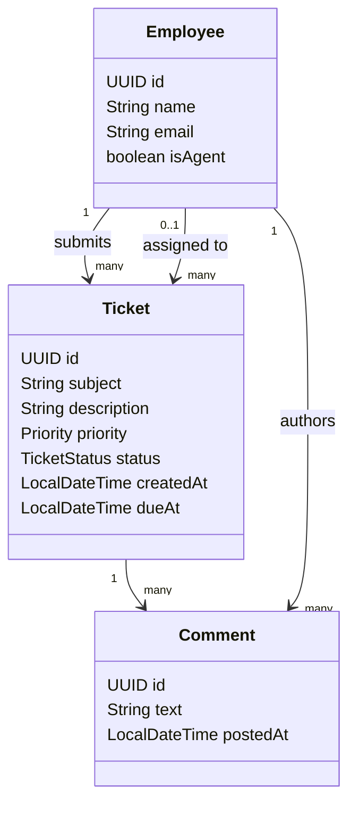

# Case Study: HelpDesk Pro - Internal IT Support Ticketing System

---

## 1. The Story

Your company's IT team currently tracks support requests over email and Slack DMs — nothing gets prioritized, nothing gets tracked, and nobody knows who's working on what. You're building **HelpDesk Pro**: employees raise tickets ("My laptop won't connect to VPN"), support agents pick them up, work them, and close them out. No payments, no complex workflows — just a clean, realistic ticket lifecycle that every module in this course can build on.

---

## 2. Actors

| Actor | Goal |
|---|---|
| **Employee (Requester)** | Raise a ticket, track its progress, add comments |
| **Support Agent** | Pick up tickets, update status, resolve issues |
| **IT Admin** | Manage agents, view ticket volume/SLA metrics |

---

## 3. Domain Model

`TicketStatus` is a small sealed set: `Open`, `InProgress`, `Resolved`, `Closed`.

---

## 4. Incremental Build Plan

Each part is a short, self-contained session. Later parts build directly on earlier ones — same three entities throughout.

### Part 1 — Core Java

- **US-1.1** — *As a developer, I want `Employee`, `Ticket`, `Comment` modeled as records* so the domain is immutable and boilerplate-free.
- **US-1.2** — *As a developer, I want `TicketStatus` modeled as a sealed type* (`Open`, `InProgress`, `Resolved`, `Closed`) with an exhaustive `switch` printing a status badge.
- **US-1.3** — *As an IT admin, I want a list of tickets that are overdue (`dueAt` in the past and not `Resolved`/`Closed`)*, computed from an in-memory `List<Ticket>` using the **Stream API** (`filter` + `sorted` by due date).

> **Hands-on:** One `Main.java` — seed a few employees and tickets; print the overdue list.

---

### Part 2 — JPA & Spring Data

- **US-2.1** — *As a developer, I want `Employee`, `Ticket`, `Comment` as JPA entities* with `@ManyToOne` from `Ticket` to submitter and assignee, and from `Comment` to `Ticket` and author.
- **US-2.2** — *As a support agent, I want a repository method `findByStatusAndAssignedToId(...)`* to fetch my active queue.

> **Hands-on:** Swap the in-memory list for an H2 database; re-run the overdue query as a Spring Data query method.

---

### Part 3 — Spring Framework 7

- **US-3.1** — *As a developer, I want a `TicketService` bean (`@Service`)* holding "raise", "assign", and "resolve" logic.
- **US-3.2** — *As an IT admin, I want every status change logged automatically* via a simple `@Around` AOP aspect — no changes to `TicketService` itself.

---

### Part 4 — Spring Boot 4

- **US-4.1** — *As a developer, I want the app scaffolded with Spring Initializr* (Web + JPA starters) and running with `mvn spring-boot:run`.
- **US-4.2** — *As a developer, I want `/actuator/health` available* to confirm the app is up.

---

### Part 5 — REST API

- **US-5.1** — *As an employee, I want `POST /api/tickets`* to raise a new ticket.
- **US-5.2** — *As a support agent, I want `GET /api/tickets?status=OPEN`* to see the unassigned queue.
- **US-5.3** — *As a support agent, I want `PATCH /api/tickets/{id}/assign`* to pick up a ticket, and `PATCH /api/tickets/{id}/status` to move it through its lifecycle.
- **US-5.4** — *As an employee, I want `POST /api/tickets/{id}/comments`* to follow up on my ticket.

> **Hands-on:** Test the full raise → assign → resolve flow with Postman.

---

### Part 6 — NoSQL (light touch)

- **US-6.1** — *As a support agent, I want to log a short "resolution note" (free-form troubleshooting steps that worked)* in a simple **MongoDB** collection, separate from the core relational data — a lightweight knowledge base, and a natural second data store to demo.

---

### Part 7 — Spring Security 7

- **US-7.1** — *As an employee, I want to log in and receive a JWT* to raise and view my own tickets.
- **US-7.2** — *As a support agent, I want a separate `AGENT` role* that alone can assign and resolve tickets (`@PreAuthorize("hasRole('AGENT')")`).
- **US-7.3** — *As an employee, I want to see only my own tickets, and an agent to see any ticket assigned to them* — a simple ownership check in the service layer.

---

### Part 8 — Transactions

- **US-8.1** — *As a support agent, when I resolve a ticket, I want the ticket's status, resolution timestamp, and a closing comment recorded together* — one `@Transactional` method, so a failure never leaves a ticket marked resolved with no explanation.

---

### Part 9 — Microservices (overview, not a full rebuild)

- **US-9.1** — *As an architect, I want to see how `TicketService` and a future `NotificationService` (emailing employees on status change) **could** be split apart* — discussed and sketched, not necessarily fully coded live, given the small scope.

---

### Part 10 — Docker & DevOps

- **US-10.1** — *As a developer, I want a `Dockerfile` for the Spring Boot app* and a `docker-compose.yml` that also starts Postgres, so the whole thing runs with `docker compose up`.

---

## 5. Sprint-to-Module Traceability

| Part | Module | What Gets Built |
|---|---|---|
| 1 | Core Java | Records, sealed `TicketStatus`, Streams overdue report |
| 2 | JPA & Spring Data | Entities + repository |
| 3 | Spring Framework | `TicketService` + AOP logging |
| 4 | Spring Boot | Runnable app + actuator |
| 5 | REST API | Raise/assign/status/comment endpoints |
| 6 | NoSQL | MongoDB resolution notes |
| 7 | Spring Security | JWT + role + ownership check |
| 8 | Transactions | Atomic ticket-resolution operation |
| 9 | Microservices | Conceptual split (discussion) |
| 10 | Docker/DevOps | Dockerfile + Compose |

