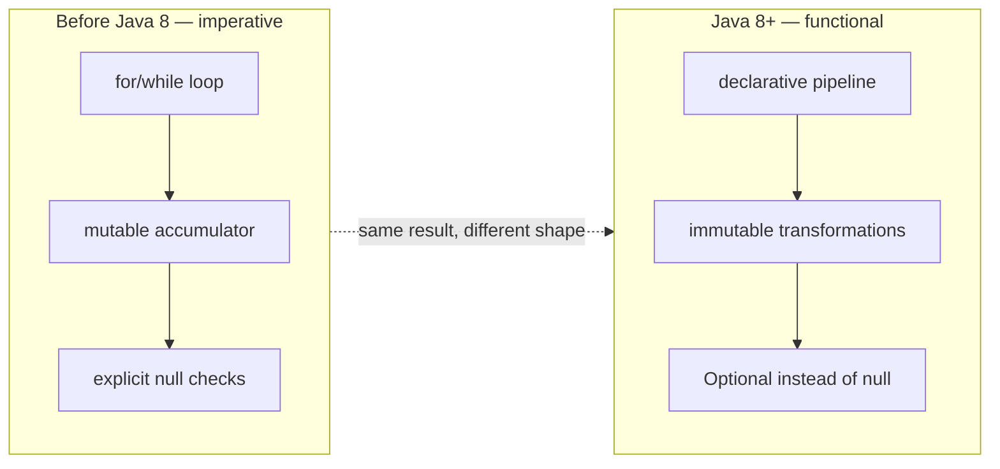
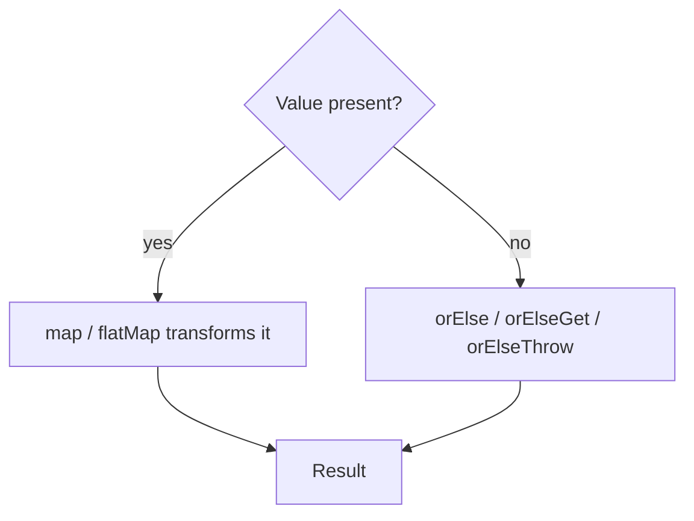

# Java 8 Refresher: Streams, Optionals, Lambdas

Java 8 (2014) is the biggest single mindset shift in the language's history —
bigger than generics in Java 5. Before it, Java code was almost entirely
**imperative**: you described *how* to do something, step by step, with
mutable loop variables and explicit control flow. Java 8 added a
**functional** layer on top: you describe *what* you want, and pass behavior
around as data.

This file is a fast refresher tying the three headline features together.
Lambdas and Streams each get a deep-dive file of their own —
[03](03-lambda-expressions-functional-interfaces.md) and
[04](04-stream-api-collectors-parallel-streams.md). This file focuses on the
mindset shift and on `Optional`, which doesn't get a dedicated file.

## The mindset shift



## Before → After: summing active users' ages

**Before Java 8:**

```java
List<User> users = fetchUsers();
int totalAge = 0;
int activeCount = 0;
for (User u : users) {
    if (u.isActive()) {
        totalAge += u.getAge();
        activeCount++;
    }
}
double averageAge = activeCount == 0 ? 0 : (double) totalAge / activeCount;
```

Four moving parts you have to get right yourself: the loop, the filter
condition, the accumulator, and the divide-by-zero guard.

**After Java 8:**

```java
double averageAge = fetchUsers().stream()
        .filter(User::isActive)
        .mapToInt(User::getAge)
        .average()
        .orElse(0);
```

Same result, but the "how" (looping, accumulating) is delegated to the
Stream implementation. You only state the "what": filter, extract age,
average.

## Optional: making absence explicit

Before Java 8, "no value" was represented by `null`, and the compiler gave
you zero help remembering to check for it.

**Before — `null` as the absence marker:**

```java
public User findUserById(String id) {
    // returns null if not found — nothing in the signature says so
    return database.get(id);
}

User user = findUserById("u-42");
System.out.println(user.getName()); // NullPointerException if not found
```

The method signature `User findUserById(String id)` lies — it looks like it
always returns a `User`, but it might return `null`. The caller finds out at
runtime, usually in production.

**After — `Optional<User>` as the signature:**

```java
public Optional<User> findUserById(String id) {
    return Optional.ofNullable(database.get(id));
}

String name = findUserById("u-42")
        .map(User::getName)
        .orElse("Unknown user");
```

Now the *type itself* documents "this might not be there," and the compiler
forces you to unwrap it — via `map`, `orElse`, `orElseThrow`, or
`ifPresent` — instead of letting you dereference a maybe-null reference
directly.



### Optional chaining vs. nested null checks

**Before:**

```java
String city = null;
if (user != null) {
    Address address = user.getAddress();
    if (address != null) {
        city = address.getCity();
    }
}
```

**After:**

```java
String city = Optional.ofNullable(user)
        .map(User::getAddress)
        .map(Address::getCity)
        .orElse(null);
```

The "pyramid of doom" collapses into a single readable chain. Each `map`
short-circuits automatically if the previous step was empty — you never
write an explicit `null` check.

## Real advantages — and honest caveats

**Advantages:**
- **Fewer `NullPointerException`s at the boundary.** `Optional` return types
  force callers to consciously handle the empty case instead of forgetting.
- **Self-documenting APIs.** `Optional<User>` communicates intent that
  `User` (which might secretly be `null`) never could.
- **Composability.** `map`/`flatMap`/`filter` chain the same way Stream
  operations do, so the two features reinforce each other.

**Caveats — don't cargo-cult this:**
- `Optional` is meant for **return types**, not fields, method parameters,
  or collection elements — Brian Goetz (Java's language architect) has said
  this explicitly. Using `Optional<String> name` as a field just adds an
  extra allocation and `.get()` calls with no benefit over a well-documented
  nullable field.
- `Optional` doesn't eliminate `null` from the language — it's still legal,
  and `Optional.of(null)` throws. It's a discipline you opt into, not a
  guarantee the compiler enforces everywhere (unlike, say, Kotlin's
  nullable types).
- Overusing `Optional` chains for simple null checks can make stack traces
  and debugging harder than a plain `if`. Use it where the *absence* is a
  meaningful part of the API contract, not everywhere a value could
  theoretically be missing.

## See also

- [Lambda expressions & functional interfaces](03-lambda-expressions-functional-interfaces.md)
  for how `filter`/`map`/`orElseGet` accept behavior as arguments.
- [Stream API](04-stream-api-collectors-parallel-streams.md) for the full
  pipeline model (`filter`, `map`, `collect`, laziness, parallelism).
