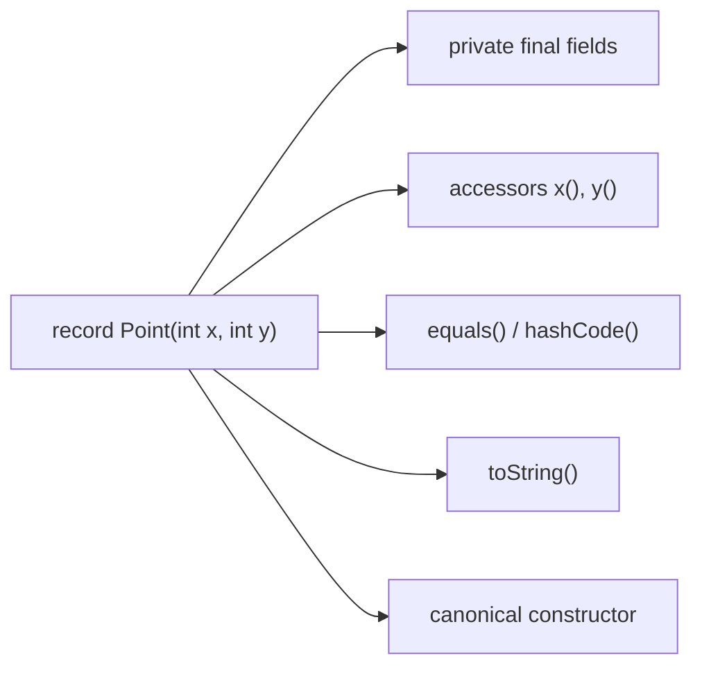
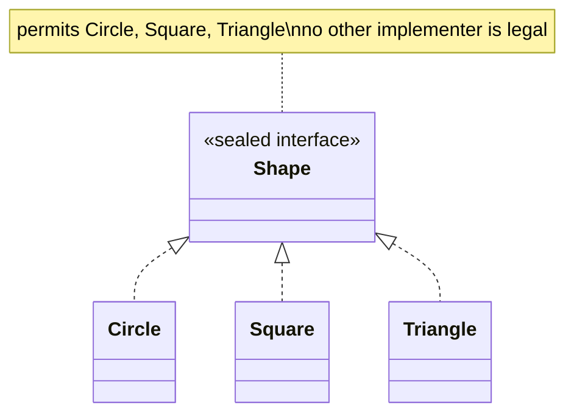
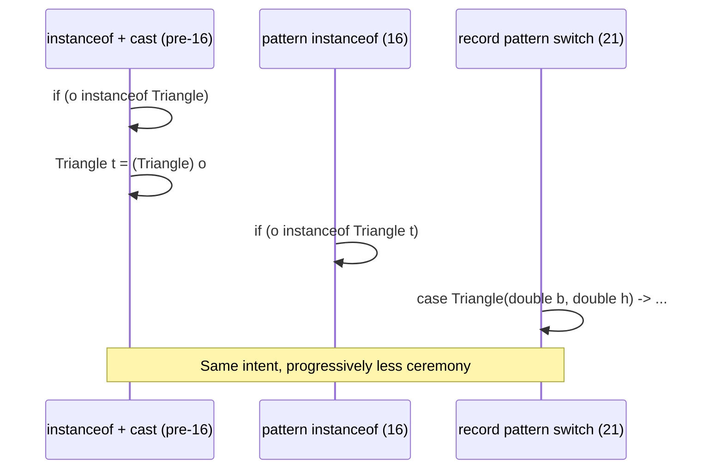

# Records, Sealed Classes, Pattern Matching (Switch Expressions)

Three separate JEPs (records — JEP 395, sealed classes — JEP 409, pattern
matching for switch — JEP 441) that were designed together and are meant to
be used together. Individually each removes boilerplate; combined, they let
you model a **closed set of data shapes** and handle every case
exhaustively, with the compiler checking your work — something Java
famously couldn't do well before Java 17/21.

## 1. Records — data carriers without the boilerplate

**Before — a "plain old Java object":**

```java
public final class Point {
    private final int x;
    private final int y;

    public Point(int x, int y) {
        this.x = x;
        this.y = y;
    }

    public int getX() { return x; }
    public int getY() { return y; }

    @Override
    public boolean equals(Object o) {
        if (this == o) return true;
        if (!(o instanceof Point)) return false;
        Point p = (Point) o;
        return x == p.x && y == p.y;
    }

    @Override
    public int hashCode() {
        return Objects.hash(x, y);
    }

    @Override
    public String toString() {
        return "Point[x=" + x + ", y=" + y + "]";
    }
}
```

~30 lines, and every line is boilerplate you have to write, maintain, and
keep in sync if you ever add a field.

**After — a record:**

```java
public record Point(int x, int y) { }
```

One line. The compiler generates the canonical constructor, private final
fields, accessors (`x()`, `y()` — not `getX()`), `equals`, `hashCode`, and
`toString`.



You can still add validation via a **compact constructor**:

```java
public record Point(int x, int y) {
    public Point {
        if (x < 0 || y < 0) {
            throw new IllegalArgumentException("Coordinates must be non-negative");
        }
    }
}
```

**Real advantage:** records aren't just "less typing" — they encode
*intent*. A `record` tells every reader "this is an immutable data
holder, judged by its contents," the same way `final` tells you a variable
won't be reassigned. A class doesn't give you that guarantee at a glance.

**Caveat:** records are for **plain data aggregates**. If your type has
significant identity beyond its field values (e.g. a mutable JPA `@Entity`,
which needs identity, lazy loading, and often a no-args constructor), a
record is the wrong tool — see the JPA notes for why entities generally stay
classes.

## 2. Sealed classes — closing the hierarchy

Without sealed classes, any hierarchy is **open**: anyone, anywhere, can
write `class Circle extends Shape`. That means code that switches on
subtypes can never be sure it has covered every case.

**Before — an open hierarchy with a defensive `else`:**

```java
abstract class Shape { }
class Circle extends Shape { double radius; }
class Square extends Shape { double side; }
// nothing stops: class Triangle extends Shape { ... }

double area(Shape shape) {
    if (shape instanceof Circle c) {
        return Math.PI * c.radius * c.radius;
    } else if (shape instanceof Square s) {
        return s.side * s.side;
    } else {
        // dead code today — but is it? The compiler can't tell you.
        throw new IllegalStateException("Unknown shape: " + shape);
    }
}
```

If someone adds `class Triangle extends Shape` next year, this method
silently falls into the `else` branch at runtime. No compile error, no
warning — just a production incident.

**After — sealed hierarchy + exhaustive pattern-matching switch:**

```java
sealed interface Shape permits Circle, Square, Triangle { }

record Circle(double radius) implements Shape { }
record Square(double side) implements Shape { }
record Triangle(double base, double height) implements Shape { }

double area(Shape shape) {
    return switch (shape) {
        case Circle c   -> Math.PI * c.radius() * c.radius();
        case Square s   -> s.side() * s.side();
        case Triangle t -> 0.5 * t.base() * t.height();
        // no default needed — compiler proves this is exhaustive
    };
}
```

Now add a fourth shape, say `record Hexagon(...) implements Shape`, to the
`permits` list. Every `switch` over `Shape` in the codebase that lacks a
`case Hexagon` **fails to compile**. The compiler turns a runtime bug into a
build error, at the exact call sites that need updating.



## 3. Pattern matching for `switch` — deconstructing, not just branching

Pattern matching goes further than type-checking — with **record
patterns** (Java 21) you can deconstruct a record's components directly in
the `case` label.

**Before Java 21 (still valid, but manual):**

```java
if (shape instanceof Triangle) {
    Triangle t = (Triangle) shape;   // manual cast
    double area = 0.5 * t.base() * t.height();
}
```

**After — pattern matching for `instanceof` (Java 16) removes the cast:**

```java
if (shape instanceof Triangle t) {
    double area = 0.5 * t.base() * t.height();   // t already usable, right type
}
```

**After — record patterns in `switch` (Java 21) destructure in the label,
plus guards (`when`) for conditions:**

```java
String describe(Shape shape) {
    return switch (shape) {
        case Circle(double r) when r > 100      -> "huge circle";
        case Circle(double r)                   -> "circle r=" + r;
        case Square(double side) when side == 0 -> "degenerate square";
        case Square(double side)                -> "square side=" + side;
        case Triangle(double b, double h)       -> "triangle b=" + b + " h=" + h;
    };
}
```

No casts, no accessor calls (`t.base()`) — the components (`b`, `h`) are
bound directly as local variables from the pattern.



## Real advantages

- **Exhaustiveness checking.** This is the headline win — sealed +
  `switch` gives Java something close to algebraic data types /
  discriminated unions from functional languages. Refactors that add a new
  case can't be forgotten; the compiler finds every affected `switch`.
- **Boilerplate elimination.** Records remove the getter/equals/hashCode/
  toString tax that made Java famously verbose compared to Kotlin/Scala.
- **Data-oriented modeling.** Records + sealed interfaces let you model
  "one of these N shapes" directly in the type system instead of via
  inheritance-plus-`instanceof` or the visitor pattern, which existed
  largely to work around this exact gap.

## Caveats

- Sealed types are a commitment: adding a new permitted subtype is a
  **compile-time break** for every exhaustive `switch` — which is the
  point, but it means sealing a hierarchy that's still actively growing
  (e.g. a plugin system third parties extend) is the wrong call. Sealed
  fits closed, known domains (shapes, HTTP methods, a fixed set of
  event types) — not open extension points.
- Records give up mutability and inheritance (a record is implicitly
  `final` and can't extend another class, though it can implement
  interfaces). Don't reach for a record just to save typing on a type that
  actually needs mutable state or a class hierarchy.
