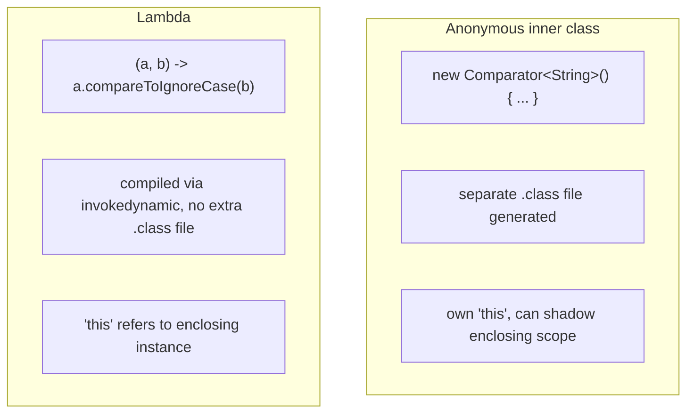
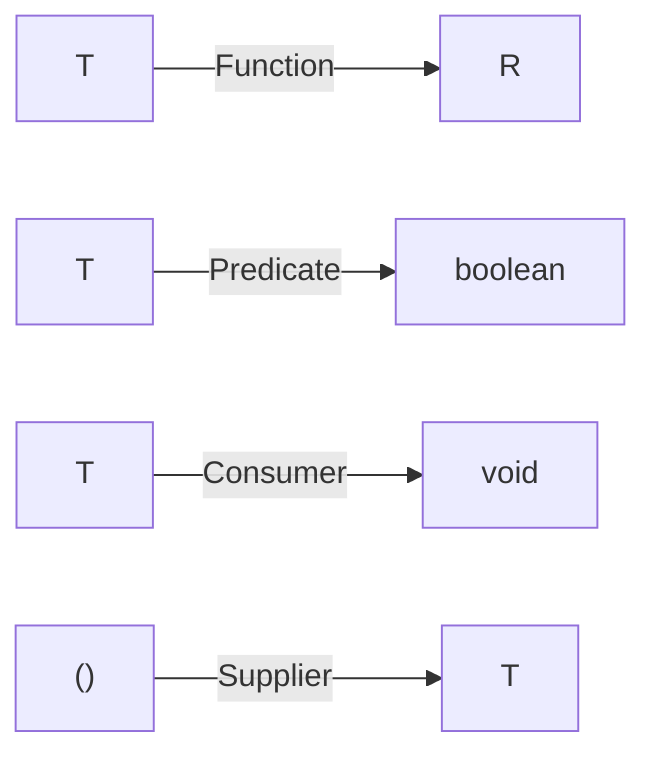

# Lambda Expressions & Functional Interfaces

A **functional interface** is any interface with exactly one abstract
method (a "SAM" — Single Abstract Method). A **lambda expression** is a
compact, inline way to provide an implementation of one, without writing an
anonymous class. The two features only exist because of each other: lambdas
need a target type to compile against, and that target type is always a
functional interface.

## Before → After: passing behavior as an argument

**Before Java 8 — anonymous inner class:**

```java
List<String> names = Arrays.asList("Charlie", "alice", "Bob");

Collections.sort(names, new Comparator<String>() {
    @Override
    public int compare(String a, String b) {
        return a.compareToIgnoreCase(b);
    }
});
```

Five lines of ceremony (`new Comparator<String>() { @Override public int
compare(...) { ... } }`) to express one idea: "compare case-insensitively."

**After Java 8 — lambda:**

```java
names.sort((a, b) -> a.compareToIgnoreCase(b));
```

**After — method reference (when the lambda just forwards to an existing
method):**

```java
names.sort(String::compareToIgnoreCase);
```

Same bytecode-level intent, radically less syntax. The compiler infers the
parameter types from `Comparator<String>`'s single abstract method
`int compare(String, String)`.



## The core functional interfaces (`java.util.function`)

You rarely need to declare your own functional interface — the JDK ships a
standard set covering almost every shape:

| Interface | Method | Signature | Use for |
|---|---|---|---|
| `Function<T,R>` | `apply` | `T -> R` | transforming a value |
| `BiFunction<T,U,R>` | `apply` | `(T,U) -> R` | transforming two values |
| `Predicate<T>` | `test` | `T -> boolean` | a yes/no check (filters) |
| `Consumer<T>` | `accept` | `T -> void` | doing something with a value |
| `Supplier<T>` | `get` | `() -> T` | producing a value lazily |
| `UnaryOperator<T>` | `apply` | `T -> T` | `Function` where input/output type match |
| `BinaryOperator<T>` | `apply` | `(T,T) -> T` | combining two values of the same type |
| `Runnable` (pre-8) | `run` | `() -> void` | no input, no output |



## Before → After: a custom "strategy" without a functional interface

**Before — defining a whole interface + implementations for one bit of
behavior:**

```java
interface DiscountStrategy {
    double apply(double price);
}

class TenPercentOff implements DiscountStrategy {
    public double apply(double price) { return price * 0.9; }
}

double finalPrice = new TenPercentOff().apply(100.0);
```

**After — reuse `UnaryOperator<Double>`, no new type needed:**

```java
UnaryOperator<Double> tenPercentOff = price -> price * 0.9;
double finalPrice = tenPercentOff.apply(100.0);
```

You only need a **custom** functional interface when none of the standard
ones fit — typically when you want a more descriptive method name than
`apply`/`test`/`accept`, or need to throw a checked exception:

```java
@FunctionalInterface
interface RowMapper<T> {
    T map(ResultSet rs) throws SQLException;   // checked exception — Function<T,R> can't do this
}
```

`@FunctionalInterface` is optional but recommended: it makes the compiler
enforce single-abstract-method-ness, so someone adding a second abstract
method later gets a compile error instead of silently breaking every
lambda that targets the interface.

## Method references — the four flavors

```java
// 1. Static method
Function<String, Integer> parse = Integer::parseInt;

// 2. Instance method on a particular object
String prefix = "Hello, ";
Function<String, String> greet = prefix::concat;

// 3. Instance method on an arbitrary object of a type (first lambda param becomes the receiver)
Function<String, Integer> length = String::length;

// 4. Constructor reference
Supplier<ArrayList<String>> newList = ArrayList::new;
```

## Real advantages

- **Behavior as a first-class value.** You can store a lambda in a variable,
  pass it around, return it from a method — code that used to require the
  Strategy or Command design pattern (a whole extra class per behavior) is
  now a one-line expression.
- **Deferred / lazy execution.** A `Supplier<T>` or a lambda passed to
  `Optional.orElseGet(...)` doesn't run until actually invoked — unlike a
  pre-computed value passed to `orElse(...)`. This matters for expensive
  fallbacks (e.g. a DB query you only want to run if the cache misses).
- **Less incidental state capture risk.** Lambdas can only capture
  effectively-final local variables (same as anonymous classes), but
  without generating a visible extra `.class` file per usage and without
  their own shadowing `this` — `this` inside a lambda is the enclosing
  instance, which avoids a classic anonymous-class gotcha.
- **Enables the Stream API.** Lambdas are the mechanism; Streams (next
  file) are the biggest consumer of that mechanism.

## Caveats

- Lambdas are **not free** — the JVM compiles each distinct lambda call
  site via `invokedynamic` with a bootstrap method that generates a hidden
  class at runtime the first time it's hit. This is fast in steady state
  but is not literally zero-cost, and can affect startup-sensitive contexts
  (e.g. CLI tools, some serverless cold starts).
- Overusing lambdas for anything with more than a couple of lines hurts
  readability and stack traces (`lambda$processOrder$3` is a much worse
  stack frame than a named method). If a lambda body needs a comment to
  explain itself, extract it to a named method and use a method reference
  instead.
- Checked exceptions don't compose well with the standard functional
  interfaces — `Function<T,R>` can't throw `SQLException`. This routinely
  forces awkward try/catch-and-wrap inside lambdas, or custom functional
  interfaces as shown above.
