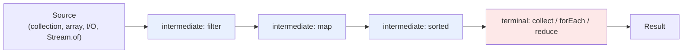
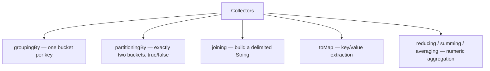
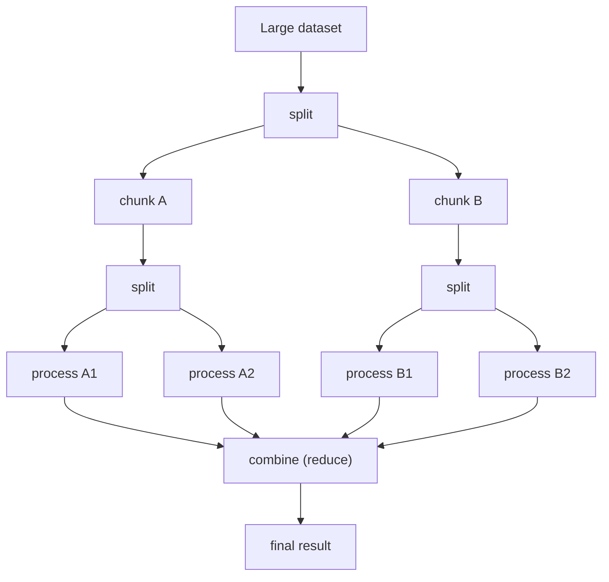

# Stream API: Collectors & Parallel Streams

A `Stream` is a one-time-use pipeline of **lazy**, **declarative**
operations over a source of data. It replaces most hand-written loops over
collections with a chain that reads close to the problem statement instead
of the mechanics of iteration.

## Before → After: group employees by department, salaries summed

**Before Java 8 — imperative:**

```java
Map<String, Double> totalByDept = new HashMap<>();
for (Employee e : employees) {
    if (e.getSalary() > 50_000) {
        totalByDept.merge(e.getDepartment(), e.getSalary(), Double::sum);
    }
}
```

Compact once you know the `merge` trick — but that trick itself is a
workaround: `HashMap.merge` didn't exist for this purpose before Java 8
either, and without it you'd need an explicit `containsKey` check first.

**After Java 8 — Stream + Collectors:**

```java
Map<String, Double> totalByDept = employees.stream()
        .filter(e -> e.getSalary() > 50_000)
        .collect(Collectors.groupingBy(
                Employee::getDepartment,
                Collectors.summingDouble(Employee::getSalary)));
```

The pipeline reads as a sentence: filter high earners, group by department,
sum salaries within each group.

## The pipeline model: source → intermediate ops → terminal op



**Intermediate operations** (`filter`, `map`, `sorted`, `distinct`, `limit`,
`peek`) are **lazy** — they don't run anything, they just build up a
pipeline description. **Nothing executes until a terminal operation**
(`collect`, `forEach`, `reduce`, `count`, `anyMatch`, ...) is called. This is
different from, say, calling `.filter()` on a `List` copy in a loop, which
runs immediately.

```java
Stream<String> pipeline = names.stream()
        .filter(n -> {
            System.out.println("filtering " + n);   // never printed yet
            return n.length() > 3;
        });
// nothing has printed — no terminal op called

long count = pipeline.count();   // NOW the filter actually runs
```

**Real advantage of laziness:** short-circuiting terminal ops
(`findFirst`, `anyMatch`, `limit`) can stop the whole pipeline early
without processing the rest of the source — something a hand-rolled loop
gets for free with `break`, but a chain of separate `.filter().map()` calls
over intermediate `List`s (a common pre-8 style) does not, since each stage
fully materializes before the next starts.

```java
// Only scans as far as needed to find one match — stops immediately, even on a huge/infinite source
Optional<User> firstAdmin = users.stream()
        .filter(User::isAdmin)
        .findFirst();
```

## Collectors — the terminal operation you'll use most

`Collectors` is a toolbox of reusable strategies for the `collect()`
terminal op:

```java
List<String> names = employees.stream()
        .map(Employee::getName)
        .collect(Collectors.toList());

String csv = employees.stream()
        .map(Employee::getName)
        .collect(Collectors.joining(", ", "[", "]"));   // "[Alice, Bob, Carol]"

Map<Boolean, List<Employee>> partitioned = employees.stream()
        .collect(Collectors.partitioningBy(e -> e.getSalary() > 100_000));
// partitioned.get(true) = high earners, partitioned.get(false) = the rest

Map<String, Long> countByDept = employees.stream()
        .collect(Collectors.groupingBy(Employee::getDepartment, Collectors.counting()));
```



**Before → After: `Collectors.groupingBy` vs. manual bucketing:**

```java
// Before
Map<String, List<Employee>> byDept = new HashMap<>();
for (Employee e : employees) {
    byDept.computeIfAbsent(e.getDepartment(), k -> new ArrayList<>()).add(e);
}

// After
Map<String, List<Employee>> byDept = employees.stream()
        .collect(Collectors.groupingBy(Employee::getDepartment));
```

## Parallel streams

Calling `.parallelStream()` (or `.stream().parallel()`) splits the pipeline
across the **common `ForkJoinPool`** (sized to `Runtime.availableProcessors() - 1`
worker threads by default) using a fork/join, divide-and-conquer strategy.

```java
// Sequential
long total = numbers.stream().mapToLong(Long::valueOf).sum();

// Parallel — same result, computed across multiple threads
long total = numbers.parallelStream().mapToLong(Long::valueOf).sum();
```



### When parallel actually helps — and when it doesn't

| Factor | Favors parallel | Favors sequential |
|---|---|---|
| Data size | Large (100k+ elements) | Small — fork/join overhead dominates |
| Source structure | `ArrayList`, arrays, `IntStream.range` (splits cheaply) | `LinkedList`, I/O-based streams (splits poorly) |
| Per-element cost | CPU-heavy work | Cheap operations (e.g. simple `+`) |
| Shared mutable state | None (pure functions) | Any — parallel + shared state = race conditions |
| Ordering requirement | Not required, or associative reduce | Order-sensitive `forEach` |

**Common mistake — a parallel stream that's actually slower:**

```java
// Small list, cheap operation: overhead of splitting/merging threads
// swamps the tiny amount of work. This is usually SLOWER than sequential.
int sum = List.of(1, 2, 3, 4, 5).parallelStream()
        .mapToInt(Integer::intValue)
        .sum();
```

**Common mistake — a race condition from shared mutable state:**

```java
// BROKEN: ArrayList is not thread-safe; concurrent add() calls corrupt it
// or silently drop elements.
List<String> results = new ArrayList<>();
items.parallelStream().forEach(item -> results.add(process(item)));   // don't do this

// Correct: let collect() handle thread-safe accumulation
List<String> results = items.parallelStream()
        .map(this::process)
        .collect(Collectors.toList());
```

## Real advantages

- **Declarative code that mirrors intent.** `filter → map → collect` reads
  like the requirement itself; a hand-rolled loop makes you reconstruct
  intent from mechanics.
- **Composability.** Pipelines chain naturally; extracting a step into a
  named `Predicate`/`Function` and reusing it across pipelines is trivial
  compared to extracting part of a loop body.
- **Built-in short-circuiting and laziness** for free — `findFirst`,
  `anyMatch`, `limit` don't process the whole source.
- **A one-line path to multi-core** for large, CPU-bound, side-effect-free
  workloads (`.parallelStream()`), without hand-writing thread pools.

## Caveats

- Streams are **single-use** — calling a terminal operation twice on the
  same stream throws `IllegalStateException`.
- Debugging a stream pipeline is harder than a loop: breakpoints inside
  lambdas and stack traces full of internal Stream frames are less
  friendly than a debugger stepping through a `for` loop. `peek()` helps,
  but is easy to misuse for side effects it isn't designed for.
- Parallel streams share **one** JVM-wide common pool — a long-running
  parallel stream elsewhere in the app (or in a library you depend on) can
  starve yours. For real concurrency control, a dedicated
  `ExecutorService` (or, on Java 21+, virtual threads — see
  [file 5](05-virtual-threads-structured-concurrency.md)) gives you
  isolation that `.parallelStream()` does not.
- Not every operation is faster as a stream. For tiny collections or
  simple loops, a plain `for` loop is often just as readable and has less
  overhead — reach for streams for clarity and composability, not as a
  reflexive performance move.
