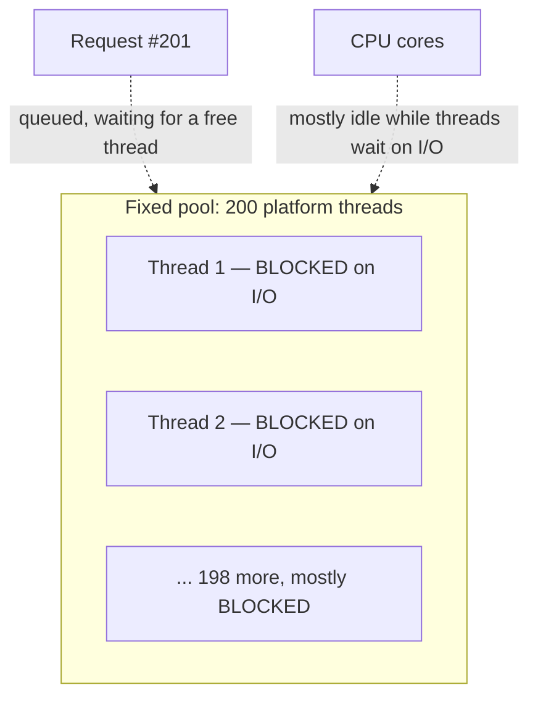
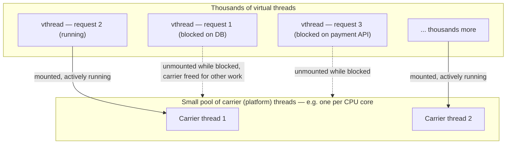
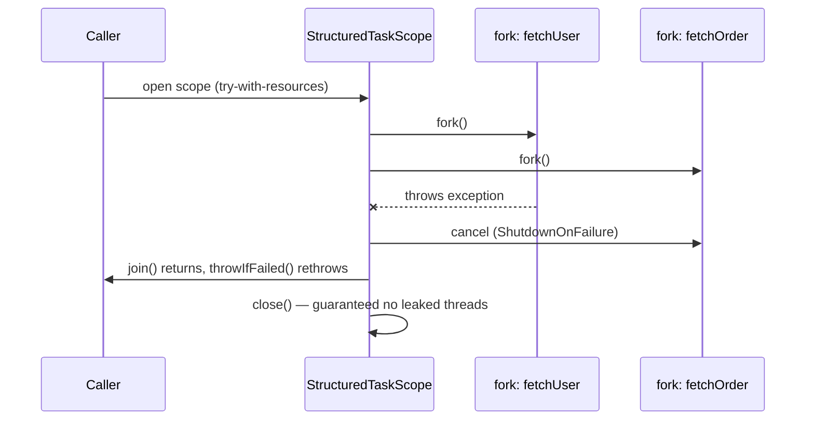

# Virtual Threads (Project Loom) & Structured Concurrency

Java 21 (LTS) finalized **virtual threads** (JEP 444) — the biggest change
to Java's concurrency model since threads were introduced in Java 1.0. It
directly targets the scalability wall that platform threads hit under
high-concurrency, I/O-bound workloads (the exact shape of a typical REST
API or microservice handling thousands of blocked-on-the-database
requests).

## The problem: platform threads are expensive

A **platform thread** is a thin wrapper around an OS thread — a 1:1
mapping. OS threads are expensive to create and reserve real resources: a
default ~1MB stack (much of it reserved address space, but still real
kernel bookkeeping) and OS-level scheduling overhead. Practically, a single
JVM can run maybe a few thousand platform threads before context-switching
overhead and memory pressure degrade the whole system.

**Before — thread-per-request with a bounded pool:**

```java
ExecutorService pool = Executors.newFixedThreadPool(200);   // 200 is already a lot of OS threads

for (Order order : incomingOrders) {
    pool.submit(() -> {
        String result = callPaymentService(order);   // blocks this OS thread for the whole call
        callInventoryService(order);                  // blocks again
        saveOrder(order, result);
    });
}
```

If `callPaymentService` blocks on network I/O for 200ms, that entire OS
thread — with its full stack — sits idle, doing nothing but waiting, for
200ms. With a fixed pool of 200, request #201 queues behind it even though
the CPU is almost completely idle. The bottleneck isn't CPU — it's **the
number of OS threads you're willing to pay for**.



## After — virtual threads: cheap, JVM-managed threads

A **virtual thread** is scheduled by the JVM, not the OS. Many virtual
threads share a small pool of **carrier** platform threads. When a virtual
thread blocks on I/O (network calls, `Thread.sleep`, blocking JDBC, etc.),
the JVM **unmounts** it from its carrier thread and mounts a different,
runnable virtual thread in its place — the carrier thread is never left
idle just because one task is waiting.

```java
try (ExecutorService executor = Executors.newVirtualThreadPerTaskExecutor()) {
    for (Order order : incomingOrders) {
        executor.submit(() -> {
            String result = callPaymentService(order);   // "blocks" the virtual thread only
            callInventoryService(order);
            saveOrder(order, result);
        });
    }
}   // executor.close() waits for all submitted tasks to finish
```

The code is **nearly identical** to the platform-thread version — same
blocking style, same `try/catch`, same debugger-friendly stack traces. That
was a deliberate design goal of Loom: no new async/reactive syntax
(`CompletableFuture` chains, `.thenApply()`, callback pyramids) to learn.
You keep writing simple, sequential, blocking-looking code, and get the
scalability of async for free.



**Key mental model:** platform threads are a *scarce* resource you pool and
reuse (`newFixedThreadPool(200)`); virtual threads are *cheap and
disposable* — the idiom is one virtual thread **per task**, created and
discarded freely, never pooled (`newVirtualThreadPerTaskExecutor`).
Millions of virtual threads can exist in one JVM; each one costs roughly a
few hundred bytes, not a megabyte-scale OS stack.

## Structured concurrency — giving thread lifetimes a shape

Spawning threads (virtual or not) ad hoc — fire-and-forget via
`executor.submit(...)` — creates a well-known problem: if one subtask fails,
nothing automatically stops the sibling subtasks still running, and errors
can silently vanish if you forget to call `.get()` on every `Future`.

**Before — manual `Future` coordination, easy to get wrong:**

```java
ExecutorService executor = Executors.newVirtualThreadPerTaskExecutor();
Future<User> userFuture = executor.submit(() -> fetchUser(id));
Future<Order> orderFuture = executor.submit(() -> fetchOrder(id));

User user = userFuture.get();     // if this throws, orderFuture keeps running unattended
Order order = orderFuture.get();  // — a leaked, forgotten task doing wasted work
```

If `fetchUser` throws, execution never reaches `orderFuture.get()` — that
task is now an orphan: still running, its result (or its own failure)
discarded, its thread not cleaned up until it happens to finish on its own.

**After — structured concurrency (`StructuredTaskScope`, JDK 21+
preview/incubating API) ties subtask lifetimes to a single scope:**

```java
try (var scope = new StructuredTaskScope.ShutdownOnFailure()) {
    Subtask<User> userTask = scope.fork(() -> fetchUser(id));
    Subtask<Order> orderTask = scope.fork(() -> fetchOrder(id));

    scope.join();            // waits for both subtasks
    scope.throwIfFailed();   // propagates the first failure, if any

    User user = userTask.get();
    Order order = orderTask.get();
}   // scope.close() guarantees both subtasks are finished or cancelled — no leaks
```

`ShutdownOnFailure` means: the moment either subtask fails, the scope
**cancels the other one automatically** instead of letting it run to
completion uselessly. The `try-with-resources` block guarantees that by the
time you leave the scope, there is no orphaned thread left running in the
background — the concurrent work has the same "single in, single out"
shape as a normal method call, just internally parallel.



## Real advantages

- **Massive concurrency for I/O-bound workloads with familiar code.** A
  typical Spring MVC controller that blocks on a DB call can go from
  handling ~200 concurrent requests (pool-limited) to handling requests
  limited only by memory and downstream systems — without rewriting to
  reactive/`WebFlux` style. This is the single biggest reason Loom exists:
  it makes the *boring, readable* blocking style scale like the *complex,
  hard-to-debug* reactive style used to be required for.
- **No new syntax or mental model.** Unlike reactive programming
  (`Mono`/`Flux`, callback chains), virtual threads keep normal
  try/catch, normal stack traces, and normal step-through debugging.
- **Structured concurrency prevents a whole class of leaks.** Cancellation
  and error propagation become automatic instead of something every
  call site has to remember to implement correctly with raw `Future`s.

## Caveats

- Virtual threads help **I/O-bound** blocking, not CPU-bound work. A
  virtual thread running a tight CPU loop still occupies its carrier
  thread the whole time — you don't get more CPU parallelism than you have
  cores, and CPU-bound work still contends for those cores exactly like
  platform threads. Don't expect virtual threads to speed up number
  crunching; that's what parallel streams / `ForkJoinPool` are for.
- **`synchronized` blocks can "pin" a virtual thread** to its carrier
  (this was fully fixed for most cases in JDK 24, but is worth knowing for
  17/21) — a long or contended `synchronized` block prevents unmounting,
  which can undermine the scalability benefit under heavy contention.
  Prefer `java.util.concurrent.locks.ReentrantLock` in hot paths on
  virtual threads if you hit this.
- Virtual threads are **not a replacement for thread pools sized around a
  limited external resource** — e.g. a database connection pool still caps
  concurrent DB work regardless of how many virtual threads try to use it.
  Loom removes the *thread* bottleneck, not every downstream bottleneck.
- `StructuredTaskScope` was still a **preview/incubating** API as of Java
  21 — expect API refinement in later releases; don't treat the exact
  method names as permanently frozen.
