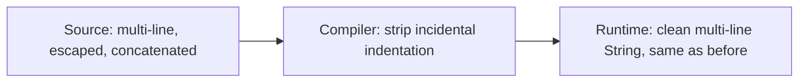
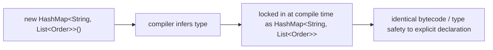
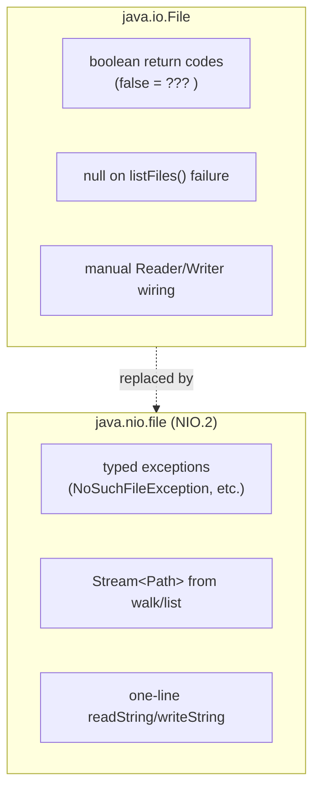

# Text Blocks, `var`, and Enhanced NIO

Three smaller quality-of-life features that don't change what's *possible*
in Java, but meaningfully reduce noise in day-to-day code — string
literals, local variable declarations, and file I/O.

## Text blocks (Java 15+, JEP 378)

**Before — multi-line strings via concatenation and escaping:**

```java
String json = "{\n" +
              "  \"name\": \"Alice\",\n" +
              "  \"role\": \"admin\"\n" +
              "}";

String sql = "SELECT id, name, email " +
             "FROM users " +
             "WHERE active = true " +
             "ORDER BY name";
```

Every newline needs `\n` and a `+`; every embedded `"` needs a `\"`. The
literal itself is harder to read than the text it represents, and it's easy
to introduce a subtle whitespace bug (a missing leading space where two
concatenated lines join).

**After — text blocks:**

```java
String json = """
        {
          "name": "Alice",
          "role": "admin"
        }
        """;

String sql = """
        SELECT id, name, email
        FROM users
        WHERE active = true
        ORDER BY name
        """;
```

No `\n`, no `+`, no escaping the inner `"`. The compiler strips incidental
leading whitespace based on the least-indented line (the closing `"""`'s
column typically sets the baseline), so you can indent the block to match
your code without that indentation leaking into the string's actual
content.



Text blocks still support `String.format`-style interpolation via
`.formatted(...)`:

```java
String query = """
        SELECT * FROM users WHERE id = %d
        """.formatted(userId);
```

**Real advantage:** embedded SQL, JSON, HTML, and regex become copy-paste
readable instead of requiring manual escaping/concatenation — this alone
noticeably reduces bugs in hand-written SQL and JSON test fixtures.

**Caveat:** text blocks are still just `String`s at runtime — no compile-
time SQL/JSON validation, and no parameterization safety. A text block
holding SQL is exactly as vulnerable to **SQL injection** as a concatenated
string if you interpolate user input into it directly instead of using
bind parameters (`PreparedStatement`, `@Query` with `:param`).

## `var` — local variable type inference (Java 10+, JEP 286)

**Before — explicit type on both sides:**

```java
Map<String, List<Order>> ordersByCustomer = new HashMap<String, List<Order>>();
for (Map.Entry<String, List<Order>> entry : ordersByCustomer.entrySet()) {
    List<Order> orders = entry.getValue();
}
```

**After — `var` infers the type from the right-hand side:**

```java
var ordersByCustomer = new HashMap<String, List<Order>>();
for (var entry : ordersByCustomer.entrySet()) {
    var orders = entry.getValue();
}
```

`var` is **not** dynamic typing — the compiler still infers and locks in a
concrete static type at compile time (`entry` above is exactly
`Map.Entry<String, List<Order>>`); `var` only removes the need to *write*
that type explicitly. IDEs show and check the real type the same as ever.



**Real advantage:** removes duplication where the type is already obvious
from the constructor or return type (`new HashMap<...>()`, a well-named
factory method) — the redundant left-hand type was pure noise the compiler
already knew. It also makes it easier to refactor a return type without
touching every call site that just does `var result = someMethod();`.

**Caveats — this is where `var` earns real pushback:**
- `var` is restricted to **local variables** with an initializer, `for`
  loop indices, and try-with-resources — not fields, not method
  parameters, not method return types. So it never affects a public API's
  readability, only method-body-local code.
- `var count = getCount();` hides the type when the right-hand side name
  *doesn't* make it obvious. If a reader can't tell the type at a glance
  without navigating to `getCount()`'s declaration, prefer the explicit
  type — `var` is a readability tool, and used where it obscures the type
  it actively works against its own purpose.
- `var list = new ArrayList<String>();` is fine (type is explicit on the
  right); `var list = getStrings();` is a judgment call depending on how
  well-named `getStrings` is.

## Enhanced NIO.2 (`java.nio.file`, Java 7+, still routinely under-used)

`java.io.File` (Java 1.0) predates exceptions-with-context, symbolic link
support, and any batch/stream-based directory operations. `java.nio.file`
(NIO.2, Java 7) replaced it, and later releases (8/11/17) kept adding
convenience methods that removed the remaining boilerplate.

**Before — `java.io.File`, manual streams, silent boolean failures:**

```java
File file = new File("data.txt");
StringBuilder content = new StringBuilder();
try (BufferedReader reader = new BufferedReader(new FileReader(file))) {
    String line;
    while ((line = reader.readLine()) != null) {
        content.append(line).append("\n");
    }
} catch (IOException e) {
    throw new RuntimeException(e);
}

boolean deleted = file.delete();   // returns false on failure — WHY it failed is a mystery
```

`File.delete()` returning `false` tells you nothing: permission denied?
File didn't exist? Directory not empty? You get a boolean, not a reason.

**After — `java.nio.file.Files`, one-liners, real exceptions:**

```java
Path path = Path.of("data.txt");
String content = Files.readString(path);              // Java 11+, whole file in one call
List<String> lines = Files.readAllLines(path);         // or line-by-line

Files.delete(path);   // throws NoSuchFileException / DirectoryNotEmptyException / IOException — you know WHY it failed
```

**Before — recursively listing files:**

```java
File dir = new File("logs");
File[] files = dir.listFiles();   // null if dir doesn't exist or isn't a directory — NPE waiting to happen
if (files != null) {
    for (File f : files) {
        if (f.isFile() && f.getName().endsWith(".log")) {
            System.out.println(f.getName());
        }
    }
}
```

**After — `Files.walk` / `Files.list` as a Stream:**

```java
try (Stream<Path> paths = Files.walk(Path.of("logs"))) {
    paths.filter(Files::isRegularFile)
         .filter(p -> p.toString().endsWith(".log"))
         .forEach(System.out::println);
}
```

`listFiles()` returning `null` instead of an empty array/throwing is a
famous `File` API wart; `Files.walk` throws `IOException` on a real
failure and otherwise gives you a proper (lazy!) `Stream<Path>` you can
compose with `filter`/`map`/`collect` exactly like any other stream.



## Real advantages (all three combined)

- These are **friction removers**, not new capabilities — the honest
  pitch is fewer bytes between "what I mean" and "what I type," which
  compounds across a large codebase into real readability gains.
- Text blocks and `Files.readString`/`writeString` together make
  "load a fixture, compare a JSON/SQL string" test code dramatically
  shorter and more copy-paste-safe than the pre-Java-11 equivalent.
- `Files` methods surfacing real exceptions instead of `File`'s booleans
  and `null`s directly improves error-handling correctness, not just
  brevity — you can no longer silently ignore a failed delete.

## Caveats

- None of these features change performance or add new capability — don't
  oversell them in an interview or design review as more than what they
  are: reduced ceremony.
- `java.io.File` still exists and interoperates with `Path`
  (`file.toPath()`, `path.toFile()`) — plenty of older library APIs still
  take `File`, so you'll keep seeing both for a long time.
