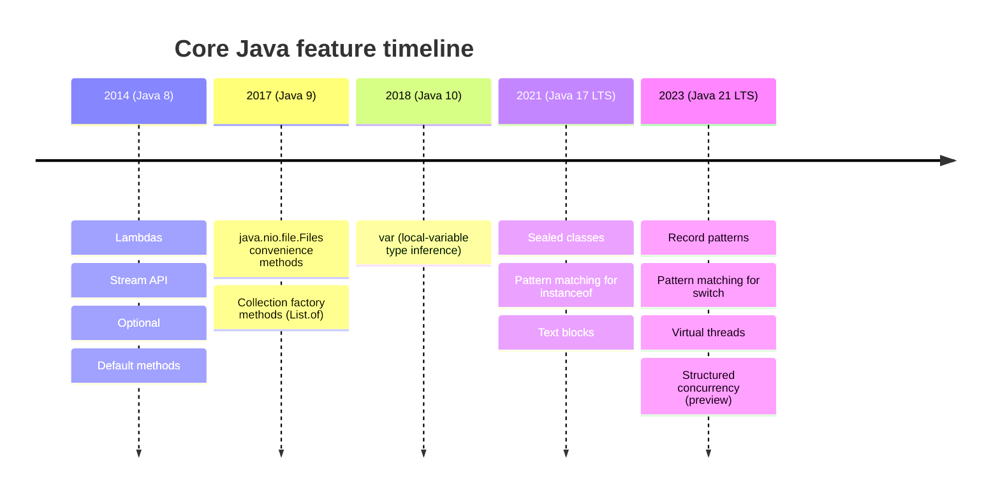
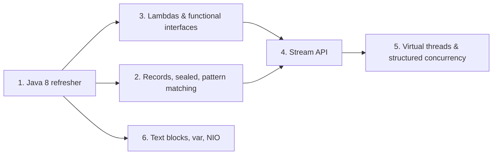

# Core Java (Java 17/21 LTS)

Notes and runnable-style examples for the first section of the course. Each
topic gets its own file with a **before → after** comparison, a diagram, and
an honest discussion of what actually improved (and what didn't).

## Topics

1. [Java 8 refresher — Streams, Optionals, Lambdas](01-java8-refresher.md)
2. [Records, sealed classes, pattern matching](02-records-sealed-classes-pattern-matching.md)
3. [Lambda expressions & functional interfaces](03-lambda-expressions-functional-interfaces.md)
4. [Stream API — Collectors, parallel streams](04-stream-api-collectors-parallel-streams.md)
5. [Virtual threads (Project Loom) & structured concurrency](05-virtual-threads-structured-concurrency.md)
6. [Text blocks, var, enhanced NIO](06-text-blocks-var-enhanced-nio.md)

## How the language evolved

## Reading order

If you only have limited time, read them in this order — each one builds on
concepts from the last:

