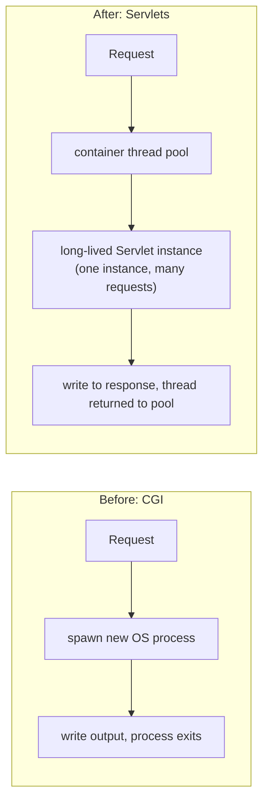
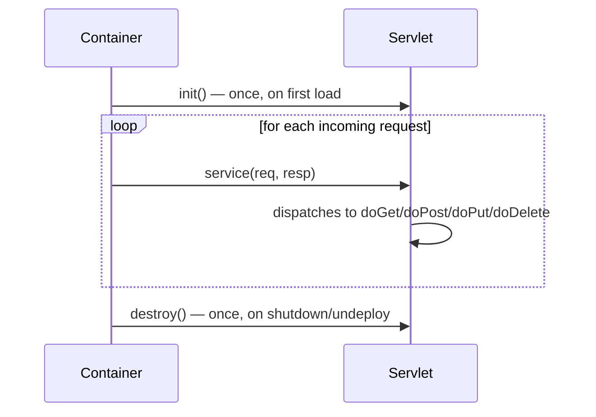
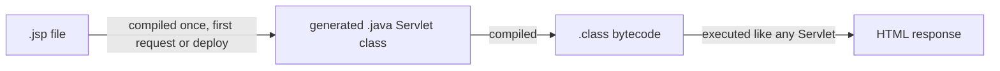

# Servlets & JSP (Legacy Context)

Brief overview, as flagged in the syllabus — you won't write raw Servlets
or JSP day-to-day once you're working in Spring Boot, but Spring MVC is
*built on top of* the Servlet API, and understanding what it replaced
explains why Spring exists in the first place.

## What a Servlet is

A `Servlet` is a Java class that handles HTTP requests inside a **Servlet
container** (Tomcat, Jetty, Undertow — Spring Boot embeds Tomcat by
default). Before Servlets (mid-to-late 1990s), dynamic web content on Java
back ends typically meant CGI: the web server spawned a **new OS process**
per request to generate a response. Servlets replaced that with a
long-lived Java object whose methods the container invokes per request —
no process spawn, and container-managed thread pooling instead.



## Before → After: handling a GET request

**Raw Servlet (this is what you'd write pre-Spring):**

```java
@WebServlet("/hello")
public class HelloServlet extends HttpServlet {
    @Override
    protected void doGet(HttpServletRequest req, HttpServletResponse resp)
            throws IOException {
        String name = req.getParameter("name");
        resp.setContentType("text/html");
        resp.getWriter().write("<html><body><h1>Hello, " + name + "</h1></body></html>");
    }
}
```

Every concern is manual: reading a query parameter, setting the content
type, and — notice — string-concatenating `name` directly into HTML output.
That's an XSS vulnerability sitting right there, because nothing in the raw
Servlet API escapes it for you.

**Same thing in Spring MVC (covered in depth later in the course):**

```java
@RestController
public class HelloController {
    @GetMapping("/hello")
    public String hello(@RequestParam String name) {
        return "Hello, " + name;   // Spring handles content-type negotiation, serialization
    }
}
```

Spring's `DispatcherServlet` is itself just one `HttpServlet` — every
`@RestController` method you'll write later still runs inside the same
Servlet lifecycle described below. Spring didn't replace Servlets; it
automated the repetitive parts of writing them by hand.

## The Servlet lifecycle



- `init()` runs once, when the container first loads the Servlet (or at
  startup, if configured eagerly).
- `service()` runs on **every request**, on a container-managed thread —
  `HttpServlet.service()` looks at the HTTP method and delegates to
  `doGet`/`doPost`/`doPut`/`doDelete`/etc.
- `destroy()` runs once, when the container shuts down or undeploys the
  app.
- **One Servlet instance typically serves many requests concurrently** —
  which means instance fields on a Servlet are shared, mutable state
  across threads unless you're careful. This is a classic legacy-code bug
  source, and part of why Spring beans' scope and thread-safety are worth
  paying attention to later.

## JSP — templating before it was a separate concern

JSP (JavaServer Pages) let you embed Java directly inside HTML, compiled
into a Servlet behind the scenes at deploy/first-request time.

**Before — raw Servlet generating HTML via string concatenation (shown
above) — unreadable past a few lines, and mixes business logic with markup
in Java source.**

**JSP — the same idea, inverted: HTML as the primary syntax, Java embedded
via scriptlets:**

```jsp
<html>
<body>
    <h1>Orders for <%= request.getParameter("customer") %></h1>
    <ul>
    <% for (Order o : orderService.findAll()) { %>
        <li><%= o.getId() %> — $<%= o.getTotal() %></li>
    <% } %>
    </ul>
</body>
</html>
```

This reads more like a template, but `<% %>` scriptlets mean arbitrary
Java logic — including database calls — can live directly inside the view.
That mixing of concerns (data access, business logic, and presentation all
in one `.jsp` file) is the specific problem later architectures were
designed to fix.



## Why this is "legacy context only"

- **Mixing concerns.** Business logic, data access, and HTML markup
  living in the same file made JSPs hard to test (no clean way to unit
  test embedded scriptlet logic) and hard to maintain as apps grew.
- **No built-in escaping.** Like raw Servlets, JSP's `<%= %>` doesn't
  escape output by default — direct XSS risk unless you remember JSTL's
  `<c:out>` or a similar helper on every single output.
- **Server-rendered HTML has partly given way to APIs.** Modern
  architectures increasingly separate a JSON/REST back end (what the rest
  of this course focuses on) from a separately-deployed front end (React,
  Angular, Vue) or use a purpose-built template engine (Thymeleaf,
  FreeMarker) that enforces escaping by default and doesn't allow
  arbitrary Java scriptlets.
- **Spring MVC's `@Controller` + view layer (or `@RestController` + JSON)
  replaced the "Servlet + JSP" pattern** with dependency-injected
  controllers, a proper templating abstraction, and automatic JSON
  serialization — which is why this topic is "brief overview" rather than
  something you'll write by hand going forward.

## Real advantages (historical) and why they still matter

- Servlets solved a real, serious problem (CGI's per-request process
  spawn) and the container-managed lifecycle/thread-pooling model
  Servlets introduced is still exactly what Tomcat does under Spring Boot
  today — you're relying on it even if you never touch it directly.
- Understanding `doGet`/`doPost`/`service()` demystifies what
  `@GetMapping`/`@PostMapping` are doing underneath, and explains why a
  Spring MVC app still needs a Servlet container (embedded Tomcat) to run
  at all.
- JSP's core idea — separating a template from Java logic — was correct;
  its execution (arbitrary Java scriptlets, no default escaping) is what
  later template engines and REST+SPA architectures fixed, not the
  underlying goal.
