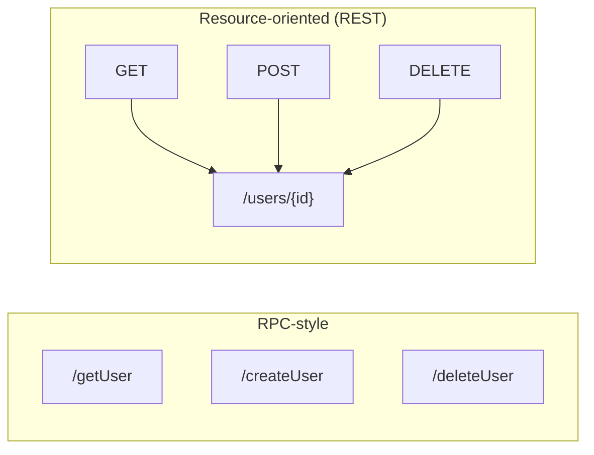
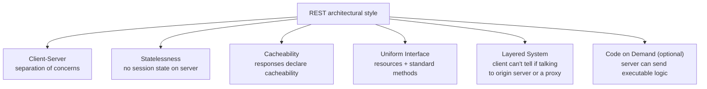
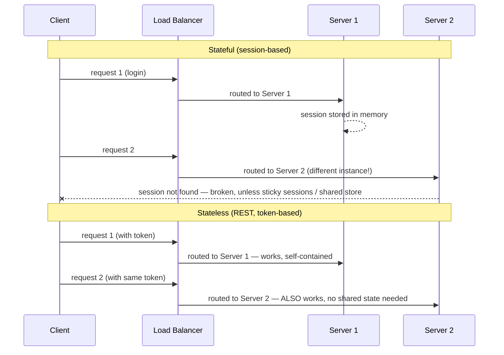
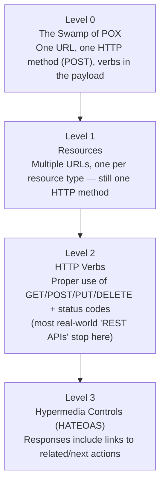

# REST Architecture Principles

REST (**RE**presentational **S**tate **T**ransfer) is an architectural
style defined by Roy Fielding in his 2000 doctoral dissertation — not a
protocol, not a standard, and not "any API that returns JSON." It's a set
of constraints that, applied together, produce systems with specific
properties: scalability, independent evolvability of client and server,
and cacheability.

## Before → After: RPC-style endpoint vs. resource-oriented endpoint

**Before — RPC-style (action-oriented) API, common before REST caught on:**

```
POST /getUser?id=42
POST /createUser
POST /updateUserEmail?id=42&email=new@example.com
POST /deleteUser?id=42
```

Every operation is its own verb-named endpoint. The HTTP method is always
`POST` — it carries no meaning. The client has to know four different URLs
for four operations on the *same underlying thing* (a user).

**After — resource-oriented (REST) API:**

```
GET    /users/42          — read
POST   /users              — create
PUT    /users/42           — replace
PATCH  /users/42           — partial update
DELETE /users/42           — delete
```

One URL — `/users/{id}` — identifies **the resource**. The HTTP method
carries the meaning of the operation. This is the core REST insight:
nouns (resources, identified by URLs) in the path, verbs (actions) as HTTP
methods — not verbs baked into the URL itself.



## The six REST constraints



1. **Client-Server** — the UI and data storage/business logic are
   separated and can evolve independently, as long as the interface
   between them stays stable.
2. **Statelessness** — every request from a client must contain **all**
   the information needed to process it. The server holds no client
   session state between requests.
3. **Cacheability** — responses must explicitly (or implicitly, by
   convention) indicate whether they're cacheable, so clients/intermediate
   proxies can reuse data and reduce round trips.
4. **Uniform Interface** — the big one; broken down further below.
5. **Layered System** — a client can't tell (and shouldn't need to know)
   whether it's talking directly to the origin server or through a load
   balancer, cache, or gateway in between.
6. **Code on Demand (optional)** — servers can temporarily extend client
   functionality by sending executable code (e.g. JavaScript) — the only
   *optional* constraint; most JSON REST APIs don't use this.

## Before → After: statefulness

**Before — server-side session state (classic pre-REST web app pattern):**

```java
// Login stores state ON THE SERVER, keyed by a session ID
session.setAttribute("loggedInUser", user);
session.setAttribute("cart", shoppingCart);

// A later request relies on the server remembering this session's state
@GetMapping("/checkout")
public String checkout(HttpSession session) {
    User user = (User) session.getAttribute("loggedInUser");   // implicit dependency on prior requests
    ...
}
```

The server must keep this session in memory (or a shared store) for as
long as the client might come back — and if a load balancer routes the
next request to a *different* server instance that doesn't have this
session, the request breaks unless you add sticky sessions or a
distributed session store.

**After — stateless, every request self-contained:**

```java
@GetMapping("/checkout")
public String checkout(@RequestHeader("Authorization") String bearerToken) {
    User user = tokenService.validateAndExtractUser(bearerToken);   // no server memory needed
    ...
}
```

The JWT (or similar token) carries everything the server needs to
authenticate and identify the caller, **on every request**. Any server
instance behind a load balancer can handle any request — that's precisely
why this matters for the microservices/horizontal-scaling material later
in the course.



## The Uniform Interface, in practice

The uniform interface constraint itself decomposes into four sub-ideas that
map directly onto how you'll design endpoints later:

- **Resource identification in requests** — URLs identify resources
  (`/users/42`), not actions (`/getUser`).
- **Manipulation through representations** — the client gets a
  *representation* of the resource (typically JSON) and sends back a
  representation to modify it; the client never manipulates server-side
  state directly.
- **Self-descriptive messages** — each message includes enough metadata
  to be understood on its own — `Content-Type: application/json`,
  status codes, etc. — without out-of-band information.
- **HATEOAS** (Hypermedia As The Engine Of Application State) — in the
  strict, fully mature form of REST, responses include links describing
  what the client can do *next* (e.g. a `links` array with `"cancel"`,
  `"pay"` URLs on an order resource), so the client doesn't need to
  hard-code URL structure. **In practice, most real-world "REST" APIs
  (including the vast majority you'll build in this course) skip
  HATEOAS entirely** — see maturity model below.

## The Richardson Maturity Model — how "RESTful" is a spectrum



Most APIs described as "RESTful" in industry — including the ones this
course builds — sit at **Level 2**: proper resources, proper HTTP verbs,
proper status codes, but no hypermedia links. That's a pragmatic, widely
accepted target; true Level 3 (full HATEOAS) is comparatively rare outside
specific ecosystems (e.g. some hypermedia-heavy APIs, Spring HATEOAS
demos).

## Real advantages

- **Independent evolution.** Because the interface is uniform and the
  server holds no client state, front end and back end teams can deploy
  independently as long as the contract (URLs, methods, payload shapes)
  stays stable.
- **Horizontal scalability.** Statelessness is what makes "just add more
  server instances behind a load balancer" work without sticky sessions —
  directly relevant to the microservices section later in this course.
- **Cacheability reduces load.** Proper use of HTTP caching semantics
  (`Cache-Control`, `ETag`) — a direct consequence of the cacheability
  constraint — can eliminate entire round trips to the server.
- **Predictability.** Once you know a URL identifies "a user," you can
  *guess* that `DELETE /users/42` deletes it, without reading
  documentation — the uniform interface constraint pays off directly in
  API discoverability.

## Caveats

- **REST is not a standard, and there's no REST compliance checker.**
  "RESTful" in casual industry use almost always means "Level 2 on the
  Richardson model," not Fielding's full definition — know the difference,
  especially if asked in an interview.
- **Statelessness has a cost**: every request re-authenticating (e.g.
  validating a JWT) is repeated work compared to a cached server-side
  session lookup. This is a deliberate scalability-over-efficiency
  trade-off, not a free lunch.
- REST isn't the only valid style — GraphQL (client-specified queries,
  one endpoint) and gRPC (binary, contract-first, high-performance RPC)
  solve different problems REST is comparatively weak at (over-fetching/
  under-fetching data, and low-latency service-to-service calls,
  respectively). Knowing *why* you'd reach for REST vs. those alternatives
  matters more than being able to recite the constraints.
