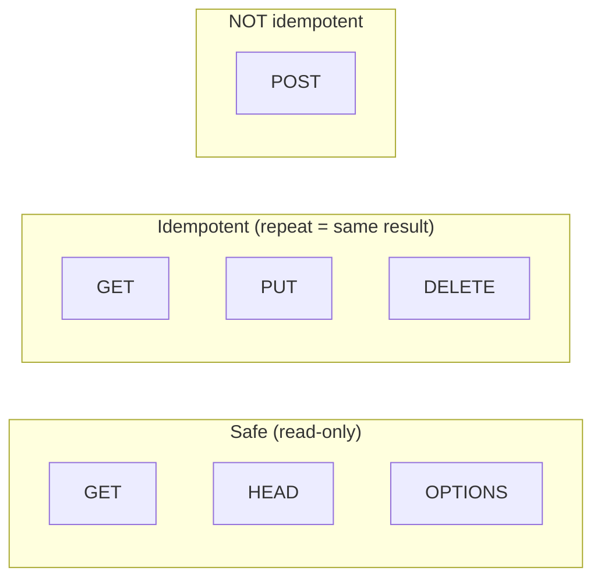
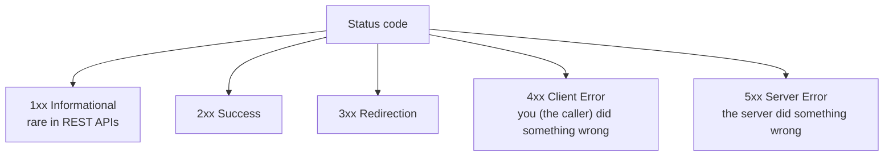
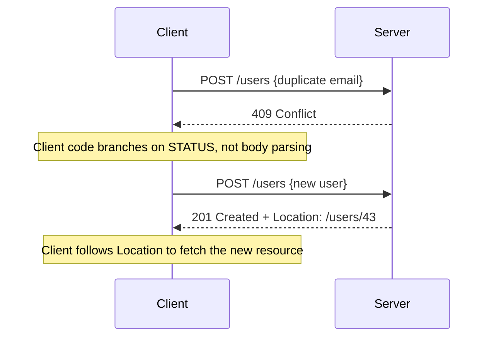
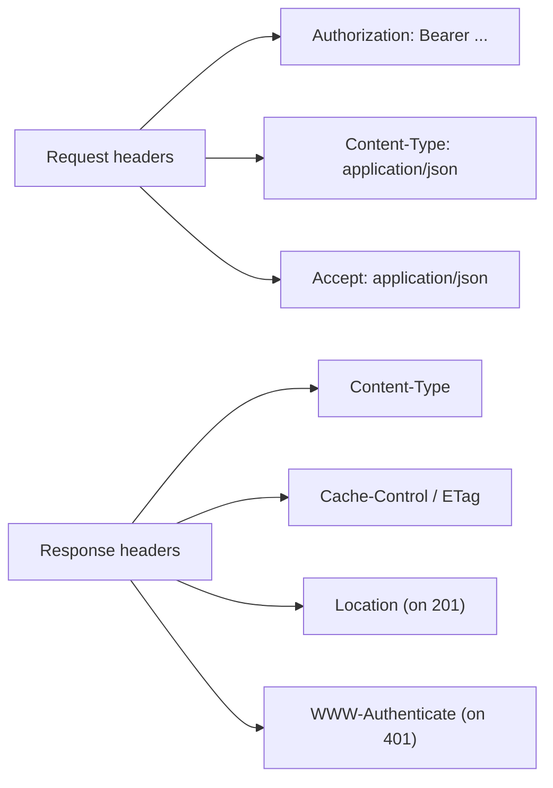
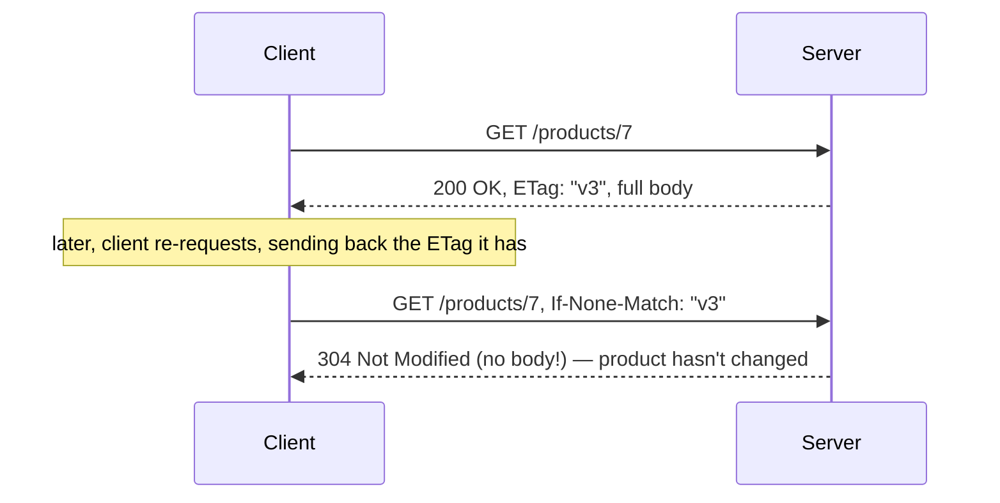

# HTTP Methods, Status Codes, Headers

The vocabulary every REST API is built from. Spring's `@GetMapping`,
`ResponseEntity<T>`, and `@RequestHeader` (later in the course) are thin
wrappers over exactly what's described here — nothing more.

## HTTP methods — semantics matter, not just "which one works"

| Method | Purpose | Safe? | Idempotent? | Has a request body? |
|---|---|---|---|---|
| `GET` | Retrieve a resource | Yes | Yes | No (by convention) |
| `POST` | Create a resource / trigger an action | No | **No** | Yes |
| `PUT` | Replace a resource entirely | No | Yes | Yes |
| `PATCH` | Partially update a resource | No | Not guaranteed | Yes |
| `DELETE` | Remove a resource | No | Yes | No (by convention) |
| `HEAD` | Like GET, headers only, no body | Yes | Yes | No |
| `OPTIONS` | Discover allowed methods (also used for CORS preflight) | Yes | Yes | No |

**Safe** = doesn't change server state (read-only). **Idempotent** = calling
it once has the same server-side effect as calling it N times.



### Before → After: misusing `GET` for a state-changing action

**Before — a "GET" that secretly mutates state (a real, common bug):**

```java
@GetMapping("/users/42/delete")   // WRONG: GET must never change state
public void deleteUser() {
    userRepository.deleteById(42L);
}
```

This looks harmless until a search engine crawler, a browser prefetcher, or
a monitoring tool that automatically follows `GET` links visits this URL —
and silently deletes the user. `GET` being "safe" isn't a suggestion;
browsers, proxies, and crawlers all rely on that guarantee and will
prefetch or retry `GET` requests freely.

**After — the state change lives behind the correct verb:**

```java
@DeleteMapping("/users/42")
public void deleteUser(@PathVariable Long id) {
    userRepository.deleteById(id);
}
```

### Before → After: `PUT` vs `POST` for "idempotent create"

**Before — `POST` used for something that's actually idempotent
(re-running a script re-creates duplicates):**

```java
// Running this deployment script twice creates TWO users named "admin"
POST /users
{ "username": "admin", "email": "admin@example.com" }
```

**After — `PUT` at a client-specified URL, safe to retry:**

```java
// Running this twice: first call creates it, second call replaces it
// with an identical copy — same end state either way
PUT /users/admin
{ "username": "admin", "email": "admin@example.com" }
```

`PUT`'s idempotency guarantee is exactly why it's the right choice for
retry-safe operations — e.g. a flaky network causing a client to resend a
request should never be able to create two of the same resource.

### `PATCH` vs `PUT` — the distinction people get wrong

```java
// PUT: send the WHOLE resource, replacing everything
PUT /users/42
{ "username": "alice", "email": "alice@new.com", "role": "admin" }
// omit "role" here and a correct PUT implementation clears/resets it

// PATCH: send only the fields that changed
PATCH /users/42
{ "email": "alice@new.com" }
// "username" and "role" are left untouched
```

A `PUT` handler that only updates fields present in the request body isn't
really a `PUT` — it's a `PATCH` wearing the wrong method name. This mix-up
is one of the most common REST API design bugs in real codebases.

## Status codes — communicating outcome, not just success/fail



| Code | Meaning | Typical use |
|---|---|---|
| `200 OK` | Generic success | `GET`, `PUT`, `PATCH` success with a body |
| `201 Created` | Resource created | `POST` success — pair with a `Location` header |
| `204 No Content` | Success, no body | `DELETE` success, or `PUT` with nothing to return |
| `400 Bad Request` | Malformed/invalid request | Validation failure, bad JSON |
| `401 Unauthorized` | Not authenticated | Missing/invalid credentials |
| `403 Forbidden` | Authenticated, not allowed | Valid user, insufficient permissions |
| `404 Not Found` | Resource doesn't exist | Bad ID, wrong URL |
| `409 Conflict` | State conflict | Duplicate unique key, version mismatch |
| `422 Unprocessable Entity` | Syntactically valid, semantically wrong | Passed schema validation, fails business rules |
| `500 Internal Server Error` | Unhandled server-side failure | Uncaught exception |
| `503 Service Unavailable` | Server temporarily can't handle it | Overload, downstream dependency down |

### Before → After: `200` for everything vs. meaningful codes

**Before — a REST anti-pattern: always `200`, error info buried in the
body:**

```java
@PostMapping("/users")
public ResponseEntity<Map<String, Object>> createUser(@RequestBody UserDto dto) {
    if (userRepository.existsByEmail(dto.email())) {
        return ResponseEntity.ok(Map.of("error", "Email already exists"));   // status 200!
    }
    User saved = userRepository.save(toUser(dto));
    return ResponseEntity.ok(Map.of("user", saved));   // status 200
}
```

Every response is `200 OK`, so a client (or a monitoring dashboard, or an
API gateway's error-rate alerting) can't tell success from failure without
parsing the body — which defeats a huge part of the point of HTTP status
codes.

**After — the status code itself carries the outcome:**

```java
@PostMapping("/users")
public ResponseEntity<?> createUser(@RequestBody UserDto dto) {
    if (userRepository.existsByEmail(dto.email())) {
        return ResponseEntity.status(HttpStatus.CONFLICT)
                .body(Map.of("error", "Email already exists"));   // 409
    }
    User saved = userRepository.save(toUser(dto));
    return ResponseEntity.status(HttpStatus.CREATED)
            .header("Location", "/users/" + saved.getId())
            .body(saved);   // 201
}
```

Now a load balancer, API gateway, monitoring tool, or generic HTTP client
retry policy can all correctly distinguish success from failure **without
understanding this API's specific JSON shape** — that's the self-descriptive
messages idea from the REST notes, in practice.



## Headers — metadata about the message, not the resource itself



| Header | Direction | Purpose |
|---|---|---|
| `Content-Type` | Request & Response | The media type of the body (e.g. `application/json`) |
| `Accept` | Request | What media types the client can handle in the response |
| `Authorization` | Request | Credentials — `Bearer <token>`, `Basic <base64>` |
| `Location` | Response | URL of a newly created resource (with `201`) |
| `Cache-Control` | Response | Caching directives (`no-store`, `max-age=3600`) |
| `ETag` | Response | Version fingerprint of a resource, for conditional requests |
| `If-None-Match` | Request | "Only send the body if it doesn't match this ETag" |
| `WWW-Authenticate` | Response | Tells the client how to authenticate (paired with `401`) |

### Before → After: no caching vs. conditional requests via `ETag`

**Before — every request refetches the full resource, even if unchanged:**

```java
@GetMapping("/products/{id}")
public Product getProduct(@PathVariable Long id) {
    return productRepository.findById(id).orElseThrow();
    // full JSON body sent on EVERY request, even if the client already has it
}
```

**After — conditional GET using `ETag`, skips the body entirely when
unchanged:**

```java
@GetMapping("/products/{id}")
public ResponseEntity<Product> getProduct(
        @PathVariable Long id,
        @RequestHeader(value = "If-None-Match", required = false) String ifNoneMatch) {

    Product product = productRepository.findById(id).orElseThrow();
    String etag = "\"" + product.getVersion() + "\"";

    if (etag.equals(ifNoneMatch)) {
        return ResponseEntity.status(HttpStatus.NOT_MODIFIED).eTag(etag).build();   // 304, no body
    }
    return ResponseEntity.ok().eTag(etag).body(product);
}
```



The second request transfers **zero bytes of product data** — just
headers — because the client proves it already has the current version.

## Real advantages

- **Status codes let infrastructure make correct decisions without
  understanding your API.** Load balancers route around `5xx`s, retry
  logic safely retries `503`s but not `400`s, monitoring dashboards
  compute error rates — all without parsing a single response body.
- **Correct method semantics (safe/idempotent) enable safe automatic
  retries.** A client (or an API gateway, or a mobile app on a flaky
  connection) can safely retry a `PUT` or `DELETE` after a timeout without
  risking duplicate side effects — it can't safely do that for `POST`.
- **Headers separate metadata from payload**, which is what makes generic
  HTTP tooling (caches, proxies, browsers, curl, Postman) work with *any*
  API without custom per-API logic — the entire web's infrastructure
  (CDNs, browser caches, API gateways) is built on trusting these
  conventions.

## Caveats

- **Status codes and methods are conventions, not enforced by HTTP
  itself.** Nothing stops a server from mutating state on `GET` or
  returning `200` for an error — as the anti-pattern examples above show,
  these bugs are common precisely *because* nothing forces correctness.
  Code review and API design discipline are what actually enforce this.
- `PATCH`'s semantics are less strictly defined than `PUT`/`GET`/`DELETE` —
  there's no single agreed body format (some APIs use partial JSON as
  shown above, others use JSON Patch, RFC 6902, an explicit list of
  operations). Check what convention your team/API actually uses before
  assuming.
- Overusing `200` with error details in the body (rather than real status
  codes) is extremely common in real-world APIs, not just a theoretical
  anti-pattern — you will encounter (and should push back on) this in
  actual codebases.
