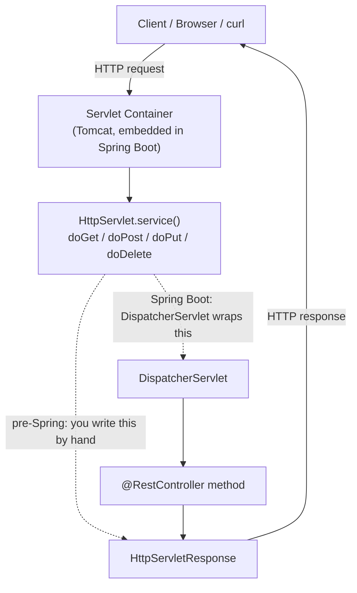

# Web Fundamentals

The layer beneath every Spring MVC/REST controller you'll write later in
this course. Understanding what Spring is automating away — a Servlet
container dispatching HTTP requests — makes the framework layers in later
sections click instead of feeling like magic.

## Topics

1. [Servlets & JSP (legacy context)](01-servlets-and-jsp.md)
2. [REST architecture principles](02-rest-architecture-principles.md)
3. [HTTP methods, status codes, headers](03-http-methods-status-codes-headers.md)

## Where this fits

Every `@RestController` method you write in the Spring section still runs
*inside* a Servlet (Spring's `DispatcherServlet`) and still produces an
HTTP response governed by the same methods, status codes, and headers
covered here.
