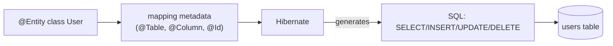
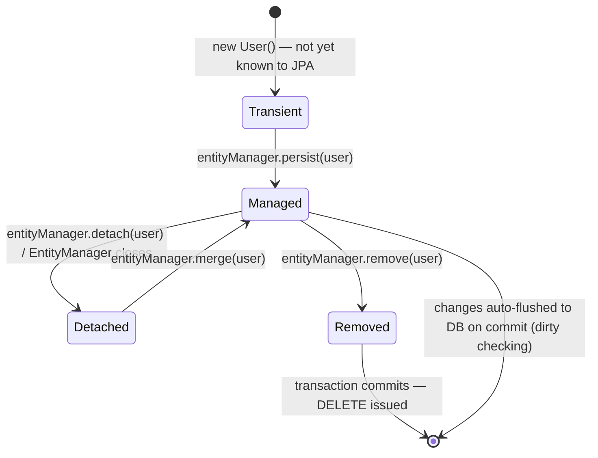

# JPA — Entities & Mappings

Jakarta Persistence API (JPA — formerly "Java Persistence API" before the
Java EE → Jakarta EE rename) is the standard for mapping Java objects to
relational tables: **ORM (Object-Relational Mapping)**. It's a
specification; Hibernate is the implementation Spring Boot uses by default.

## Before → After: hand-written JDBC vs. a JPA entity

**Before — raw JDBC, every operation hand-written:**

```java
public class UserDao {
    public User findById(Long id) throws SQLException {
        try (Connection conn = dataSource.getConnection();
             PreparedStatement ps = conn.prepareStatement(
                     "SELECT id, name, email FROM users WHERE id = ?")) {
            ps.setLong(1, id);
            try (ResultSet rs = ps.executeQuery()) {
                if (rs.next()) {
                    User u = new User();
                    u.setId(rs.getLong("id"));
                    u.setName(rs.getString("name"));
                    u.setEmail(rs.getString("email"));
                    return u;
                }
                return null;
            }
        }
    }

    public void save(User user) throws SQLException {
        try (Connection conn = dataSource.getConnection();
             PreparedStatement ps = conn.prepareStatement(
                     "INSERT INTO users (name, email) VALUES (?, ?)")) {
            ps.setString(1, user.getName());
            ps.setString(2, user.getEmail());
            ps.executeUpdate();
        }
    }
    // ... update(), delete(), findAll() — all hand-written, all similar boilerplate
}
```

Every column read/written manually, connection/statement/result-set
lifecycle managed by hand, and this pattern repeats near-identically for
every entity in the system.

**After — a JPA entity + Hibernate handles the SQL:**

```java
@Entity
@Table(name = "users")
public class User {

    @Id
    @GeneratedValue(strategy = GenerationType.IDENTITY)
    private Long id;

    @Column(name = "name", nullable = false, length = 100)
    private String name;

    @Column(unique = true)
    private String email;

    protected User() { }   // JPA requires a no-args constructor

    public User(String name, String email) {
        this.name = name;
        this.email = email;
    }
    // getters/setters omitted
}
```

```java
User user = entityManager.find(User.class, 1L);          // SELECT generated for you
entityManager.persist(new User("Alice", "alice@x.com"));  // INSERT generated for you
```

No SQL written for basic CRUD — Hibernate generates it from the mapping
metadata (the annotations) at runtime.



## Core mapping annotations

| Annotation | Purpose |
|---|---|
| `@Entity` | Marks a class as a JPA-managed, persistable type |
| `@Table(name=...)` | Maps to a specific table name (defaults to class name) |
| `@Id` | Marks the primary key field |
| `@GeneratedValue` | How the ID is generated (`IDENTITY`, `SEQUENCE`, `AUTO`, `TABLE`) |
| `@Column` | Customizes column name, nullability, length, uniqueness |
| `@Transient` | Field exists on the Java object but is **not** persisted |
| `@Enumerated` | How an `enum` is stored (`STRING` or `ORDINAL`) |
| `@Temporal` (legacy) / `LocalDate`/`LocalDateTime` (modern) | Date/time mapping |

```java
@Entity
public class Order {
    @Id
    @GeneratedValue(strategy = GenerationType.SEQUENCE)
    private Long id;

    @Enumerated(EnumType.STRING)   // stores "PENDING", not 0 — survives enum reordering
    private OrderStatus status;

    private LocalDateTime createdAt;

    @Transient
    private BigDecimal computedDiscount;   // calculated in memory, never hits the DB
}
```

**Real gotcha worth calling out:** `@Enumerated(EnumType.ORDINAL)` (the
default if you omit `@Enumerated` entirely and just store an enum) persists
the enum's **position** (0, 1, 2...) instead of its name. Reorder or insert
a new value into the enum later, and every existing row's meaning silently
shifts. Always use `EnumType.STRING` unless you have a specific, measured
reason not to (e.g. extreme storage sensitivity).

## Entity lifecycle states



- **Transient** — a plain Java object, JPA doesn't know it exists.
- **Managed** — attached to a `Persistence Context` (roughly, the current
  transaction's unit of work); JPA tracks changes to it automatically —
  this is **dirty checking**: you don't call `save()` again after mutating
  a managed entity's fields, JPA notices the change and issues an `UPDATE`
  on commit.
- **Detached** — was managed, but the persistence context closed (e.g.
  the transaction ended). Changes to a detached entity are **not**
  tracked or persisted until re-attached via `merge()`.
- **Removed** — marked for deletion; the `DELETE` fires on commit.

## Before → After: relying on dirty checking

**Before — explicit update statement (JDBC style, shown for contrast):**

```java
user.setEmail("new@example.com");
userDao.update(user);   // you must remember to call this
```

**After — mutate a managed entity inside a transaction, JPA notices:**

```java
@Transactional
public void updateEmail(Long userId, String newEmail) {
    User user = entityManager.find(User.class, userId);   // now MANAGED
    user.setEmail(newEmail);                                // no explicit save() call needed
}   // on commit, Hibernate detects the change and issues UPDATE automatically
```

This is convenient, but it's also a common source of confusion for
newcomers: forgetting that a mutation *inside* a transaction on a managed
entity persists automatically, or conversely, mutating a **detached**
entity and being surprised nothing happened.

## Real advantages

- **Massive boilerplate reduction.** One annotated class replaces a whole
  hand-written DAO's worth of SQL and mapping code, and that mapping is
  declared once, in one place, instead of duplicated across every query
  method.
- **Database portability.** JPQL (the JPA query language, covered in file
  4) is translated to the target database's SQL dialect by Hibernate — the
  same entity/query code can target PostgreSQL, MySQL, H2, etc. with only
  a dialect/driver config change.
- **Dirty checking removes a whole class of "forgot to call save()"
  bugs** for updates to already-loaded, managed entities.

## Caveats

- **The N+1 query problem.** Lazy-loaded associations (see the
  relationships file) can silently generate one query per row instead of
  one query total if you're not careful — ORMs make it easy to write code
  that *looks* like a single object graph traversal but triggers dozens of
  hidden queries.
- **Hibernate's generated SQL isn't always optimal.** For complex
  reporting queries, hand-written native SQL or JPQL is often still the
  right call — JPA doesn't replace SQL knowledge, it removes the need for
  SQL on the *repetitive* 80% of cases.
- **The no-args constructor requirement** (`protected User() {}` above) is
  why entities are usually still plain classes, not records — see the
  discussion in [the records file](../01-core-java/02-records-sealed-classes-pattern-matching.md)
  for why records (implicitly final, single canonical constructor, no
  natural place for JPA's proxy-based lazy loading) are a poor fit for
  `@Entity` classes.
