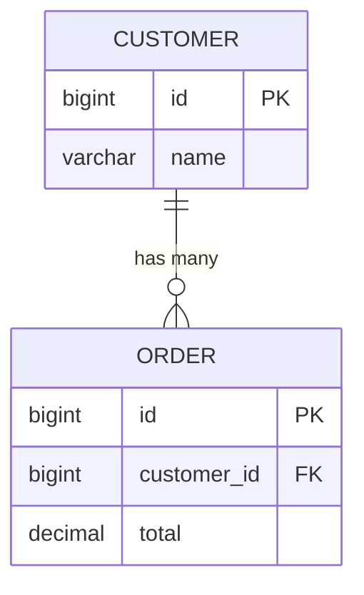
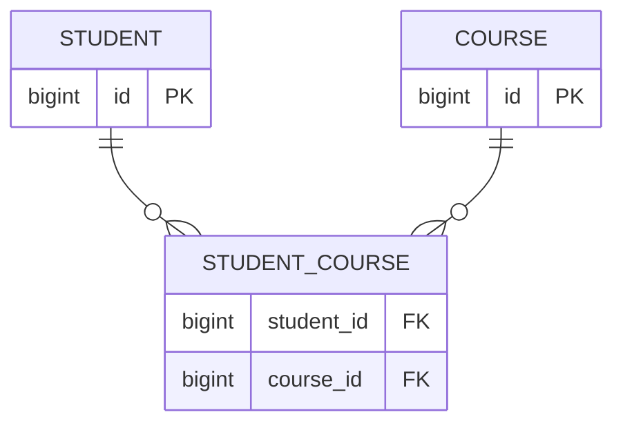
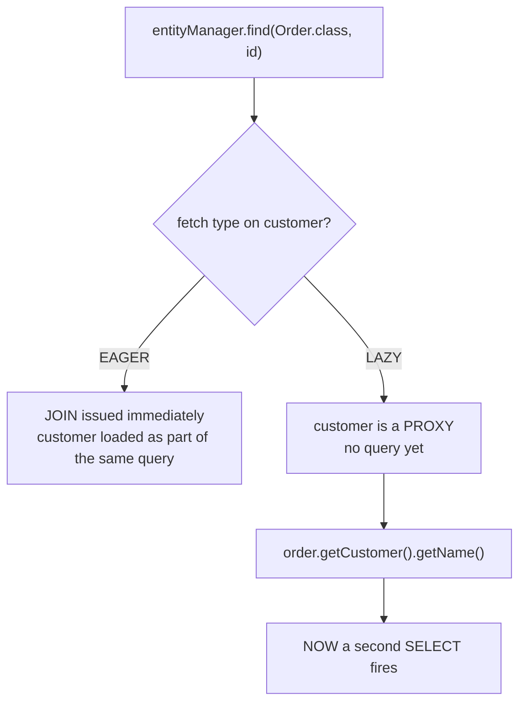

# Relationships: One-to-One, One-to-Many, Many-to-One, Many-to-Many

Relational databases model relationships via foreign keys and join tables.
JPA lets you express those same relationships as **object references**
between entities — but the mapping decisions you make (owning side,
fetch type, cascade) have real, sometimes surprising runtime consequences.

## Before → After: manual foreign key vs. object reference

**Before — raw JDBC, relationships are just foreign key columns you join
by hand:**

```java
// orders table has a customer_id column
String sql = "SELECT o.*, c.name AS customer_name FROM orders o " +
             "JOIN customers c ON o.customer_id = c.id WHERE o.id = ?";
// ... manually map the joined ResultSet into two separate objects
```

**After — JPA relationship annotation, navigate via `.getCustomer()`:**

```java
@Entity
public class Order {
    @Id @GeneratedValue
    private Long id;

    @ManyToOne
    @JoinColumn(name = "customer_id")
    private Customer customer;
}

Order order = entityManager.find(Order.class, 1L);
String name = order.getCustomer().getName();   // Hibernate issues the JOIN/second query for you
```

## Many-to-One / One-to-Many — the most common pair

These two always come together: one `Order` belongs to one `Customer`
(`@ManyToOne` on `Order`), and one `Customer` has many `Order`s
(`@OneToMany` on `Customer`). **The foreign key always lives on the "many"
side** — `orders.customer_id`, never the other way around.

```java
@Entity
public class Customer {
    @Id @GeneratedValue
    private Long id;

    @OneToMany(mappedBy = "customer", cascade = CascadeType.ALL, orphanRemoval = true)
    private List<Order> orders = new ArrayList<>();
}

@Entity
public class Order {
    @Id @GeneratedValue
    private Long id;

    @ManyToOne(fetch = FetchType.LAZY)
    @JoinColumn(name = "customer_id")
    private Customer customer;
}
```

`mappedBy = "customer"` on the `Customer` side says "I don't own this
relationship — look at the `customer` field on `Order` for the actual
foreign key." **`Order` is the owning side** (it has the `@JoinColumn`);
`Customer` is the inverse side, purely for convenient navigation.



## One-to-One

```java
@Entity
public class User {
    @Id @GeneratedValue
    private Long id;

    @OneToOne(cascade = CascadeType.ALL)
    @JoinColumn(name = "profile_id")   // owning side holds the FK
    private UserProfile profile;
}

@Entity
public class UserProfile {
    @Id @GeneratedValue
    private Long id;

    @OneToOne(mappedBy = "profile")
    private User user;
}
```

Used for splitting a wide/rarely-needed set of columns into a separate
table — e.g. `User` (hot, queried constantly) vs. `UserProfile` (bio,
avatar, preferences — loaded less often).

## Many-to-Many

**Before — a manual join table, queried by hand:**

```sql
-- student_course join table, no entity represents it directly in raw JDBC
SELECT c.* FROM courses c
JOIN student_course sc ON c.id = sc.course_id
WHERE sc.student_id = ?
```

**After — `@ManyToMany`, Hibernate manages the join table:**

```java
@Entity
public class Student {
    @Id @GeneratedValue
    private Long id;

    @ManyToMany
    @JoinTable(
        name = "student_course",
        joinColumns = @JoinColumn(name = "student_id"),
        inverseJoinColumns = @JoinColumn(name = "course_id"))
    private Set<Course> courses = new HashSet<>();
}

@Entity
public class Course {
    @Id @GeneratedValue
    private Long id;

    @ManyToMany(mappedBy = "courses")
    private Set<Student> students = new HashSet<>();
}
```



**Caveat specific to `@ManyToMany`:** if the join table needs its **own**
columns (e.g. `enrolled_date`, `grade`), a plain `@ManyToMany` can't
express that — you need to model the join table as its own `@Entity`
(e.g. `Enrollment`) with two `@ManyToOne`s. This is a very common
refactor once a "simple" many-to-many relationship grows metadata.

## Fetch types: `LAZY` vs `EAGER` — and the N+1 trap



**Before — `EAGER` everywhere "to be safe" (a very common mistake):**

```java
@ManyToOne(fetch = FetchType.EAGER)   // default for @ManyToOne/@OneToOne!
private Customer customer;

@OneToMany(mappedBy = "customer", fetch = FetchType.EAGER)   // dangerous default territory
private List<Order> orders;
```

Loading one `Customer` this way can cascade into loading *every order that
customer ever placed*, even when you only wanted the customer's name — for
a customer with 10,000 orders, that's one query that silently becomes
enormous.

**After — `LAZY` by default, fetch eagerly only where the access pattern
actually needs it:**

```java
@ManyToOne(fetch = FetchType.LAZY)
private Customer customer;

@OneToMany(mappedBy = "customer", fetch = FetchType.LAZY)
private List<Order> orders;
```

```java
// When you DO need the orders eagerly for a specific query, ask for them
// explicitly via JPQL JOIN FETCH, rather than changing the mapping's default:
@Query("SELECT c FROM Customer c JOIN FETCH c.orders WHERE c.id = :id")
Optional<Customer> findByIdWithOrders(@Param("id") Long id);
```

**The N+1 problem in practice:**

```java
List<Order> orders = orderRepository.findAll();   // 1 query
for (Order o : orders) {
    System.out.println(o.getCustomer().getName());   // LAZY customer: +1 query PER order
}
// Total: 1 + N queries, where N = number of orders — this is "N+1"
```

The fix is the `JOIN FETCH` pattern above, or Spring Data's
`@EntityGraph`, either of which collapses this back down to a single
query.

## Cascade types

`cascade = CascadeType.ALL` on a `@OneToMany`/`@OneToOne` means operations
on the parent (persist, remove, merge...) propagate to the children
automatically.

```java
@OneToMany(mappedBy = "customer", cascade = CascadeType.ALL, orphanRemoval = true)
private List<Order> orders = new ArrayList<>();

customerRepository.delete(customer);   // with CascadeType.ALL/REMOVE, also deletes all their orders
```

`orphanRemoval = true` goes further: **removing an order from the list**
(not just deleting the customer) deletes that order from the database too.

**Real advantage:** cascading turns "delete a customer and everything that
depends on them" from a multi-statement manual operation (or a database-
level `ON DELETE CASCADE`, which is invisible to your Java code and easy
to forget exists) into a single, visible-in-code `delete()` call.

**Caveat:** `CascadeType.ALL` on a `@ManyToMany` is almost always wrong —
deleting a `Student` shouldn't cascade-delete every `Course` they're
enrolled in, since other students are enrolled in those same courses.
Cascade settings need to match the actual ownership semantics of the
relationship, not just "make the compiler/runtime happy."

## Real advantages (overall)

- Relationships become **navigable object graphs** (`order.getCustomer()`)
  instead of manual joins re-written at every query site.
- Cascade and orphan removal express real domain rules (e.g. "an order
  line item cannot exist without its order") directly in the mapping,
  where the rest of the codebase can rely on them.

## Caveats (overall)

- **`EAGER` fetch types and forgotten `JOIN FETCH` are the single most
  common JPA performance bug** in real applications (the N+1 problem) —
  always default to `LAZY` and fetch eagerly only where profiling or a
  known access pattern justifies it.
- Bidirectional relationships (`mappedBy` on both sides) need careful
  handling of **both sides** when you add/remove an association — e.g.
  adding an `Order` to `customer.getOrders()` doesn't automatically set
  `order.setCustomer(customer)`; a well-designed entity adds a helper
  method (`customer.addOrder(order)`) that keeps both sides in sync,
  otherwise dirty checking can silently miss the change on the non-owning
  side.
