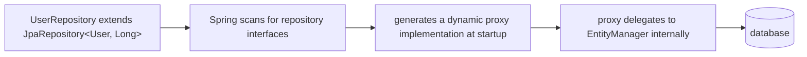
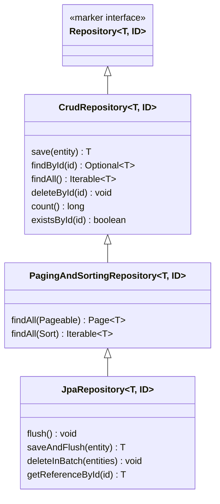

# Spring Data JPA — Repositories (CrudRepository, JpaRepository)

Even with JPA's boilerplate reduction (previous file), you'd still
hand-write a DAO class per entity with `EntityManager` calls for basic
CRUD. Spring Data JPA removes that layer too: you declare an **interface**,
and Spring generates the implementation at runtime via a dynamic proxy.

## Before → After: hand-written JPA DAO vs. a repository interface

**Before — a DAO using `EntityManager` directly (still boilerplate, even
with JPA):**

```java
@Repository
public class UserDao {
    @PersistenceContext
    private EntityManager entityManager;

    public User findById(Long id) {
        return entityManager.find(User.class, id);
    }

    public List<User> findAll() {
        return entityManager.createQuery("SELECT u FROM User u", User.class)
                .getResultList();
    }

    @Transactional
    public User save(User user) {
        if (user.getId() == null) {
            entityManager.persist(user);
            return user;
        }
        return entityManager.merge(user);
    }

    @Transactional
    public void deleteById(Long id) {
        User user = entityManager.find(User.class, id);
        if (user != null) {
            entityManager.remove(user);
        }
    }
}
```

Every entity in the system needs a near-identical class like this — same
`findById`, `findAll`, `save`, `delete` pattern, copy-pasted and adapted.

**After — a Spring Data repository interface, zero implementation code:**

```java
public interface UserRepository extends JpaRepository<User, Long> {
}
```

That's the entire class. `findById`, `findAll`, `save`, `deleteById`,
`count`, `existsById`, and more are all inherited — Spring generates a
proxy implementation at application startup.



## The repository interface hierarchy



- **`Repository<T, ID>`** — an empty marker interface; mostly used when you
  want to hand-pick only specific methods (see below).
- **`CrudRepository<T, ID>`** — the basic CRUD set: `save`, `findById`,
  `findAll`, `deleteById`, `count`, `existsById`.
- **`PagingAndSortingRepository<T, ID>`** — adds `findAll(Pageable)` and
  `findAll(Sort)` — covered in the [pagination & sorting file](05-pagination-sorting.md).
- **`JpaRepository<T, ID>`** — the one you'll use almost always; adds
  JPA-specific batch operations (`saveAndFlush`, `deleteInBatch`) on top
  of everything above.

**Practical rule:** extend `JpaRepository<T, ID>` unless you have a
specific reason to expose a narrower interface (e.g. a read-only service
that should only ever see `findById`/`findAll`, never `save`/`delete` —
extend `Repository<T, ID>` directly and declare only the methods you want,
so the compiler enforces the restriction).

## What you get for free

```java
public interface UserRepository extends JpaRepository<User, Long> {
}

// Usage — no implementation written anywhere:
User saved = userRepository.save(new User("Alice", "alice@x.com"));   // INSERT or UPDATE
Optional<User> found = userRepository.findById(1L);                    // SELECT by PK
List<User> all = userRepository.findAll();                              // SELECT *
long total = userRepository.count();                                    // SELECT COUNT(*)
userRepository.deleteById(1L);                                          // DELETE by PK
boolean exists = userRepository.existsById(1L);                         // SELECT EXISTS(...)
```

`save()` is smart about insert vs. update: if the entity's `@Id` is
`null` (or, for a manually-assigned ID, if `existsById` says it's new),
Spring Data issues an `INSERT`; otherwise it `merge()`s, issuing an
`UPDATE`.

## Before → After: transaction boilerplate

**Before — every write operation needs explicit transaction handling:**

```java
@Transactional
public User createUser(String name, String email) {
    User user = new User(name, email);
    return entityManager.merge(user);
}
```

Forgetting `@Transactional` on a write method is a classic bug — writes
either fail outright or (worse) silently don't persist, depending on
`EntityManager` configuration.

**After — Spring Data repository methods are already transactional:**

```java
userRepository.save(new User("Alice", "alice@x.com"));
// no @Transactional needed here — the repository's save() method
// is already annotated @Transactional internally (SimpleJpaRepository)
```

You still need `@Transactional` on **your own service methods** when a
single business operation spans multiple repository calls that must
succeed or fail together — that's covered in the Transactions section
later in the course — but you don't need it just to call `save()` once.

## Real advantages

- **Near-zero boilerplate for standard CRUD.** One interface declaration
  replaces an entire hand-written DAO class per entity — across a
  50-entity application, that's 50 fewer near-identical classes to write,
  test, and maintain.
- **Consistency.** Every repository behaves the same way (same method
  names, same transactional behavior, same exception translation from
  JDBC/Hibernate exceptions into Spring's `DataAccessException` hierarchy)
  because they're all generated from the same proxy machinery — no
  drift between hand-written DAOs written by different people at
  different times.
- **Still an escape hatch.** You're never locked out of custom JPQL,
  native SQL, or `Specification`-based dynamic queries — those layer on
  top of the same interface (covered in the next two files).

## Caveats

- **Magic has a learning cost.** Because there's no implementation class
  to `Cmd+click` into, understanding *why* `findByEmailAndActiveTrue(...)`
  works at all requires knowing Spring Data's method-name-parsing
  convention (next file) — it's not discoverable from reading the
  interface alone without that background.
- **`getReferenceById` vs `findById`** is a subtle, easy-to-misuse
  distinction: `findById` executes a `SELECT` immediately and returns
  `Optional.empty()` if missing; `getReferenceById` returns a **lazy
  proxy** without querying the database at all, and throws
  `EntityNotFoundException` only when you actually access a field on it.
  Using `getReferenceById` where you actually need the real data (not
  just a reference to attach to another entity) is a common source of
  confusing, delayed exceptions.
- Extending `JpaRepository` on every entity by default, even ones that
  should be read-only from certain layers of your app, can make it too
  easy to call `.deleteById(...)` somewhere it shouldn't be — worth
  considering narrower `Repository<T, ID>` interfaces for sensitive
  entities.
