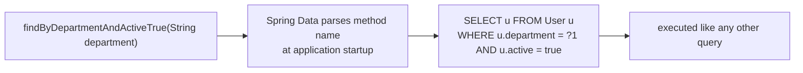
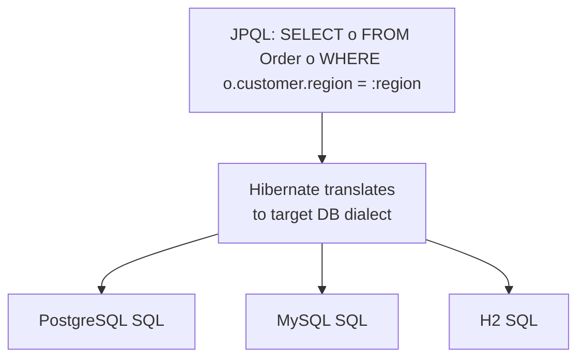
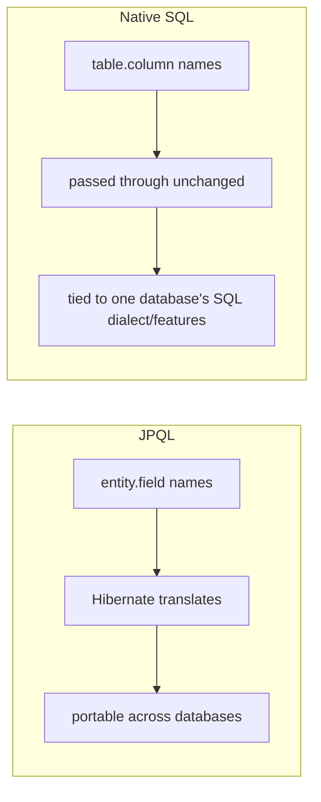
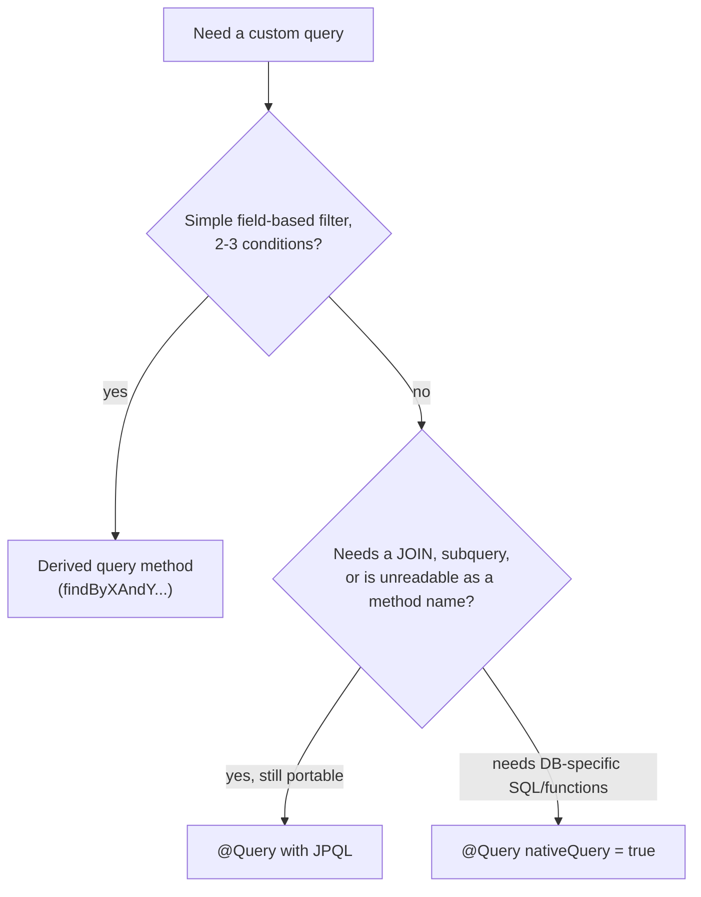

# Query Methods, @Query, Native vs. JPQL

`JpaRepository` gives you CRUD for free, but almost every real application
needs custom queries — "find active users in a department," "find orders
over $1000 placed last week." Spring Data JPA gives you three escalating
ways to write these, trading convenience for control as your query gets
more complex.

## Before → After: hand-written JPQL query vs. a derived query method

**Before — explicit `EntityManager` query, written by hand:**

```java
public List<User> findActiveUsersByDepartment(String department) {
    return entityManager.createQuery(
                "SELECT u FROM User u WHERE u.department = :dept AND u.active = true",
                User.class)
            .setParameter("dept", department)
            .getResultList();
}
```

**After — Spring Data derives the same query from the method name:**

```java
public interface UserRepository extends JpaRepository<User, Long> {
    List<User> findByDepartmentAndActiveTrue(String department);
}
```

No query written anywhere — Spring Data parses the method name at startup
(`findBy` + `Department` + `And` + `ActiveTrue`), maps each part to an
entity field, and generates the exact JPQL shown above.



## Query method keyword vocabulary

| Keyword | Example method | Generates |
|---|---|---|
| `findBy` | `findByEmail(String email)` | `WHERE email = ?` |
| `And` / `Or` | `findByNameAndActive(...)` | `WHERE name = ? AND active = ?` |
| `Between` | `findByAgeBetween(int min, int max)` | `WHERE age BETWEEN ? AND ?` |
| `LessThan`/`GreaterThan` | `findByPriceGreaterThan(BigDecimal p)` | `WHERE price > ?` |
| `Like` / `Containing` | `findByNameContaining(String s)` | `WHERE name LIKE %?%` |
| `In` | `findByStatusIn(List<Status> s)` | `WHERE status IN (?)` |
| `OrderBy` | `findByActiveTrueOrderByNameAsc()` | adds `ORDER BY name ASC` |
| `IsNull` / `IsNotNull` | `findByDeletedAtIsNull()` | `WHERE deleted_at IS NULL` |
| `Top`/`First` | `findTop5ByOrderByCreatedAtDesc()` | `ORDER BY ... LIMIT 5` |
| `Distinct` | `findDistinctByDepartment(...)` | adds `DISTINCT` |
| `Count`/`Exists` | `countByActiveTrue()` | `SELECT COUNT(*) WHERE ...` |

```java
public interface OrderRepository extends JpaRepository<Order, Long> {
    List<Order> findByCustomerIdAndStatusOrderByCreatedAtDesc(Long customerId, OrderStatus status);
    List<Order> findByTotalGreaterThanEqual(BigDecimal amount);
    boolean existsByCustomerIdAndStatus(Long customerId, OrderStatus status);
    long countByStatus(OrderStatus status);
}
```

**Where derived queries stop making sense:** once a method name needs 5+
keywords chained together (`findByStatusAndCustomerRegionAndCreatedAtBetweenOrderByTotalDesc`),
it becomes harder to read than the JPQL it generates. That's the signal to
switch to `@Query`.

## `@Query` with JPQL — explicit control, still database-portable

**Before — an unreadable derived-query method name:**

```java
List<Order> findByStatusAndCustomer_RegionAndCreatedAtBetween(
        OrderStatus status, String region, LocalDateTime from, LocalDateTime to);
```

**After — the same query, readable as JPQL:**

```java
@Query("""
        SELECT o FROM Order o
        WHERE o.status = :status
          AND o.customer.region = :region
          AND o.createdAt BETWEEN :from AND :to
        """)
List<Order> findRegionalOrders(
        @Param("status") OrderStatus status,
        @Param("region") String region,
        @Param("from") LocalDateTime from,
        @Param("to") LocalDateTime to);
```

Notice this queries `o.customer.region` — JPQL navigates the **object
graph** (entity fields and their relationships) using entity/field names,
not table/column names. This is JPQL's core distinction from SQL: it's
database-agnostic, translated to the target dialect's SQL by Hibernate.



## `@Query` with native SQL — full database power, no portability

Sometimes you need something JPQL can't express — a database-specific
function, a complex window function, a query tuned around a specific
index.

```java
@Query(value = """
        SELECT * FROM orders o
        WHERE o.total > (
            SELECT AVG(total) FROM orders WHERE customer_id = o.customer_id
        )
        """, nativeQuery = true)
List<Order> findAboveCustomerAverage();
```

`nativeQuery = true` tells Spring Data this is **raw SQL against actual
table/column names**, not JPQL against entity/field names. Hibernate
passes it straight through to the database driver, unmodified.



### Modifying queries — `@Modifying`

`SELECT`-shaped `@Query` methods return entities/collections. `UPDATE` and
`DELETE` queries need an extra annotation:

```java
@Modifying
@Transactional
@Query("UPDATE Order o SET o.status = :status WHERE o.id = :id")
int updateStatus(@Param("id") Long id, @Param("status") OrderStatus status);
```

`@Modifying` tells Spring Data this isn't a `SELECT` — without it, Spring
Data tries to interpret an `UPDATE`/`DELETE` JPQL string as a result-
returning query and throws an exception. The return value (`int`) is the
number of rows affected, mirroring `PreparedStatement.executeUpdate()`.

## Choosing between the three approaches



## Real advantages

- **Derived queries eliminate the most common category of query code
  entirely** — no query string to write, review, or accidentally get
  wrong, for the majority of simple lookups an application needs.
- **JPQL keeps you database-portable** while still giving you full control
  over joins, subqueries, and projections that a derived method name can't
  express.
- **Native SQL is always there as an escape hatch** — you're never stuck
  fighting the abstraction when you genuinely need a database-specific
  feature (e.g. PostgreSQL's `JSONB` operators, a recursive CTE).

## Caveats

- **Derived query names are validated at startup, not compile time.** A
  typo (`findByDeprtment` instead of `findByDepartment`) fails when the
  application context loads, not when you save the file — always run the
  app (or tests that load the context) after adding one.
- **Native queries bypass JPQL's portability and, more importantly, can
  bypass the persistence context.** A native `UPDATE`/`DELETE` doesn't
  automatically sync in-memory managed entities with what changed in the
  database — you can end up with stale entity state in the same
  transaction unless you're careful (`entityManager.clear()` or refetch).
- **`@Query` string literals aren't refactoring-safe** the way a derived
  method name partially is — renaming an entity field means manually
  finding and updating every JPQL string that references it (IDEs with
  JPA support can help, but it's not as safe as a pure Java rename).
