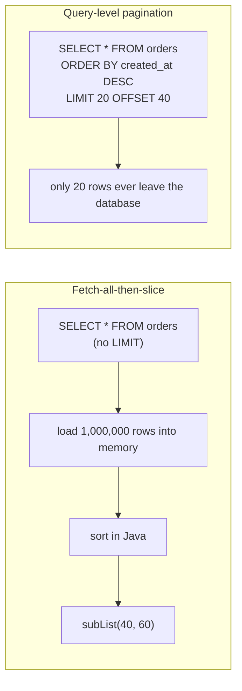
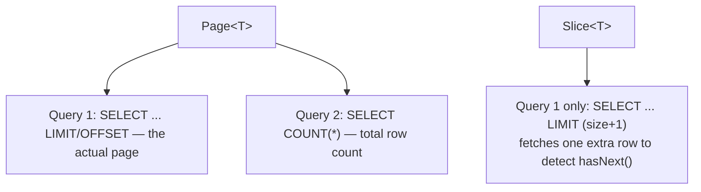
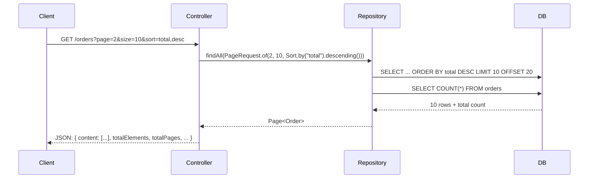

# Pagination & Sorting

Returning an entire table in one response doesn't scale — a `findAll()`
against a million-row `orders` table will exhaust memory, blow past
reasonable response times, and send an unusably large payload to the
client. Pagination and sorting solve this at the query level, not by
fetching everything and slicing it in Java.

## Before → After: fetch-everything-then-slice vs. query-level pagination

**Before — load the entire table, paginate in application memory:**

```java
public List<Order> getOrdersPage(int page, int size) {
    List<Order> allOrders = orderRepository.findAll();   // loads EVERY row into memory
    allOrders.sort(Comparator.comparing(Order::getCreatedAt).reversed());
    int fromIndex = page * size;
    int toIndex = Math.min(fromIndex + size, allOrders.size());
    return allOrders.subList(fromIndex, toIndex);
}
```

This fetches and sorts the **entire table** on every request, just to
throw away everything except 20 rows. For a large table, this is both
slow and a memory-usage time bomb.

**After — `Pageable`, sorting and limiting happen in the database:**

```java
public interface OrderRepository extends JpaRepository<Order, Long> {
}

Pageable pageable = PageRequest.of(page, size, Sort.by("createdAt").descending());
Page<Order> ordersPage = orderRepository.findAll(pageable);
```

`JpaRepository` already extends `PagingAndSortingRepository`, so
`findAll(Pageable)` is available with zero extra code — Spring Data
translates it into `ORDER BY ... LIMIT ... OFFSET ...` (or the
database's equivalent) so only the requested page is ever fetched.



## `Pageable` and `Page<T>`

```java
Pageable pageable = PageRequest.of(
        0,                              // page index, ZERO-based
        20,                             // page size
        Sort.by("lastName").ascending().and(Sort.by("firstName").ascending()));

Page<User> page = userRepository.findAll(pageable);

page.getContent();          // List<User> — the actual 20 (or fewer) rows
page.getTotalElements();    // total matching rows across ALL pages (a separate COUNT query)
page.getTotalPages();       // ceil(totalElements / pageSize)
page.hasNext();             // is there a page after this one?
page.getNumber();           // current page index
```

**Important:** `Page<T>` issues **two queries** under the hood — one for
the actual data (`SELECT ... LIMIT ... OFFSET ...`) and one `SELECT
COUNT(*)` to compute `getTotalElements()`. If you don't need the total
count (e.g. an infinite-scroll UI that just needs "is there more?"), use
`Slice<T>` instead:

```java
Slice<User> slice = userRepository.findByActiveTrue(pageable);
slice.hasNext();   // knows this WITHOUT a separate COUNT query — cheaper
```



## Combining with derived and custom queries

Pagination composes with everything from the previous file — just add a
`Pageable` parameter:

```java
public interface OrderRepository extends JpaRepository<Order, Long> {

    // Derived query + pagination
    Page<Order> findByCustomerId(Long customerId, Pageable pageable);

    // @Query + pagination — Spring Data appends LIMIT/OFFSET automatically
    @Query("SELECT o FROM Order o WHERE o.total > :minTotal")
    Page<Order> findLargeOrders(@Param("minTotal") BigDecimal minTotal, Pageable pageable);
}
```

## Before → After: exposing pagination through a REST endpoint

**Before — the controller hard-codes a fixed batch, no client control:**

```java
@GetMapping("/orders")
public List<Order> getOrders() {
    return orderRepository.findAll();   // always everything, always unsorted
}
```

**After — the client controls page/size/sort via query parameters:**

```java
@GetMapping("/orders")
public Page<Order> getOrders(
        @RequestParam(defaultValue = "0") int page,
        @RequestParam(defaultValue = "20") int size,
        @RequestParam(defaultValue = "createdAt,desc") String sort) {

    String[] sortParts = sort.split(",");
    Sort.Direction direction = Sort.Direction.fromString(sortParts[1]);
    Pageable pageable = PageRequest.of(page, size, Sort.by(direction, sortParts[0]));

    return orderRepository.findAll(pageable);
}
// GET /orders?page=2&size=10&sort=total,desc
```

Spring MVC can also resolve `Pageable` directly as a controller method
parameter (`Pageable pageable` with no manual parsing) when
`spring-data-web` is on the classpath — the manual version above is shown
to make the mechanics explicit.



## Real advantages

- **The database does what it's good at** — filtering, sorting, and
  limiting at the storage layer, using indexes, instead of the JVM doing
  it after loading everything into memory.
- **Consistent pagination contract across the whole app.** Every
  repository gets `Pageable`/`Page<T>` support automatically, so every
  endpoint that lists something can expose pagination the same way — no
  bespoke "page" logic reinvented per controller.
- **`Page<T>` gives the client everything needed to build pagination
  UI** (`totalPages`, `hasNext`, current page) in one response, without a
  separate count endpoint.

## Caveats

- **Deep offset pagination (`OFFSET 100000`) is slow** on large tables —
  the database still has to scan and discard the first 100,000 rows even
  though it returns none of them. For very large datasets or infinite
  scroll, **keyset/cursor-based pagination** (`WHERE created_at < :lastSeenTimestamp
  ORDER BY created_at DESC LIMIT 20`) scales far better than `OFFSET`, at
  the cost of not supporting "jump to page 50" UIs.
- **`Page<T>`'s count query can itself be expensive** on a large,
  unindexed, or heavily filtered table — if you don't need the total, use
  `Slice<T>` or a cursor-based approach instead of paying for a `COUNT(*)`
  on every single request.
- Sorting on a field with **no database index** forces a full sort of the
  matching rows on every request — for frequently-sorted large tables,
  make sure the sort column is indexed.
