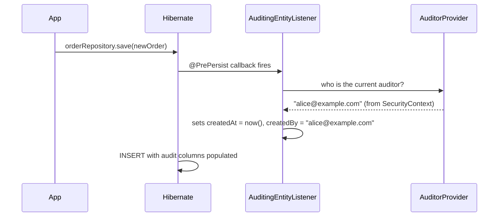
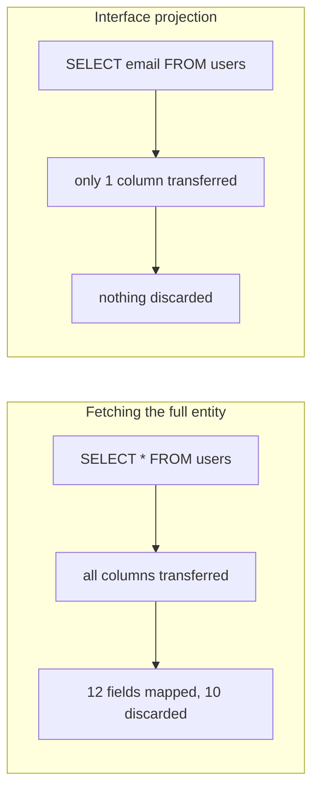
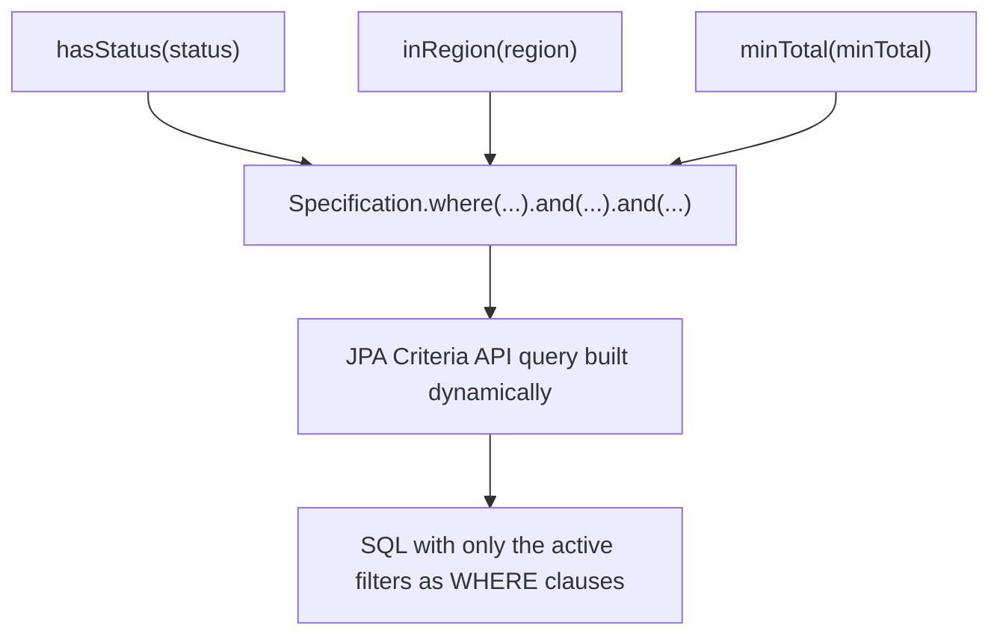

# Auditing, Projections, Specifications

Three features that solve three unrelated problems, but all show up
constantly in real Spring Data applications: automatically tracking
who/when changed a row, fetching only the columns you actually need, and
building queries whose filters vary at runtime.

## Auditing — who created/modified this, and when

**Before — manually setting timestamps and users on every save:**

```java
@PrePersist
public void onCreate() {
    this.createdAt = LocalDateTime.now();
    this.createdBy = SecurityContextHolder.getContext().getAuthentication().getName();
}

@PreUpdate
public void onUpdate() {
    this.updatedAt = LocalDateTime.now();
    this.updatedBy = SecurityContextHolder.getContext().getAuthentication().getName();
}
```

Every entity that needs auditing repeats this same pair of lifecycle
callbacks, with the same bug risk (forgetting to add them to a new entity,
or getting `@PrePersist` vs `@PreUpdate` semantics slightly wrong).

**After — Spring Data JPA auditing annotations, declared once, reused
everywhere:**

```java
@Configuration
@EnableJpaAuditing
public class JpaConfig {
    @Bean
    public AuditorAware<String> auditorProvider() {
        return () -> Optional.ofNullable(SecurityContextHolder.getContext().getAuthentication())
                .map(Authentication::getName);
    }
}
```

```java
@MappedSuperclass
@EntityListeners(AuditingEntityListener.class)
public abstract class Auditable {
    @CreatedDate
    private LocalDateTime createdAt;

    @LastModifiedDate
    private LocalDateTime updatedAt;

    @CreatedBy
    private String createdBy;

    @LastModifiedBy
    private String updatedBy;
}

@Entity
public class Order extends Auditable {
    @Id @GeneratedValue
    private Long id;
    // no auditing fields to declare here — inherited, and auto-populated
}
```

Every entity that extends `Auditable` gets all four fields populated
automatically, with zero repeated logic.



**Real advantage:** auditing logic (the *what* — timestamp/user tracking)
is declared **once**, in `Auditable`, and reused via inheritance —
consistent behavior across every entity, and a single place to fix a bug
or add a field (e.g. `@Version` for optimistic locking) instead of N
places.

## Projections — fetching only what you need

Loading a full entity when you only need two of its twelve fields wastes
both the query bandwidth and the mapping work.

**Before — fetch the entire entity just to read one field:**

```java
List<User> users = userRepository.findAll();
List<String> emails = users.stream().map(User::getEmail).toList();
// SELECT pulled EVERY column for EVERY user, just to discard all but email
```

**After — an interface-based projection, Spring Data generates a query
selecting only the needed columns:**

```java
public interface EmailOnly {
    String getEmail();
}

public interface UserRepository extends JpaRepository<User, Long> {
    List<EmailOnly> findByActiveTrue();
}

List<String> emails = userRepository.findByActiveTrue().stream()
        .map(EmailOnly::getEmail)
        .toList();
```

Spring Data generates `SELECT u.email FROM users u WHERE u.active = true`
— the `name`, `address`, and every other column never leave the database.



**DTO (class-based) projections** work similarly but via a constructor
expression, and are useful when you want a concrete, testable return type
rather than a proxy-backed interface:

```java
public record UserSummary(String name, String email) { }

@Query("SELECT new com.example.UserSummary(u.name, u.email) FROM User u WHERE u.active = true")
List<UserSummary> findActiveUserSummaries();
```

Records (from the Core Java section) are a natural fit for DTO
projections — immutable, no boilerplate, and the constructor expression
maps directly onto the record's canonical constructor.

## Specifications — dynamic, composable query filters

Search/filter screens ("filter by status AND region AND date range, all
optional") don't fit derived query methods or a single fixed `@Query` —
the set of active filters varies per request.

**Before — a giant if-chain building a query string by hand (SQL injection
risk if not parameterized carefully, and painful to maintain):**

```java
StringBuilder jpql = new StringBuilder("SELECT o FROM Order o WHERE 1=1");
Map<String, Object> params = new HashMap<>();

if (status != null) {
    jpql.append(" AND o.status = :status");
    params.put("status", status);
}
if (region != null) {
    jpql.append(" AND o.customer.region = :region");
    params.put("region", region);
}
if (minTotal != null) {
    jpql.append(" AND o.total >= :minTotal");
    params.put("minTotal", minTotal);
}
TypedQuery<Order> query = entityManager.createQuery(jpql.toString(), Order.class);
params.forEach(query::setParameter);
List<Order> results = query.getResultList();
```

This works, but string-building JPQL by hand is fragile, easy to get
wrong, and gets uglier with every additional optional filter.

**After — `Specification<T>`, filters compose as type-safe predicates:**

```java
public interface OrderRepository extends JpaRepository<Order, Long>, JpaSpecificationExecutor<Order> {
}

public class OrderSpecifications {
    public static Specification<Order> hasStatus(OrderStatus status) {
        return (root, query, cb) -> status == null ? null : cb.equal(root.get("status"), status);
    }

    public static Specification<Order> inRegion(String region) {
        return (root, query, cb) -> region == null ? null
                : cb.equal(root.get("customer").get("region"), region);
    }

    public static Specification<Order> minTotal(BigDecimal minTotal) {
        return (root, query, cb) -> minTotal == null ? null
                : cb.greaterThanOrEqualTo(root.get("total"), minTotal);
    }
}
```

```java
Specification<Order> spec = Specification
        .where(OrderSpecifications.hasStatus(status))
        .and(OrderSpecifications.inRegion(region))
        .and(OrderSpecifications.minTotal(minTotal));

List<Order> results = orderRepository.findAll(spec);
```

Each `Specification` returns `null` when its filter isn't active, and
Spring Data's `Specification.and()` skips `null` predicates automatically
— so the exact same composition code produces a query with only the
filters actually requested, with no manual `if` branching over query
string construction.



## Real advantages

- **Auditing centralizes cross-cutting bookkeeping** that would otherwise
  be copy-pasted (and drift out of sync) across every entity.
- **Projections cut both query cost and transferred data** for read-heavy
  endpoints that don't need a full entity — a meaningful, measurable
  optimization on wide tables or high-traffic list endpoints.
- **Specifications solve dynamic filtering without string concatenation**
  — each filter is an independent, testable, reusable unit, composed
  declaratively instead of built up through branching logic.

## Caveats

- **`@EnableJpaAuditing` + `@CreatedBy`/`@LastModifiedBy` need a working
  `AuditorAware` bean** — a common setup mistake is adding the annotations
  without configuring `AuditorAware`, which leaves those fields silently
  `null` instead of failing loudly.
- **Interface projections are proxies, not real objects** — they can't be
  used outside the request/transaction that created them in the same way
  a plain DTO can, and calling anything beyond the declared getters isn't
  supported. Prefer DTO (record) projections when you need a genuinely
  standalone, serializable value.
- **The Criteria API behind `Specification` is verbose and stringly-typed
  on field names** (`root.get("status")` isn't checked against the entity
  at compile time) — for very complex dynamic queries, consider a
  type-safe alternative like the JPA Metamodel (`Order_.status`, generated
  by an annotation processor) or a query-building library, rather than
  raw string field names scattered across many `Specification`s.
