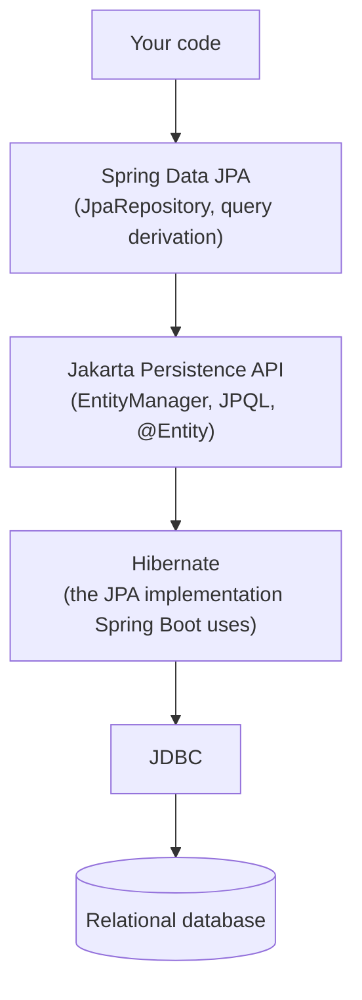

# Jakarta Persistence & Spring Data

How Java objects get mapped to relational tables, and how Spring Data
removes almost all of the repetitive DAO code that used to sit between an
entity and a database.

## Topics

1. [JPA — entities & mappings](01-jpa-entities-mappings.md)
2. [Relationships — 1:1, 1:N, N:1, N:M](02-relationships.md)
3. [Spring Data JPA repositories](03-spring-data-jpa-repositories.md)
4. [Query methods, @Query, native vs JPQL](04-query-methods-native-vs-jpql.md)
5. [Pagination & sorting](05-pagination-sorting.md)
6. [Auditing, projections, specifications](06-auditing-projections-specifications.md)

## The stack, top to bottom

**JPA is a specification** (interfaces and annotations — `@Entity`,
`EntityManager`, JPQL). **Hibernate is the implementation** Spring Boot
wires in by default. **Spring Data JPA is a layer on top of both** that
generates repository implementations so you rarely touch `EntityManager`
directly. Each file below sits at a different level of that stack.
