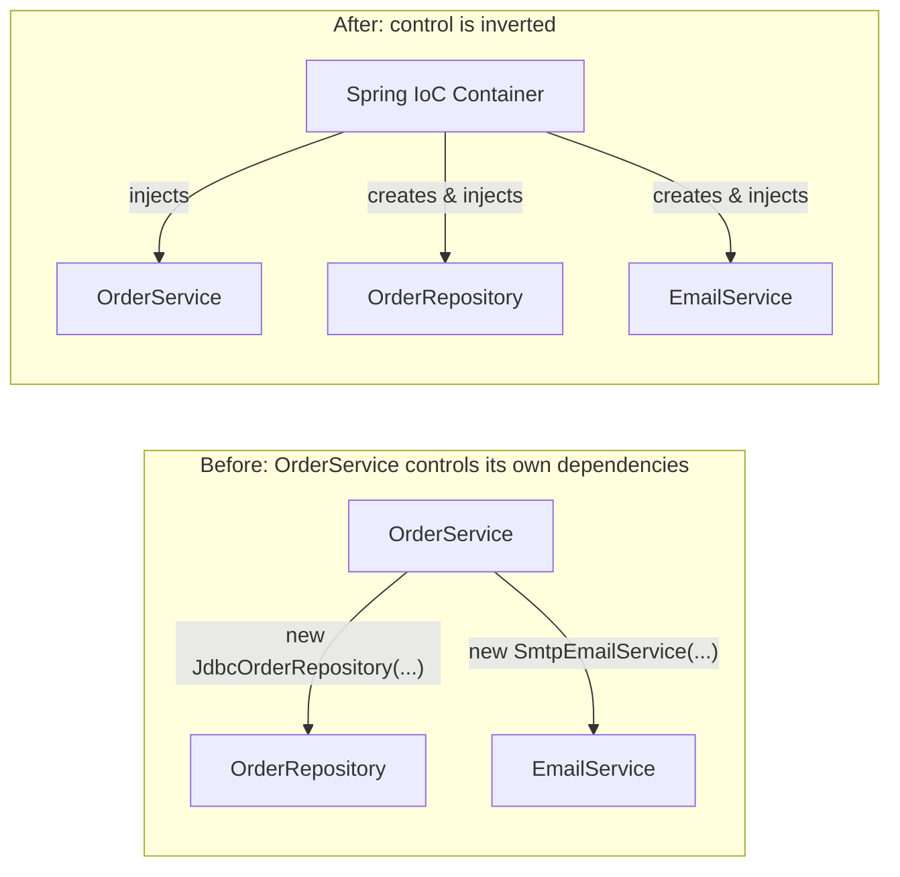
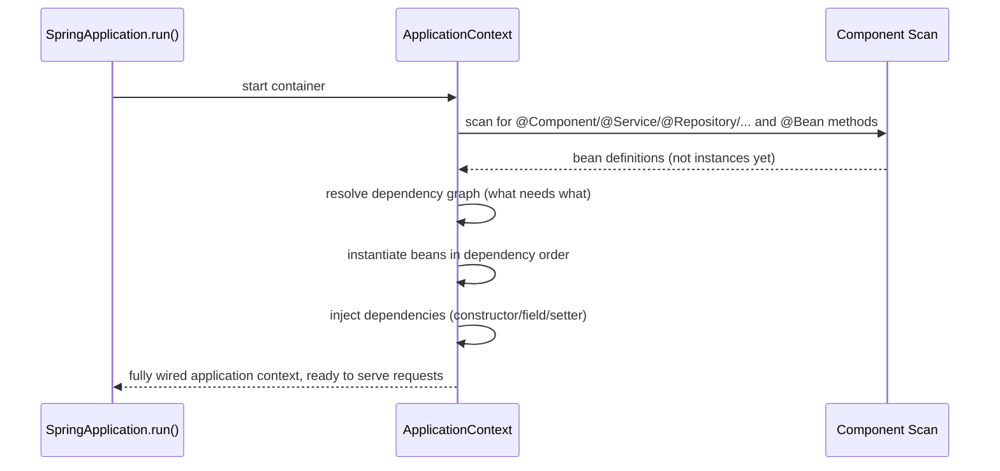

# Dependency Injection & Inversion of Control

**Inversion of Control (IoC)** is the principle: instead of your code
creating and wiring the objects it depends on, a container does it for
you, and hands you the finished objects. **Dependency Injection (DI)** is
the specific *mechanism* Spring uses to achieve IoC — passing dependencies
in (via constructor, field, or setter) rather than having a class reach
out and construct or locate them itself.

## Before → After: manual object wiring vs. injected dependencies

**Before — no framework, every class constructs its own dependencies:**

```java
public class OrderService {
    private final OrderRepository orderRepository;
    private final EmailService emailService;

    public OrderService() {
        // OrderService now knows HOW to build a JdbcOrderRepository,
        // a DataSource, an EmailService, an SMTP client...
        DataSource dataSource = new HikariDataSource(buildHikariConfig());
        this.orderRepository = new JdbcOrderRepository(dataSource);
        this.emailService = new SmtpEmailService("smtp.example.com", 587);
    }
}
```

`OrderService` is tightly coupled to *concrete* implementations
(`JdbcOrderRepository`, `SmtpEmailService`) and to *how to construct them*
(connection pool config, SMTP host/port). Testing this class means either
hitting a real database and SMTP server, or restructuring the class just
to make testing possible.

**After — dependencies are injected, `OrderService` only knows about
interfaces:**

```java
@Service
public class OrderService {
    private final OrderRepository orderRepository;
    private final EmailService emailService;

    public OrderService(OrderRepository orderRepository, EmailService emailService) {
        this.orderRepository = orderRepository;
        this.emailService = emailService;
    }
}
```

`OrderService` no longer knows or cares *how* an `OrderRepository` or
`EmailService` gets built — it just declares what it needs in its
constructor, and the Spring container supplies concrete implementations
at startup.



That arrow reversal — dependencies flowing *in* from a container instead
of being reached for by the class itself — is what "inversion of control"
literally refers to: control over object creation is inverted from the
class to an external container.

## The three injection styles

```java
// 1. Constructor injection — RECOMMENDED
@Service
public class OrderService {
    private final OrderRepository orderRepository;

    public OrderService(OrderRepository orderRepository) {   // @Autowired optional on a single constructor
        this.orderRepository = orderRepository;
    }
}

// 2. Field injection — common in old tutorials, generally discouraged now
@Service
public class OrderService {
    @Autowired
    private OrderRepository orderRepository;
}

// 3. Setter injection — for optional dependencies
@Service
public class OrderService {
    private NotificationService notificationService;   // optional

    @Autowired(required = false)
    public void setNotificationService(NotificationService notificationService) {
        this.notificationService = notificationService;
    }
}
```

**Why constructor injection is preferred:**

| | Constructor | Field | Setter |
|---|---|---|---|
| Fields can be `final` (immutable) | Yes | No | No |
| Fails fast if a dependency is missing | Yes — won't compile/construct | No — `NullPointerException` later, at first use | No |
| Testable without Spring/reflection | Yes — `new OrderService(mockRepo)` | No — needs reflection or a Spring test context | Yes, but requires calling setters manually |
| Circular dependencies are caught | Yes — fails at startup | No — Spring can often paper over these with proxies | No |

**Real advantage of constructor injection:** it makes "this class cannot
exist in a valid state without X" a **compiler-enforced fact**, not a
runtime hope. If `OrderRepository` is missing from the container, the app
fails at startup, in an obvious place — not three weeks later when some
code path finally calls the null field.

## The IoC container: `ApplicationContext`



The `ApplicationContext` is the actual IoC container: it reads bean
definitions (from component scanning or `@Bean` methods — next file),
figures out the dependency graph, and instantiates/wires everything in the
correct order — a `UserService` that depends on `UserRepository` is
guaranteed to have a fully-constructed `UserRepository` available before
`UserService` itself is built.

## Dependency Injection vs. the Service Locator pattern

DI is often contrasted with an older alternative for achieving loose
coupling: the **Service Locator** pattern.

**Service Locator (an alternative to DI, generally considered inferior
today):**

```java
public class OrderService {
    private final OrderRepository orderRepository =
            ServiceLocator.getInstance().lookup(OrderRepository.class);
    // dependency is HIDDEN inside the method body — not visible from the
    // constructor/class signature at all
}
```

The class still doesn't construct its dependency directly (some inversion
of control is happening), but the dependency is **hidden** — you have to
read the implementation to discover what `OrderService` actually needs,
and there's no compile-time or startup-time check that the locator
actually has an `OrderRepository` registered.

DI's advantage: dependencies are declared in the **constructor signature**
— visible, explicit, and checkable by both the compiler and the container
at startup.

## Real advantages

- **Testability.** Constructor-injected classes can be instantiated
  directly in unit tests with hand-built or mocked dependencies — no
  Spring context needed at all for pure unit tests.
- **Loose coupling to interfaces, not implementations.** Swapping
  `SmtpEmailService` for `SesEmailService` means changing one `@Bean`
  definition, not hunting down every `new SmtpEmailService()` call site.
- **Fail-fast configuration errors.** A missing or ambiguous dependency
  surfaces as a startup exception with a clear message
  (`NoSuchBeanDefinitionException`, `NoUniqueBeanDefinitionException`),
  not a runtime `NullPointerException` deep in a request-handling code
  path.

## Caveats

- **Circular dependencies** (`A` needs `B`, `B` needs `A`) are a design
  smell DI surfaces loudly (a startup failure with constructor injection)
  rather than silently allowing — that's a feature, but it does mean you
  need to actually restructure the code (usually by extracting a third
  class, or using setter injection to break the cycle) rather than just
  suppressing the error.
- DI doesn't eliminate the need to think about **object lifetimes and
  scope** — see the [bean lifecycle & scopes file](03-bean-lifecycle-scopes.md)
  for what happens when, e.g., a singleton service is injected with a
  request-scoped dependency.
- Overusing field injection (`@Autowired private X x;`) throughout a
  codebase, despite being "quicker to type," accumulates real technical
  debt: harder-to-test classes and hidden dependency graphs that only
  reveal themselves at runtime.
