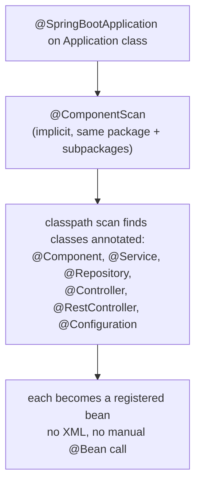
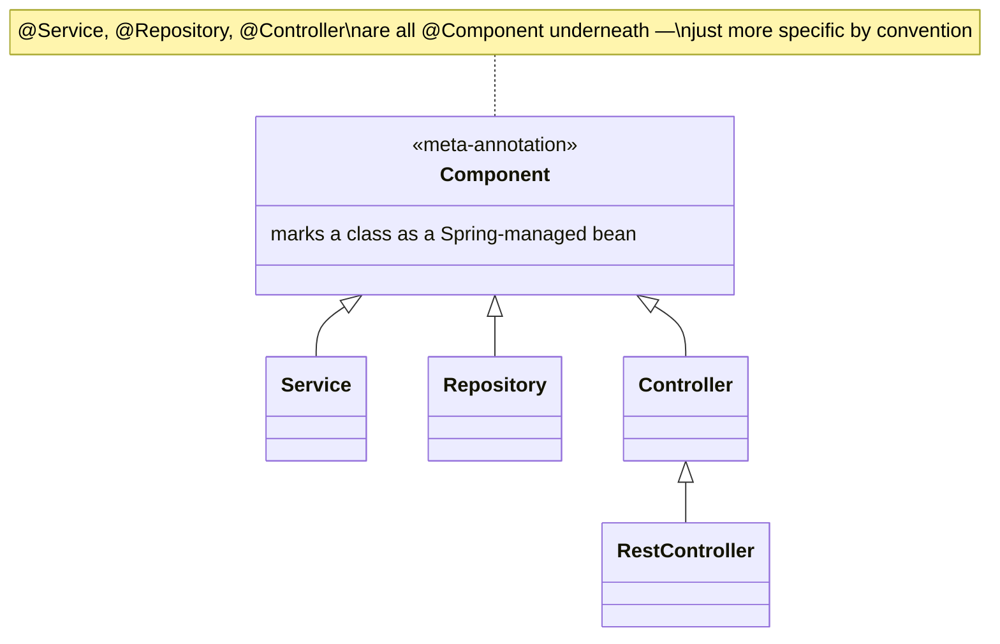
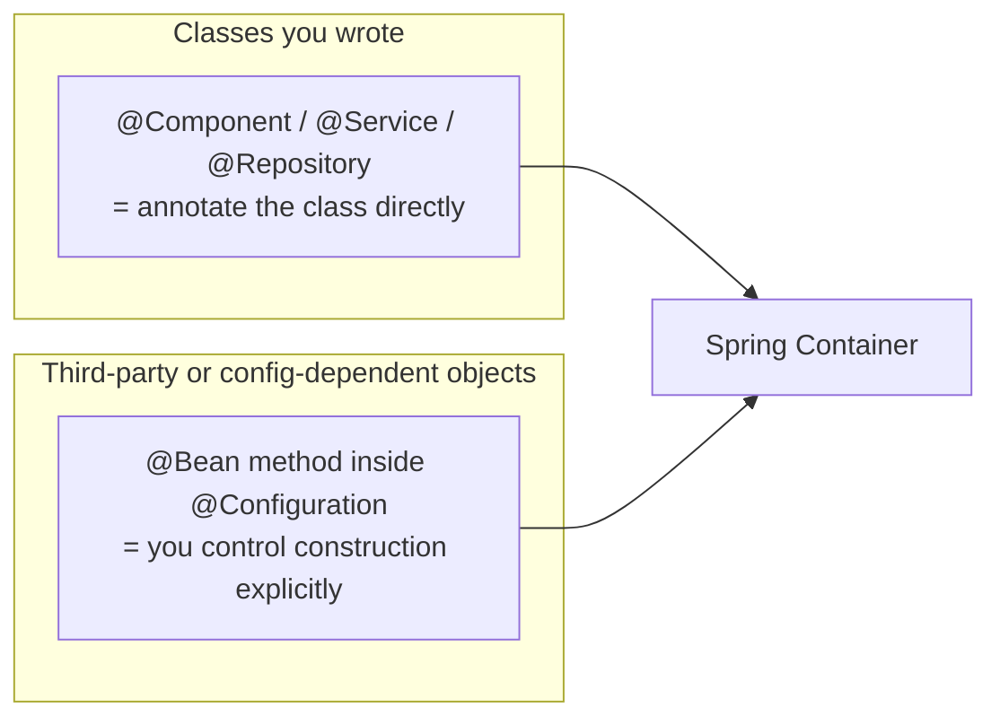

# Component Scanning & Stereotype Annotations

Dependency injection (previous file) needs the container to know *which*
classes should become beans in the first place. Component scanning is how
Spring discovers them — by walking the classpath for classes annotated
with specific "stereotype" annotations — as an alternative to registering
every single bean by hand.

## Before → After: manual bean registration (XML/Java config) vs. scanning

**Before — Spring's original style (XML config, or manual `@Bean`
registration), every bean wired explicitly:**

```xml
<!-- applicationContext.xml — the pre-annotation way of doing this -->
<bean id="userRepository" class="com.example.JpaUserRepository">
    <constructor-arg ref="entityManager"/>
</bean>
<bean id="userService" class="com.example.UserService">
    <constructor-arg ref="userRepository"/>
</bean>
<bean id="userController" class="com.example.UserController">
    <constructor-arg ref="userService"/>
</bean>
```

Every single class the container should manage needs its own explicit
`<bean>` entry — for a real application with hundreds of classes, this
file becomes enormous and has to be kept in sync by hand every time a
class is added, renamed, or its dependencies change.

**After — stereotype annotations + component scanning, zero manual
registration:**

```java
@Repository
public class JpaUserRepository implements UserRepository { ... }

@Service
public class UserService {
    public UserService(UserRepository userRepository) { ... }
}

@RestController
public class UserController {
    public UserController(UserService userService) { ... }
}
```

```java
@SpringBootApplication   // includes @ComponentScan of the current package and below
public class Application {
    public static void main(String[] args) {
        SpringApplication.run(Application.class, args);
    }
}
```

No `<bean>` entries anywhere — Spring scans the classpath starting from
`Application`'s package, finds every `@Component`-annotated class
(`@Repository`, `@Service`, `@RestController` are all specializations of
`@Component`), and registers each as a bean automatically.



## The stereotype annotations — same mechanism, different meaning

All of these are `@Component` under the hood — Spring treats them
identically for scanning/DI purposes. The distinct names exist purely for
**readability and tooling** (e.g. Spring Data exception translation is
applied specifically to `@Repository`-annotated beans).



| Annotation | Layer | Special behavior beyond `@Component` |
|---|---|---|
| `@Component` | Generic | None — the base annotation everything else builds on |
| `@Service` | Business logic | None functionally — signals intent to readers |
| `@Repository` | Data access | Enables automatic translation of JDBC/Hibernate exceptions into Spring's `DataAccessException` hierarchy |
| `@Controller` | Web (returns views) | Enables Spring MVC's request-mapping handler detection |
| `@RestController` | Web (returns data) | `@Controller` + `@ResponseBody` — every method's return value is serialized directly (usually to JSON) instead of resolved as a view name |

**Before → After: what `@Repository`'s special behavior actually buys
you:**

```java
// Without @Repository — a raw JDBC/Hibernate exception leaks through
public User findById(Long id) {
    return jdbcTemplate.queryForObject(sql, ...);
    // throws org.springframework.jdbc.BadSqlGrammarException, or a raw
    // java.sql.SQLException-derived type depending on the driver —
    // callers now need to know which persistence technology is in use
    // just to catch the right exception type
}

// With @Repository — Spring translates it to a consistent, technology-agnostic exception
@Repository
public class JdbcUserRepository {
    public User findById(Long id) {
        return jdbcTemplate.queryForObject(sql, ...);
        // any underlying failure surfaces as a Spring DataAccessException
        // (or a subtype) regardless of whether you're using JDBC, JPA, or MongoDB
    }
}
```

This is a genuinely useful, non-cosmetic reason `@Repository` exists as a
distinct annotation from `@Service` — callers can catch
`DataAccessException` once, and it works no matter what persistence
technology is behind the repository.

## `@Bean` and `@Configuration` — for things you don't own

Component scanning only works for classes **you wrote and can annotate**.
Third-party library classes (a `DataSource`, an `ObjectMapper`, an
`SmtpEmailService`), or objects that need constructor arguments computed
from configuration, need explicit registration instead.

**Before — manual instantiation scattered wherever it's needed:**

```java
public class SomeService {
    private final ObjectMapper objectMapper = new ObjectMapper()
            .registerModule(new JavaTimeModule())
            .disable(SerializationFeature.WRITE_DATES_AS_TIMESTAMPS);
    // every class that needs a similarly-configured ObjectMapper repeats this
}
```

**After — a single `@Bean` method, reused everywhere via injection:**

```java
@Configuration
public class JacksonConfig {
    @Bean
    public ObjectMapper objectMapper() {
        return new ObjectMapper()
                .registerModule(new JavaTimeModule())
                .disable(SerializationFeature.WRITE_DATES_AS_TIMESTAMPS);
    }
}

@Service
public class SomeService {
    public SomeService(ObjectMapper objectMapper) { ... }   // gets the SAME configured instance
}
```

`@Configuration` marks a class as a source of `@Bean` definitions —
each `@Bean`-annotated method's return value is registered in the
container, the same as if it had been discovered via `@Component`
scanning, but for objects you configure programmatically rather than
annotate directly.



## Real advantages

- **Zero-maintenance registration** for the vast majority of application
  classes — add a `@Service` annotation, and the class is wired in; no
  separate config file to update, no risk of it drifting out of sync with
  the actual codebase.
- **Self-documenting architecture.** Seeing `@Repository`,
  `@Service`, and `@RestController` on classes across a codebase
  immediately communicates the layered structure, without needing to read
  a separate architecture diagram.
- **`@Repository`'s exception translation is a real, functional benefit**
  — not just a naming convention — that decouples calling code from the
  specific persistence technology's exception types.

## Caveats

- **Component scanning has a scope.** `@SpringBootApplication`'s implicit
  `@ComponentScan` only covers the annotated class's package and
  subpackages — a `@Service` class sitting in a sibling package tree
  won't be found unless you widen `@ComponentScan(basePackages = ...)`
  explicitly. This is a common "why isn't my bean being picked up" bug,
  especially after a package reorganization.
- **`@Bean` methods calling each other inside the same
  `@Configuration` class** rely on CGLIB proxying to return the *same*
  singleton instance rather than a fresh one each call — this works
  correctly for `@Configuration` classes but silently breaks (returns a
  new instance every call) if the class is instead annotated
  `@Component` with `@Bean` methods, since only full `@Configuration`
  classes get that proxy treatment.
- Stereotype annotations are conventions Spring itself only partially
  enforces — nothing stops you from putting data-access code inside a
  `@Service` class. The layering benefit is real but depends on the team
  actually respecting the convention, not just applying the label.
