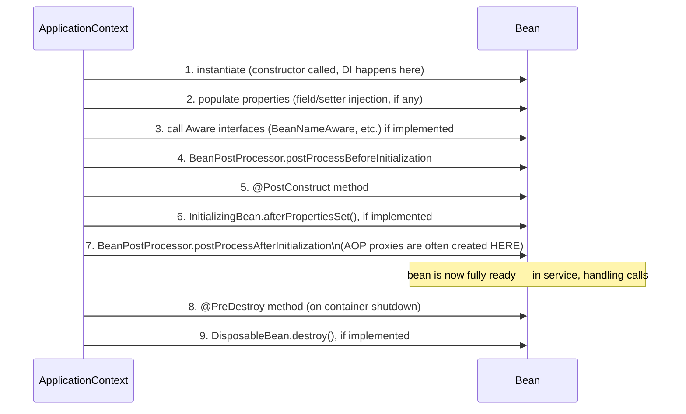
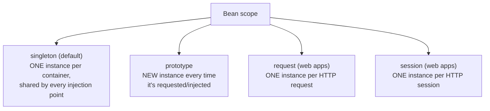
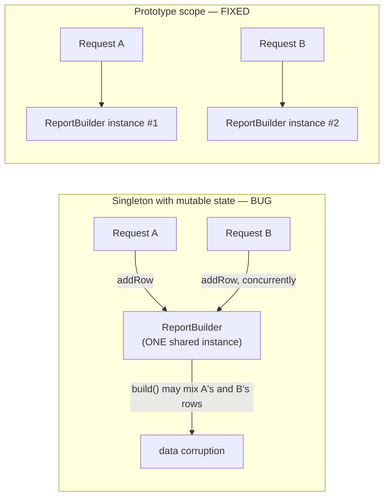
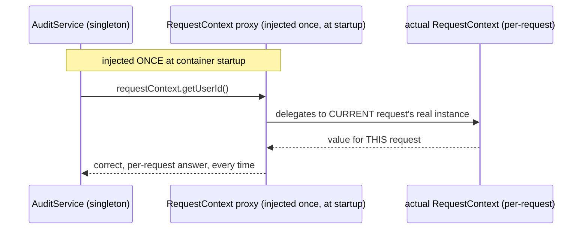

# Bean Lifecycle & Scopes

Two related questions the container answers for every bean: **when** does
this object get created and destroyed (lifecycle), and **how many
instances** exist, and shared by whom (scope)?

## The bean lifecycle



**Before → After: manual resource setup/teardown vs. lifecycle
callbacks:**

**Before — a class that requires the caller to remember to call an init
and cleanup method, in the right order, every time:**

```java
public class ConnectionPoolManager {
    private HikariDataSource pool;

    public void initialize() {
        pool = new HikariDataSource(buildConfig());
    }

    public void shutdown() {
        pool.close();
    }
}

// somewhere in application startup code, easy to forget:
ConnectionPoolManager manager = new ConnectionPoolManager();
manager.initialize();
// ... application runs ...
manager.shutdown();   // easy to forget, especially on abnormal shutdown paths
```

**After — the container calls the right method at the right time,
automatically, including on shutdown:**

```java
@Component
public class ConnectionPoolManager {
    private HikariDataSource pool;

    @PostConstruct
    public void initialize() {
        pool = new HikariDataSource(buildConfig());
    }

    @PreDestroy
    public void shutdown() {
        pool.close();
    }
}
```

The container guarantees `initialize()` runs right after construction and
dependency injection complete (so any injected dependencies are already
available), and guarantees `shutdown()` runs during a graceful application
shutdown — no call site has to remember to invoke either one.

## Bean scopes — how many instances, shared by whom



```java
@Service                              // default scope: singleton — no annotation needed
public class UserService { }

@Component
@Scope("prototype")                   // a NEW instance every time it's requested
public class ReportBuilder { }

@Component
@RequestScope                         // one instance per HTTP request
public class RequestContext { }

@Component
@SessionScope                         // one instance per HTTP session
public class ShoppingCart { }
```

**Before → After: shared mutable state bug from misusing singleton
scope:**

**Before — a stateful field on a singleton, silently shared and corrupted
across concurrent requests:**

```java
@Service   // singleton by default!
public class ReportBuilder {
    private List<String> rows = new ArrayList<>();   // SHARED across every request/thread

    public void addRow(String row) {
        rows.add(row);   // two concurrent requests interleave their rows here
    }

    public String build() {
        return String.join("\n", rows);   // may contain another request's data
    }
}
```

Because `ReportBuilder` is a singleton (Spring's default scope), every
injection point across the entire application shares **one** instance —
concurrent requests calling `addRow`/`build` on it race against each other,
and one user can end up seeing rows from someone else's report.

**After — either make the scope match the actual lifetime the state
needs, or (usually the better fix) don't hold mutable state on a
singleton at all:**

```java
@Component
@Scope("prototype")   // a fresh instance every time one is injected/requested
public class ReportBuilder {
    private final List<String> rows = new ArrayList<>();
    // now safe — each caller gets their own instance, no sharing
}
```



**Real-world rule of thumb:** the overwhelming majority of Spring beans
should be **stateless singletons** — `@Service`/`@Repository` classes that
hold only injected dependencies (themselves singletons), never per-request
mutable data. When you genuinely need per-request or per-user state,
either use `@RequestScope`/`@SessionScope` explicitly, or (often simpler
and more explicit) just pass that state as method parameters/return
values instead of storing it as a field at all.

## Injecting a narrower-scoped bean into a wider-scoped one

A subtle problem: injecting a `@RequestScope` bean directly into a
`@Service` (singleton) doesn't work the way you'd naively expect — the
singleton is only constructed **once**, at startup, before any HTTP
request exists yet.

```java
@Service   // singleton — constructed ONCE, at application startup
public class AuditService {
    private final RequestContext requestContext;   // @RequestScope bean

    public AuditService(RequestContext requestContext) {
        this.requestContext = requestContext;   // WRONG: this would freeze whatever
                                                  // RequestContext existed at STARTUP,
                                                  // not the current request's context
    }
}
```

Spring's fix is a **scoped proxy** — inject a proxy that transparently
delegates to the *current* request's real instance on every method call:

```java
@Component
@RequestScope(proxyMode = ScopedProxyMode.TARGET_CLASS)
public class RequestContext { }
```



## Real advantages

- **Predictable resource management.** `@PostConstruct`/`@PreDestroy`
  guarantee setup/teardown code runs at the right point in the
  application's life without every caller needing to remember to invoke
  it — directly analogous to why try-with-resources beat manual
  `close()` calls.
- **Scope makes sharing explicit and intentional**, instead of an
  accident of "however the class happened to be instantiated." Once you
  know a bean is `@RequestScope`, you know exactly what its lifetime and
  sharing guarantees are, without reading its implementation.
- **Scoped proxies solve a genuinely hard problem** — safely referencing
  narrower-lived state from a long-lived singleton — transparently, so
  application code doesn't need manual "look up the current request"
  boilerplate at every call site.

## Caveats

- **The default scope is singleton, and it's easy to forget.** Any field
  added to a `@Service`/`@Component` class is shared, mutable,
  concurrently-accessed state unless you've deliberately chosen a
  different scope — this is one of the most common sources of subtle,
  hard-to-reproduce concurrency bugs for developers new to Spring.
- **Prototype-scoped beans don't get `@PreDestroy` called by the
  container.** Once handed out, the container loses track of a prototype
  bean's lifecycle — if it holds a resource that needs explicit cleanup
  (a connection, a file handle), you're responsible for that cleanup
  yourself.
- Scoped proxies add a layer of indirection (and a small runtime cost) —
  reach for them specifically when you need to bridge a scope mismatch,
  not as a default habit.
