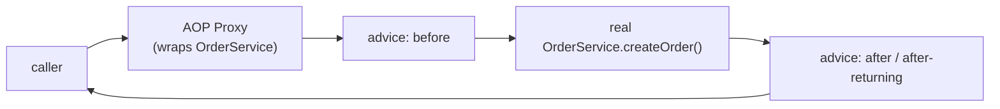
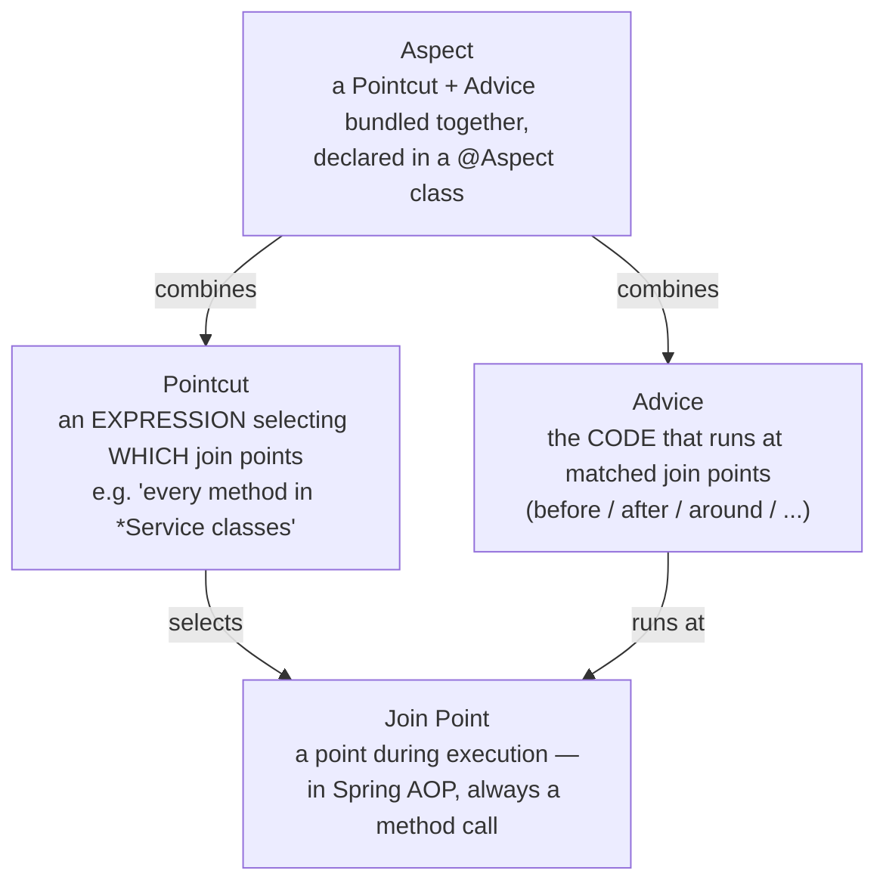
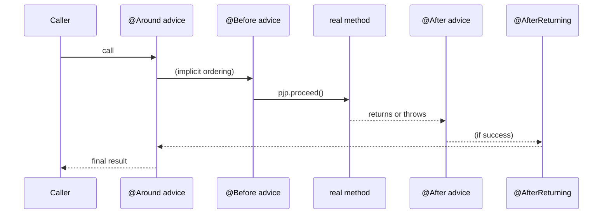
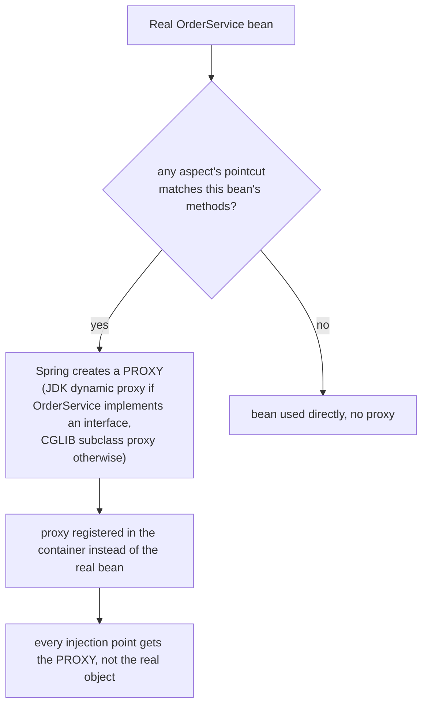

# AOP — Aspects, Join Points, Pointcuts, Advice Types

**Aspect-Oriented Programming** solves a problem OOP alone handles badly:
cross-cutting concerns. Logging, transaction management, security checks,
and metrics all need to happen around *many, unrelated* methods across the
codebase — inheritance and composition don't cleanly express "run this
code before/after every `@Transactional` method," because that set of
methods isn't a class hierarchy or a natural object relationship.

## Before → After: repeated cross-cutting code vs. an aspect

**Before — logging duplicated inside every method that needs it:**

```java
@Service
public class OrderService {
    private static final Logger log = LoggerFactory.getLogger(OrderService.class);

    public Order createOrder(OrderRequest request) {
        long start = System.currentTimeMillis();
        log.info("Entering createOrder with {}", request);
        try {
            Order order = doCreateOrder(request);
            log.info("Exiting createOrder, took {}ms", System.currentTimeMillis() - start);
            return order;
        } catch (Exception e) {
            log.error("createOrder failed", e);
            throw e;
        }
    }

    public void cancelOrder(Long id) {
        long start = System.currentTimeMillis();
        log.info("Entering cancelOrder with {}", id);
        try {
            doCancelOrder(id);
            log.info("Exiting cancelOrder, took {}ms", System.currentTimeMillis() - start);
        } catch (Exception e) {
            log.error("cancelOrder failed", e);
            throw e;
        }
    }
    // every method in every service repeats this exact pattern
}
```

The actual business logic (`doCreateOrder`, `doCancelOrder`) is buried
inside timing/logging/error-handling ceremony that has **nothing to do**
with orders — and it's duplicated, nearly verbatim, at every method that
needs it.

**After — one aspect, applied declaratively to every matching method:**

```java
@Aspect
@Component
public class LoggingAspect {

    private static final Logger log = LoggerFactory.getLogger(LoggingAspect.class);

    @Around("execution(* com.example.service.*.*(..))")
    public Object logMethod(ProceedingJoinPoint pjp) throws Throwable {
        long start = System.currentTimeMillis();
        log.info("Entering {} with {}", pjp.getSignature(), pjp.getArgs());
        try {
            Object result = pjp.proceed();   // actually calls the real method
            log.info("Exiting {}, took {}ms", pjp.getSignature(), System.currentTimeMillis() - start);
            return result;
        } catch (Throwable e) {
            log.error("{} failed", pjp.getSignature(), e);
            throw e;
        }
    }
}
```

```java
@Service
public class OrderService {
    public Order createOrder(OrderRequest request) {
        return doCreateOrder(request);   // pure business logic — nothing else
    }

    public void cancelOrder(Long id) {
        doCancelOrder(id);   // pure business logic — nothing else
    }
}
```

Every method in `com.example.service.*` now gets logging, timing, and
error logging **automatically**, without a single line of that concern
written inside the business logic itself.



## Core vocabulary



- **Join point** — a point in program execution where an aspect *could*
  attach. In Spring AOP specifically, this is always a **method
  execution** (unlike full AspectJ, which can also weave into field
  access, constructors, etc.).
- **Pointcut** — an expression that selects *which* join points a
  particular piece of advice applies to. `execution(* com.example.service.*.*(..))`
  reads as "any return type, any class in `com.example.service`, any
  method name, any arguments."
- **Advice** — the actual code that runs. Comes in five flavors (below).
- **Aspect** — a class (`@Aspect`) that bundles one or more
  pointcut+advice pairs together as a reusable, cross-cutting module.

## The five advice types

```java
@Aspect
@Component
public class SecurityAspect {

    @Before("execution(* com.example.service.AdminService.*(..))")
    public void checkAdminAccess(JoinPoint jp) {
        // runs BEFORE the method — can throw to prevent execution
        if (!currentUserIsAdmin()) {
            throw new AccessDeniedException("Admin only: " + jp.getSignature());
        }
    }

    @AfterReturning(pointcut = "execution(* com.example.service.*.find*(..))", returning = "result")
    public void logResult(Object result) {
        // runs after SUCCESSFUL return — has access to the return value
        log.debug("Query returned: {}", result);
    }

    @AfterThrowing(pointcut = "execution(* com.example.service.*.*(..))", throwing = "ex")
    public void logFailure(Exception ex) {
        // runs ONLY if the method threw
        log.error("Method threw", ex);
    }

    @After("execution(* com.example.service.*.*(..))")
    public void alwaysRuns(JoinPoint jp) {
        // runs whether the method succeeded OR threw — like a "finally" block
    }

    @Around("execution(* com.example.service.*.*(..))")
    public Object fullControl(ProceedingJoinPoint pjp) throws Throwable {
        // wraps the ENTIRE call — can skip pjp.proceed() to prevent execution,
        // modify arguments before calling it, or modify/replace the return value
        return pjp.proceed();
    }
}
```



`@Around` is the most powerful (it wraps the entire call, can short-
circuit it, and can transform arguments/return values) but also the
easiest to get wrong — forgetting to call `pjp.proceed()` silently skips
the real method entirely.

## Real-world AOP you're already using

Two features covered elsewhere in this course are themselves built on
Spring AOP — you don't write the aspect yourself, but understanding AOP
explains what's actually happening:

```java
@Transactional   // covered in the Transactions section — an @Around advice
public void transferFunds(Account from, Account to, BigDecimal amount) {
    // Spring wraps this call in a proxy that begins a transaction before,
    // and commits/rolls back after — exactly the @Around pattern above
}

@PreAuthorize("hasRole('ADMIN')")   // covered in Spring Security — a @Before advice
public void deleteUser(Long id) {
    // Spring checks the authorization expression BEFORE this method runs,
    // throwing AccessDeniedException if it fails — exactly the @Before pattern above
}
```

**This is the real payoff of understanding AOP conceptually**: two
features that look like unrelated "magic annotations" in later sections
of this course are actually the exact same mechanism — a proxy
intercepting a method call — applied to different pointcuts with
different advice.

## How the proxy actually works



This matters practically: because AOP works via a **wrapping proxy**, a
method calling another method **on the same object** (`this.otherMethod()`)
bypasses the proxy entirely — the advice won't fire, because the call
never goes through the proxy layer. This is one of the most common,
confusing "why isn't my `@Transactional`/`@Async`/`@Cacheable` working"
bugs in real Spring applications.

## Real advantages

- **Cross-cutting concerns live in exactly one place**, instead of copy-
  pasted (and inevitably drifting out of sync) across every method that
  needs them.
- **Business logic stays readable.** `OrderService.createOrder` reads as
  pure domain logic — logging, transactions, and security checks are
  declared separately, not interleaved with the actual algorithm.
- **`@Transactional` and `@PreAuthorize`, covered later, become far less
  mysterious** once you know they're ordinary AOP advice under the hood —
  same mental model, same proxy mechanics, same "self-invocation bypasses
  the proxy" gotcha applies to both.

## Caveats

- **Self-invocation bypasses AOP entirely** (shown above) — a
  `@Transactional` or `@Cacheable` method called from another method in
  the *same class* silently runs without the advice applied. The fix is
  usually to move the annotated method to a separate, injected bean, or
  (with care) to inject a self-reference proxy.
- **`@Around` advice that forgets `pjp.proceed()`** silently prevents the
  real method from ever running — a subtle bug, since the method call
  appears to succeed (returns normally, possibly with `null`) without
  ever having executed.
- **Broad pointcuts (`execution(* com.example..*.*(..))`) have real
  overhead** and can accidentally match methods you didn't intend to
  advise — pointcut expressions deserve the same care as any other
  selector that determines behavior across a large surface of code.
- Spring AOP only intercepts **Spring-managed bean method calls**, not
  arbitrary object method calls or private methods — it's a proxy-based
  subset of full AspectJ, sufficient for the vast majority of application
  needs (transactions, security, logging, caching) but not a general-
  purpose bytecode weaving tool.
