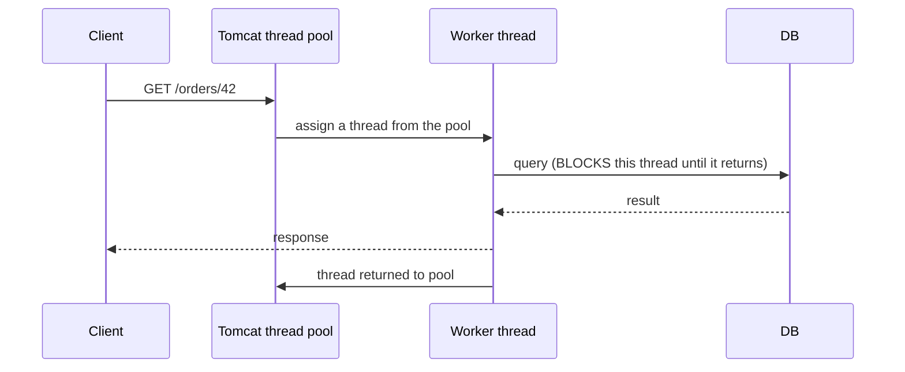
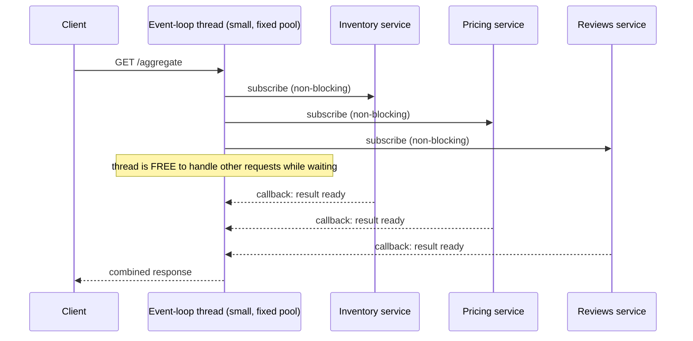
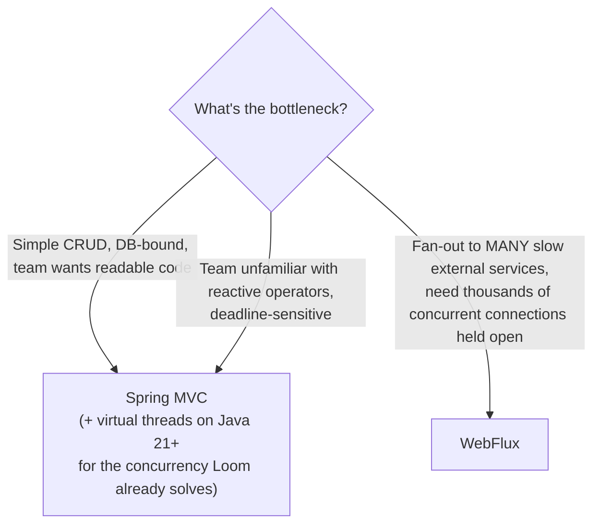

# Spring MVC / WebFlux (Reactive Overview)

Two different concurrency models for handling HTTP requests inside
Spring, built on everything from the earlier files in this section
(component scanning finds `@RestController`s, DI wires their
dependencies, AOP still applies underneath). Spring MVC is the traditional
model; WebFlux is the reactive alternative for a specific class of
workload.

## Spring MVC — thread-per-request, blocking

This is the model behind every controller example so far in this course.

```java
@RestController
public class OrderController {
    private final OrderService orderService;

    public OrderController(OrderService orderService) {
        this.orderService = orderService;
    }

    @GetMapping("/orders/{id}")
    public Order getOrder(@PathVariable Long id) {
        return orderService.findById(id);   // BLOCKS this thread until the DB responds
    }
}
```



Each request occupies **one thread for its entire duration**, including
time spent waiting on the database, an external API, or disk I/O. This is
simple to write, simple to debug (a normal stack trace, a normal
debugger), and was, before virtual threads (Java 21), fundamentally
limited by how many OS threads a JVM can reasonably run — see
[the virtual threads file](../01-core-java/05-virtual-threads-structured-concurrency.md)
for exactly this scalability problem and how Loom addresses it *within*
this same blocking model.

## Before → After: the problem WebFlux was built to solve

**Before — blocking I/O ties up a thread per concurrent slow request:**

```java
@GetMapping("/aggregate")
public AggregateReport getReport() {
    // three sequential blocking calls — thread occupied for the SUM of all three
    var inventory = inventoryClient.fetch();     // blocks, say, 200ms
    var pricing = pricingClient.fetch();          // blocks another 150ms
    var reviews = reviewsClient.fetch();           // blocks another 100ms
    return new AggregateReport(inventory, pricing, reviews);
    // total: ~450ms, thread blocked the entire time
}
```

With a bounded thread pool (pre-virtual-threads Spring MVC), each
concurrent call to this endpoint consumes a full worker thread for ~450ms
— under heavy concurrent load against slow downstream services, the pool
exhausts and new requests queue.

**After — WebFlux, non-blocking, calls run concurrently, threads never
idle-wait:**

```java
@GetMapping("/aggregate")
public Mono<AggregateReport> getReport() {
    Mono<Inventory> inventory = inventoryClient.fetchReactive();
    Mono<Pricing> pricing = pricingClient.fetchReactive();
    Mono<Reviews> reviews = reviewsClient.fetchReactive();

    return Mono.zip(inventory, pricing, reviews)
            .map(tuple -> new AggregateReport(tuple.getT1(), tuple.getT2(), tuple.getT3()));
    // all three calls run CONCURRENTLY (~200ms total, the slowest one),
    // and no thread sits idle waiting for any of them
}
```

`Mono<T>` (0 or 1 result) and `Flux<T>` (0 to N results) are Reactive
Streams publishers — the pipeline **describes** the work; nothing executes
until something subscribes (Spring's WebFlux runtime does this
automatically for a controller's return value). While waiting on I/O, the
underlying event-loop thread is freed to handle other requests instead of
blocking.



## Side-by-side comparison

| | Spring MVC | WebFlux |
|---|---|---|
| Concurrency model | Thread-per-request (blocking) | Event-loop (non-blocking) |
| Threads for N concurrent slow requests | ~N threads occupied | A handful of event-loop threads |
| Return types | Plain objects (`Order`, `List<Order>`) | `Mono<T>` / `Flux<T>` |
| Underlying server | Servlet container (Tomcat) | Netty (or a non-blocking Servlet 3.1+ container) |
| Debugging | Normal stack traces, normal breakpoints | Stack traces span reactive operators — harder to read |
| Learning curve | Familiar imperative style | New operators (`map`, `flatMap`, `zip`, `filter` — Stream-like, but async) |
| Best fit | Most CRUD apps, especially with virtual threads (Java 21+) | High-concurrency I/O fan-out (aggregating many slow downstream calls) |



## Real advantages

- **WebFlux genuinely scales differently** for a specific workload shape:
  many concurrent requests, each spending most of its time waiting on
  slow external I/O (fan-out to multiple services, streaming responses,
  very high connection counts like a chat/notification backend). A small,
  fixed pool of event-loop threads can service far more *concurrent, I/O-
  waiting* requests than a thread-per-request model ever could.
- **Backpressure is built in.** `Flux` can signal "slow down" to a
  producer that's emitting faster than a consumer can keep up — this is
  meaningfully harder to implement correctly by hand in a blocking model.
- **Spring MVC's simplicity is itself a real advantage**, not just
  "the old way" — for most CRUD-shaped applications (the majority of what
  this course builds), the mental overhead of reactive operators isn't
  justified by a scalability need that doesn't actually exist at that
  application's traffic level.

## Caveats

- **Virtual threads (Java 21, [see the Core Java file](../01-core-java/05-virtual-threads-structured-concurrency.md))
  have significantly narrowed WebFlux's advantage** for the "many
  concurrent blocked-on-I/O requests" case — Spring MVC on virtual threads
  gets much of WebFlux's scalability while keeping the simple, blocking,
  familiar programming model. As of Java 21/Spring Boot 3+, "just use
  WebFlux for scale" is no longer the automatic answer it once was — this
  is worth understanding as current, not historical, guidance.
- **You cannot freely mix blocking and reactive code.** Calling a
  blocking JDBC repository from inside a WebFlux `Mono` chain reintroduces
  the exact thread-blocking problem WebFlux exists to avoid — reactive
  code needs a reactive stack all the way down (R2DBC instead of JDBC,
  reactive `WebClient` instead of blocking `RestTemplate`/`RestClient`),
  which is a much bigger commitment than switching one layer.
- **Debugging reactive stack traces is genuinely harder** — a single
  logical error can produce a stack trace dominated by reactor-internal
  frames (`onAssembly`, `subscribe`, operator chains) instead of a clear
  path through your own code, and tools like `Hooks.onOperatorDebug()`
  help but add overhead.
- Choosing WebFlux "because it sounds more modern/performant" without an
  actual I/O-fan-out bottleneck is a common, real mistake — it adds
  complexity (reactive repositories, reactive testing, a different mental
  model for the whole team) that doesn't pay off unless the workload
  shape actually needs it.
