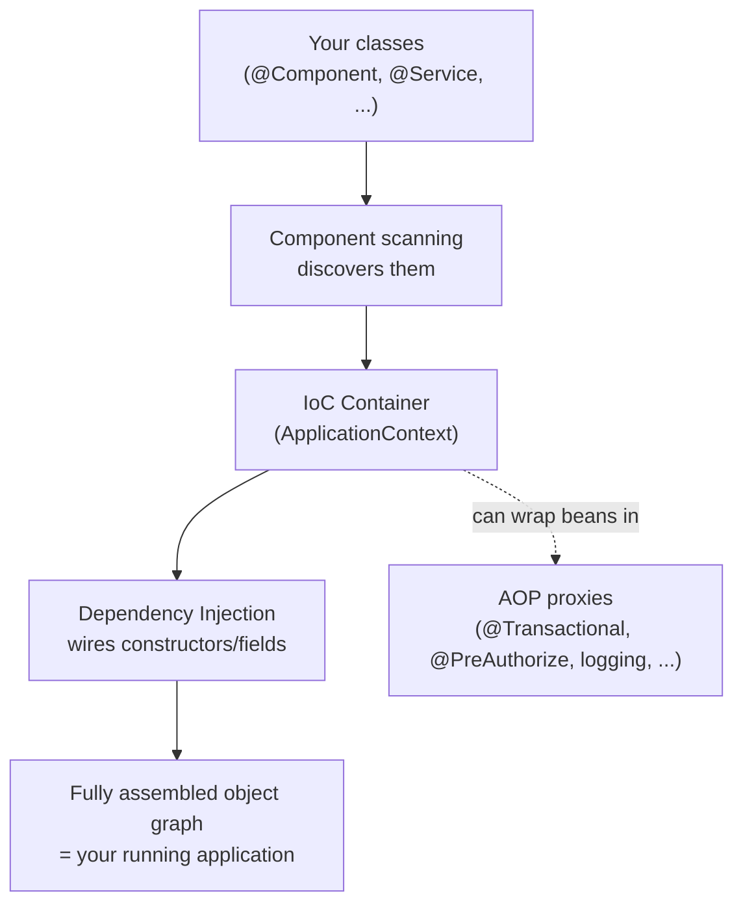

# Spring Framework 7

The core container and programming model that everything else in this
course (Spring Boot, Spring Security, Spring Data's repository proxies)
is built on top of. Spring Boot automates *configuring* Spring; it doesn't
replace the concepts here.

## Topics

1. [Dependency Injection & IoC](01-dependency-injection-ioc.md)
2. [Component scanning & stereotype annotations](02-component-scanning-annotations.md)
3. [Bean lifecycle & scopes](03-bean-lifecycle-scopes.md)
4. [AOP — aspects, join points, pointcuts, advice](04-aop.md)
5. [Spring MVC / WebFlux (reactive overview)](05-spring-mvc-webflux.md)

## The core idea, in one diagram

Every other topic in this section is really one facet of that single
picture: how beans get discovered (file 2), how they get created and
destroyed (file 3), how cross-cutting behavior gets woven in without
touching your business logic (file 4), and how HTTP requests specifically
get handled by beans registered this way (file 5).
