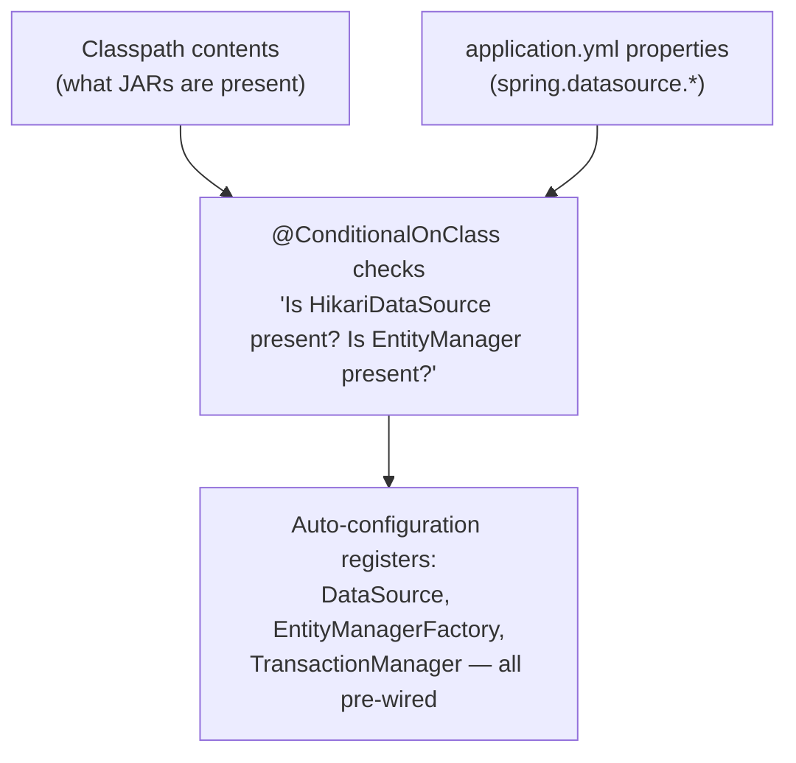
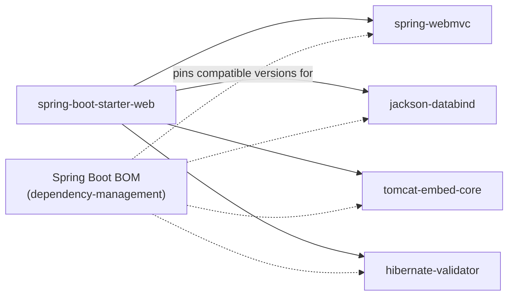
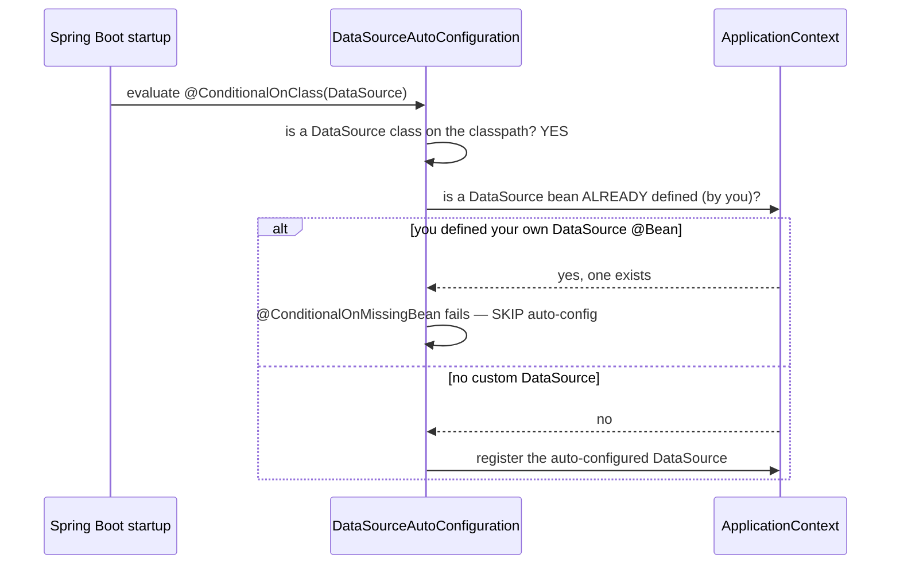

# Auto-Configuration & Starters

Spring Boot's core value proposition: turn "here's a database URL" into a
fully working, connection-pooled, transaction-managed data layer, with
**zero** explicit bean configuration — by inferring what you need from
what's on your classpath and what properties you've set.

## Before → After: manually wiring a data layer (plain Spring)

**Before — plain Spring Framework, every infrastructure bean configured
by hand:**

```java
@Configuration
@EnableTransactionManagement
public class DataSourceConfig {

    @Bean
    public DataSource dataSource() {
        HikariConfig config = new HikariConfig();
        config.setJdbcUrl("jdbc:postgresql://localhost:5432/mydb");
        config.setUsername("app");
        config.setPassword("secret");
        config.setMaximumPoolSize(10);
        return new HikariDataSource(config);
    }

    @Bean
    public LocalContainerEntityManagerFactoryBean entityManagerFactory(DataSource dataSource) {
        LocalContainerEntityManagerFactoryBean emf = new LocalContainerEntityManagerFactoryBean();
        emf.setDataSource(dataSource);
        emf.setPackagesToScan("com.example.entity");
        emf.setJpaVendorAdapter(new HibernateJpaVendorAdapter());
        Properties jpaProps = new Properties();
        jpaProps.put("hibernate.dialect", "org.hibernate.dialect.PostgreSQLDialect");
        jpaProps.put("hibernate.hbm2ddl.auto", "update");
        emf.setJpaProperties(jpaProps);
        return emf;
    }

    @Bean
    public PlatformTransactionManager transactionManager(EntityManagerFactory emf) {
        return new JpaTransactionManager(emf);
    }
}
```

~30 lines just to get a connection pool, an `EntityManagerFactory`, and a
transaction manager wired together correctly — and this pattern (or its
XML equivalent) had to be written, understood, and maintained by every
team using Spring before Boot existed.

**After — a starter dependency + a few properties, zero `@Bean` methods:**

```xml
<dependency>
    <groupId>org.springframework.boot</groupId>
    <artifactId>spring-boot-starter-data-jpa</artifactId>
</dependency>
<dependency>
    <groupId>org.postgresql</groupId>
    <artifactId>postgresql</artifactId>
</dependency>
```

```yaml
spring:
  datasource:
    url: jdbc:postgresql://localhost:5432/mydb
    username: app
    password: secret
```

That's it. `DataSource`, `EntityManagerFactory`, `PlatformTransactionManager`,
and Hibernate's dialect are all configured automatically — Spring Boot
detects PostgreSQL's driver and Hibernate on the classpath and infers
nearly everything the manual config above spelled out explicitly.



## Starters — curated dependency bundles

A **starter** is a Maven/Gradle dependency that itself has no code — it
exists purely to pull in a compatible, tested set of transitive
dependencies for one purpose.

```xml
<dependency>
    <groupId>org.springframework.boot</groupId>
    <artifactId>spring-boot-starter-web</artifactId>
</dependency>
```

**Before Boot — assembling a compatible web stack by hand:**

```xml
<!-- you'd have to pick compatible versions of ALL of these yourself -->
<dependency><groupId>org.springframework</groupId><artifactId>spring-webmvc</artifactId><version>?</version></dependency>
<dependency><groupId>com.fasterxml.jackson.core</groupId><artifactId>jackson-databind</artifactId><version>?</version></dependency>
<dependency><groupId>org.apache.tomcat.embed</groupId><artifactId>tomcat-embed-core</artifactId><version>?</version></dependency>
<dependency><groupId>org.hibernate.validator</groupId><artifactId>hibernate-validator</artifactId><version>?</version></dependency>
<!-- and every one of these needs a version that's actually compatible with every OTHER one -->
```

`spring-boot-starter-web` alone brings in Spring MVC, an embedded Tomcat,
Jackson (JSON), and Hibernate Validator — all at versions Spring's
release team has already verified work together. This "version alignment"
problem is exactly what Spring Boot's **dependency management BOM** (Bill
of Materials) solves: you declare a Boot version once, and every starter
pulls compatible transitive versions without you specifying any of them.



## How auto-configuration actually decides what to register

Every auto-configuration class is conditional — it only activates if
specific conditions about the classpath and existing beans are met.

```java
// (simplified — this is roughly what Spring Boot's real DataSourceAutoConfiguration does)
@Configuration
@ConditionalOnClass(DataSource.class)                    // only if a DataSource type is on the classpath
@ConditionalOnMissingBean(DataSource.class)               // only if YOU haven't already defined one
@EnableConfigurationProperties(DataSourceProperties.class)
public class DataSourceAutoConfiguration {
    @Bean
    public DataSource dataSource(DataSourceProperties properties) {
        return properties.initializeDataSourceBuilder().build();
    }
}
```

`@ConditionalOnMissingBean` is the crucial escape hatch: **if you define
your own `DataSource` bean, Spring Boot's auto-configured one steps
aside automatically.** Auto-configuration is a sensible default, not a
hard override — you're never locked out of taking manual control of any
specific piece.



## Real advantages

- **Massive reduction in "glue code."** The 30-line manual config example
  above, multiplied across data access, security, web MVC, messaging, and
  every other integration a real app needs, represents hundreds of lines
  of boilerplate every Boot application simply doesn't have to write or
  maintain.
- **Version compatibility is solved once, centrally**, by the Spring team,
  instead of every team individually discovering which Jackson version
  works with which Spring MVC version.
- **You're never locked in.** `@ConditionalOnMissingBean` means every
  auto-configured piece can be overridden with your own `@Bean` — auto-
  configuration is best understood as "sensible defaults you can always
  opt out of," not a black box.

## Caveats

- **"It just works" can mean "I don't know why it works."** Auto-
  configuration hides real complexity — when something goes wrong (wrong
  dialect chosen, unexpected bean registered), you need to know
  auto-configuration exists and how to inspect it, or debugging feels
  like fighting a black box.
- **`--debug` / the `ConditionEvaluationReport`** (run the app with
  `--debug`, or check `/actuator/conditions` — see the Actuator file) is
  the actual tool for "why didn't my bean get auto-configured" — worth
  knowing this exists before assuming auto-configuration is unfixable
  magic.
- **Starters can pull in more than you need.** `spring-boot-starter-web`
  brings in an embedded Tomcat even if you only wanted MVC's annotation
  processing for a non-HTTP purpose — starters optimize for the common
  case, not every case, and can be excluded/trimmed (`<exclusions>`) when
  that matters.
