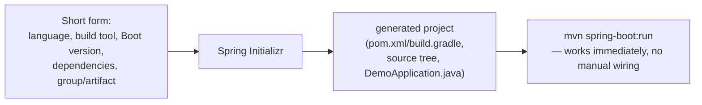
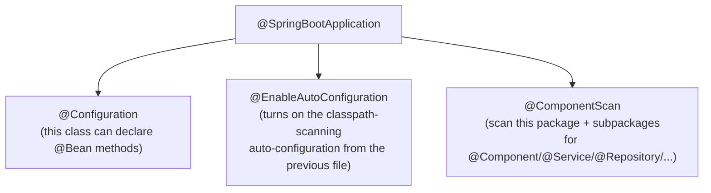

# Spring Initializr & Project Setup

Before writing a single controller or entity, every Spring Boot project
needs a build file, directory layout, and a base set of dependencies
wired together correctly. Spring Initializr (start.spring.io, and the
equivalent inside most IDEs) generates all of that from a short form,
instead of assembling it by hand.

## Before → After: hand-assembling a Maven project vs. Initializr

**Before — building `pom.xml` and the directory structure from scratch:**

```xml
<!-- pom.xml, hand-written, easy to get wrong -->
<project>
    <modelVersion>4.0.0</modelVersion>
    <groupId>com.example</groupId>
    <artifactId>demo</artifactId>
    <version>0.0.1-SNAPSHOT</version>
    <packaging>jar</packaging>
    <properties>
        <maven.compiler.source>21</maven.compiler.source>
        <maven.compiler.target>21</maven.compiler.target>
    </properties>
    <dependencies>
        <!-- have to know the exact right artifact IDs and how they relate -->
        <dependency>
            <groupId>org.springframework.boot</groupId>
            <artifactId>spring-boot-starter-web</artifactId>
            <version>???</version>  <!-- which version even goes here? -->
        </dependency>
    </dependencies>
    <build>
        <plugins>
            <plugin>
                <groupId>org.springframework.boot</groupId>
                <artifactId>spring-boot-maven-plugin</artifactId>
                <!-- needed to produce an executable "fat jar" — easy to forget -->
            </plugin>
        </plugins>
    </build>
</project>
```

Plus you'd need to manually create
`src/main/java/com/example/demo/DemoApplication.java`,
`src/main/resources/application.properties`, and the standard Maven test
directory layout — all conventions you have to already know.

**After — generated in seconds from a short form (start.spring.io, or
`New Project → Spring Initializr` in an IDE):**

- Project: Maven / Gradle
- Language: Java
- Spring Boot version: (latest stable)
- Group / Artifact: `com.example` / `demo`
- Packaging: Jar
- Java version: 21
- Dependencies: **Spring Web**, **Spring Data JPA**, **PostgreSQL Driver**

...produces a complete, correctly-versioned `pom.xml`/`build.gradle`, a
runnable `DemoApplication.java` with `@SpringBootApplication` already in
place, an empty `application.properties`, and a working test class — a
project that **compiles and runs immediately**, with zero manual
assembly.



## What gets generated — the standard layout

```
demo/
├── pom.xml                                    ← dependencies, correctly versioned via the Boot BOM
├── src/
│   ├── main/
│   │   ├── java/com/example/demo/
│   │   │   └── DemoApplication.java            ← @SpringBootApplication entry point
│   │   └── resources/
│   │       ├── application.properties          ← empty, ready for your config
│   │       └── static/, templates/              ← for serving static assets/views, if needed
│   └── test/
│       └── java/com/example/demo/
│           └── DemoApplicationTests.java        ← a trivial "does the context load" test, already passing
```

```java
@SpringBootApplication   // = @Configuration + @EnableAutoConfiguration + @ComponentScan, combined
public class DemoApplication {
    public static void main(String[] args) {
        SpringApplication.run(DemoApplication.class, args);
    }
}
```

`@SpringBootApplication` is itself worth unpacking — it's shorthand for
three annotations you've already seen separately in the Spring Framework
section:



## Real advantages

- **Removes an entire category of "getting started" friction** — the
  first hour of a new project used to be spent getting the build file
  right; Initializr collapses that to a form submission.
- **Guaranteed version compatibility from the start** — dependencies
  chosen through Initializr are pulled in via the Spring Boot BOM (see
  the previous file), so there's no manual version-pinning to get wrong
  on day one.
- **A consistent, idiomatic project layout across teams and companies** —
  because everyone starts from the same generator, onboarding onto an
  unfamiliar Spring Boot codebase almost always means recognizing the same
  directory structure, which lowers the cost of context-switching between
  projects.

## Caveats

- **Initializr is a starting point, not a governance tool.** It won't
  stop you from later adding incompatible dependency versions by hand, or
  drifting the project structure away from convention — it solves the
  cold-start problem, not ongoing dependency hygiene.
- **Picking too many dependencies up front** ("just in case") bloats the
  generated project with starters you don't end up using — it's easy
  to add a dependency later; trimming an unused one out requires actually
  noticing it's dead weight.
- The generated `DemoApplicationTests` "context loads" test is a real,
  if minimal, safety net (it fails if your bean wiring is broken) — but
  it's not a substitute for actual test coverage, and teams sometimes
  mistake its presence for "the project has tests."
