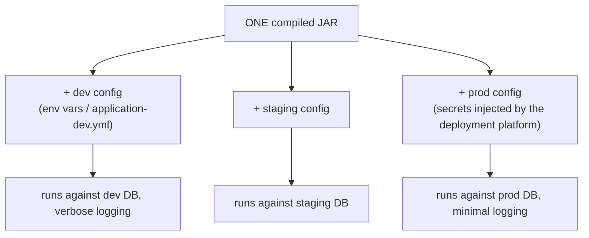
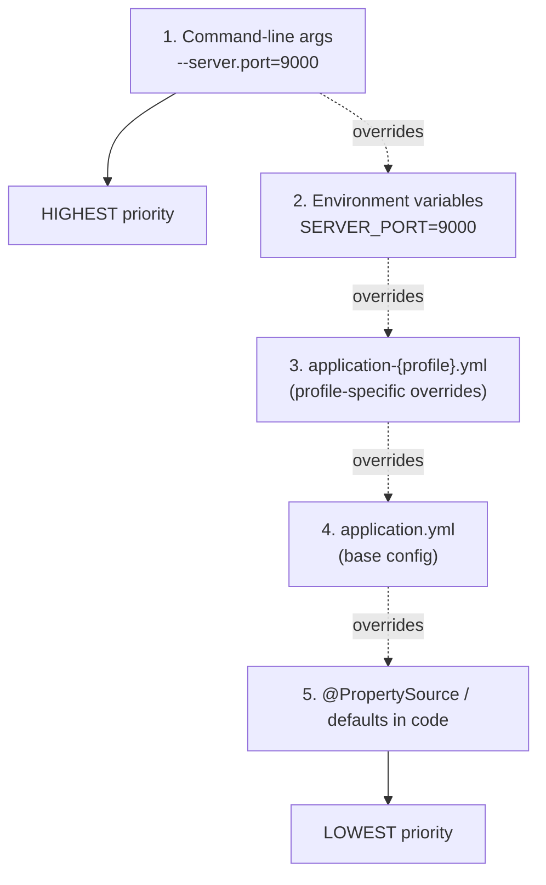
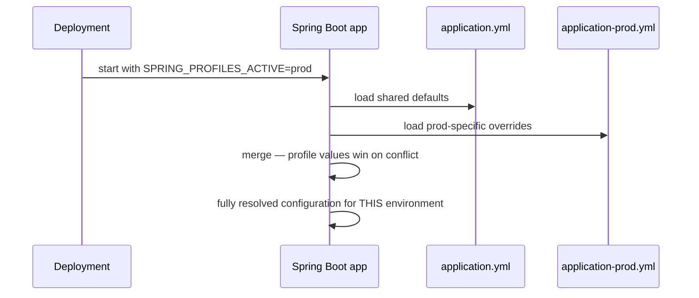

# Externalized Configuration (Profiles, YAML, Env Vars)

Hard-coding a database URL, an API key, or a feature flag directly in Java
source means every environment (local dev, CI, staging, production) needs
its own compiled build — and secrets end up committed to source control.
Externalized configuration solves this: values live *outside* the code,
and the same compiled artifact behaves differently per environment based
on what configuration it's given at startup.

## Before → After: hard-coded values vs. externalized properties

**Before — configuration baked into the code:**

```java
public class EmailService {
    private static final String SMTP_HOST = "smtp.dev.example.com";   // wrong in production!
    private static final int SMTP_PORT = 587;
    private static final String API_KEY = "sk_live_51H8x...";          // a secret, committed to git
}
```

Deploying to production means either editing this file and rebuilding
(risky, error-prone, and the dev value might accidentally ship), or
maintaining separate branches per environment (worse).

**After — externalized, environment-specific, injected at runtime:**

```yaml
# application.yml — checked into source control, no secrets
spring:
  mail:
    host: ${SMTP_HOST}
    port: ${SMTP_PORT:587}   # ':587' is a default if the env var isn't set
```

```java
@Value("${spring.mail.host}")
private String smtpHost;

// or, preferably, a typed properties class:
@ConfigurationProperties(prefix = "app.email")
public record EmailProperties(String apiKey, int retryCount) { }
```

The **same compiled JAR** now behaves differently in dev/staging/prod
purely based on environment variables or property files supplied at
deploy time — no rebuild, no risk of a dev value shipping to prod by
accident, and the actual secret (`API_KEY`) never touches source control.



## The property source precedence order

Spring Boot merges configuration from many sources, with a defined
priority — a higher-priority source overrides a lower one for the same
property key.



This precedence is exactly why environment variables are the standard way
to inject secrets in containerized deployments (Docker, Kubernetes) — they
sit above the checked-in YAML files, so a secret injected by the
deployment platform always wins without needing to touch any file in the
repo.

## Profiles — one config file per environment

**Before — a single, giant properties file with commented-in/out blocks
per environment (a common anti-pattern before profiles):**

```properties
# dev settings — uncomment for local development
# db.url=jdbc:h2:mem:testdb
# db.url=jdbc:postgresql://prod-db:5432/app   <- currently active, DON'T FORGET TO COMMENT OUT BEFORE COMMITTING
logging.level=DEBUG   # remember to change to WARN before deploying!
```

This is exactly the kind of thing that gets accidentally committed and
deployed wrong.

**After — one file per profile, activated by name, never manually
edited per deploy:**

```yaml
# application.yml — shared defaults across all profiles
spring:
  application:
    name: order-service
logging:
  level:
    root: INFO
---
# application-dev.yml
spring:
  config:
    activate:
      on-profile: dev
  datasource:
    url: jdbc:h2:mem:testdb
logging:
  level:
    root: DEBUG
---
# application-prod.yml
spring:
  config:
    activate:
      on-profile: prod
  datasource:
    url: ${DATABASE_URL}
logging:
  level:
    root: WARN
```

```bash
# Activate a profile at startup — no file editing required
java -jar app.jar --spring.profiles.active=prod
# or via an environment variable:
SPRING_PROFILES_ACTIVE=prod java -jar app.jar
```



`@Profile("dev")` also works directly on bean definitions, not just
properties — useful for swapping an entire bean (e.g. a fake/in-memory
`EmailService` for dev, a real SMTP one for prod):

```java
@Service
@Profile("dev")
public class FakeEmailService implements EmailService {
    public void send(Email email) {
        log.info("(dev mode — not actually sending) {}", email);
    }
}

@Service
@Profile("prod")
public class SmtpEmailService implements EmailService {
    public void send(Email email) { /* real SMTP call */ }
}
```

## Type-safe configuration with `@ConfigurationProperties`

**Before — scattered `@Value` injections, no validation, easy to
typo:**

```java
@Value("${app.retry.max-attempts}")
private int maxAttempts;

@Value("${app.retry.backoff-ms}")
private long backoffMs;
// related settings scattered across possibly many different classes,
// each with its own separate @Value annotations
```

**After — one cohesive, typed, validated properties class:**

```java
@ConfigurationProperties(prefix = "app.retry")
public record RetryProperties(
        @Min(1) int maxAttempts,
        @Min(0) long backoffMs) {
}
```

```yaml
app:
  retry:
    max-attempts: 3
    backoff-ms: 500
```

```java
@Service
public class RetryingClient {
    private final RetryProperties retryProperties;

    public RetryingClient(RetryProperties retryProperties) {   // injected like any other bean
        this.retryProperties = retryProperties;
    }
}
```

A record fits `@ConfigurationProperties` naturally — immutable config,
validated once at startup (`@Min`/`@Max`/`@NotBlank` from Jakarta
Validation), with a compile-time-checked structure instead of a bag of
loose `@Value` strings scattered across the codebase.

## Real advantages

- **One build artifact, many environments** — the core benefit. No
  environment-specific rebuild, no risk of shipping the wrong environment's
  hard-coded value.
- **Secrets never need to touch source control** when injected via
  environment variables at deploy time — critical for compliance and
  basic security hygiene.
- **`@ConfigurationProperties` gives you compile-time-checked,
  validated, IDE-autocompletable configuration**, instead of stringly-typed
  `@Value("${some.property.name}")` calls that fail silently (or with a
  vague error) on a typo.

## Caveats

- **YAML's indentation-based syntax is easy to get subtly wrong** — a
  misplaced indent silently changes which key a value nests under,
  without a syntax error. Validate config files (many IDEs/linters catch
  this) rather than trusting them by eye alone.
- **Profile sprawl is a real maintenance problem.** Projects that grow
  `application-dev.yml`, `application-staging.yml`, `application-qa.yml`,
  `application-prod.yml`, `application-local.yml`... each drifting
  independently, lose the "one source of truth" benefit externalized
  config was meant to provide. Keep the shared base file (`application.yml`)
  as large as possible, and profile-specific files as small as possible —
  only the values that actually differ.
- **`@Value` and `@ConfigurationProperties` resolve at startup**, not
  dynamically at runtime — changing an environment variable while the app
  is already running does nothing until restart, unless you've
  specifically wired up Spring Cloud Config's refresh mechanism (covered
  in the Microservices section later).
