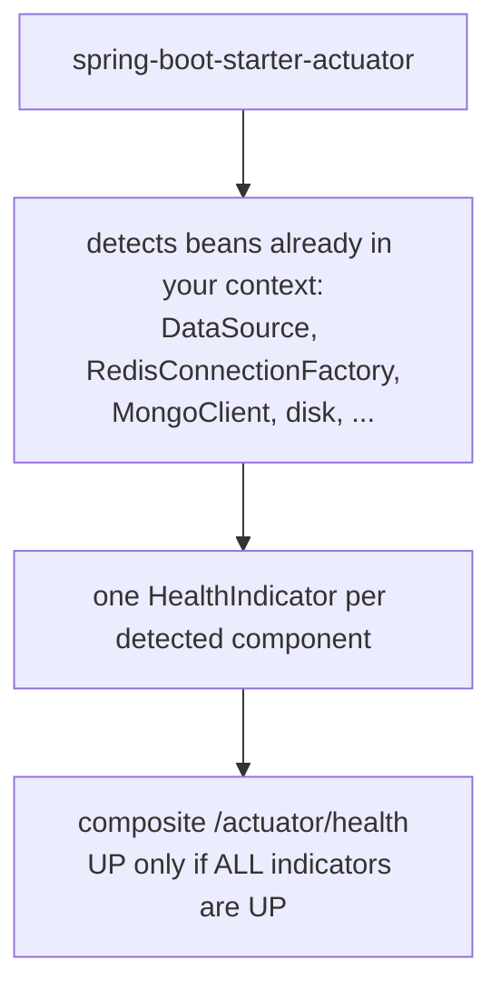
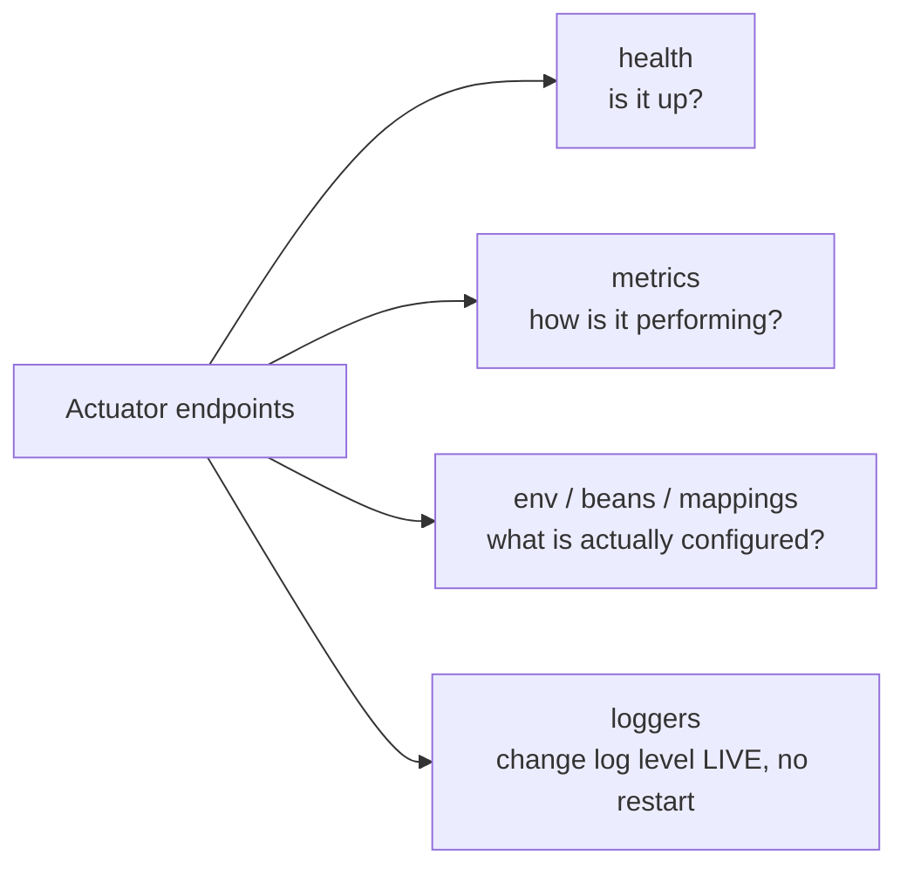
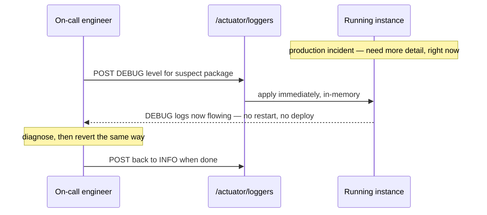

# Actuator for Observability

Once an application is deployed, "is it working?" stops being a question
you can answer by reading code — you need runtime visibility: is it up, is
the database reachable, how much memory is it using, what's the p99
latency on a given endpoint. Spring Boot Actuator exposes this as a set of
HTTP endpoints, with essentially no code written by you.

## Before → After: hand-rolled health check vs. Actuator

**Before — a custom `/health` endpoint, hand-written and incomplete:**

```java
@RestController
public class HealthController {
    @Autowired
    private DataSource dataSource;

    @GetMapping("/health")
    public ResponseEntity<String> health() {
        try (Connection conn = dataSource.getConnection()) {
            return ResponseEntity.ok("UP");
        } catch (SQLException e) {
            return ResponseEntity.status(503).body("DOWN: " + e.getMessage());
        }
        // checks the database... and nothing else. What about disk space?
        // A downstream service? Message queue connectivity? Each needs its
        // own hand-written check, in its own inconsistent format.
    }
}
```

Every new dependency (Redis, a message broker, an external API) needs its
own bespoke health-check code, written and maintained by hand, with no
guarantee of a consistent response shape across checks.

**After — add the starter, get a comprehensive health check for free:**

```xml
<dependency>
    <groupId>org.springframework.boot</groupId>
    <artifactId>spring-boot-starter-actuator</artifactId>
</dependency>
```

```json
// GET /actuator/health
{
  "status": "UP",
  "components": {
    "db": { "status": "UP", "details": { "database": "PostgreSQL", "validationQuery": "isValid()" } },
    "diskSpace": { "status": "UP", "details": { "total": 500000000000, "free": 320000000000 } },
    "ping": { "status": "UP" }
  }
}
```

Actuator auto-detects `DataSource`, disk space, and other infrastructure
already present in your application context (the same auto-configuration
mechanism from the earlier file) and builds a composite health check
automatically — no code written for any of it.



## Key endpoints

| Endpoint | Exposes |
|---|---|
| `/actuator/health` | Overall + per-component health (DB, disk, custom checks) |
| `/actuator/info` | Arbitrary build/app metadata you configure |
| `/actuator/metrics` | JVM memory, GC, HTTP request timings, thread counts, custom metrics |
| `/actuator/env` | All resolved configuration properties (with sensitive values masked) |
| `/actuator/beans` | Every bean in the application context |
| `/actuator/mappings` | Every registered `@RequestMapping` |
| `/actuator/loggers` | Current logging levels — changeable **at runtime**, no restart |
| `/actuator/conditions` (from `--debug`) | Why each auto-configuration was applied or skipped |



## Before → After: diagnosing a production issue

**Before — no Actuator: to change a noisy logger's level, you edit
config and redeploy — during an active incident:**

```yaml
logging:
  level:
    com.example.suspect.package: DEBUG
```

```bash
# rebuild, redeploy, wait for the new instance to come up —
# minutes lost during an active production incident, just to get more logs
```

**After — flip the log level live, on a running instance, in seconds:**

```bash
curl -X POST localhost:8080/actuator/loggers/com.example.suspect.package \
     -H "Content-Type: application/json" \
     -d '{"configuredLevel": "DEBUG"}'
# takes effect IMMEDIATELY, on the already-running instance — no restart,
# no redeploy, no lost traffic during the change
```



## Custom health indicators and metrics

You're not limited to what Actuator auto-detects — you can register your
own, following the same pattern:

```java
@Component
public class PaymentGatewayHealthIndicator implements HealthIndicator {
    private final PaymentGatewayClient client;

    public PaymentGatewayHealthIndicator(PaymentGatewayClient client) {
        this.client = client;
    }

    @Override
    public Health health() {
        try {
            client.ping();
            return Health.up().build();
        } catch (Exception e) {
            return Health.down(e).withDetail("gateway", "payment-provider").build();
        }
    }
}
// now appears automatically as a "paymentGateway" component under /actuator/health
```

```java
@Component
public class OrderMetrics {
    private final Counter ordersCreated;

    public OrderMetrics(MeterRegistry registry) {
        this.ordersCreated = Counter.builder("orders.created").register(registry);
    }

    public void recordOrderCreated() {
        ordersCreated.increment();   // now scrapeable at /actuator/metrics/orders.created,
                                       // and exportable to Prometheus/Grafana via micrometer
    }
}
```

Under the hood, Actuator's metrics are backed by **Micrometer** — a
vendor-neutral metrics facade (analogous to SLF4J for logging) that can
export the same recorded metrics to Prometheus, Datadog, CloudWatch, or
several other monitoring backends without changing any application code —
only the export configuration changes.

## Real advantages

- **Production observability essentially for free.** Health checks,
  metrics, and runtime introspection that would otherwise require
  significant hand-written infrastructure code arrive from adding one
  starter dependency.
- **Consistent format across every application on a team.** Every
  Spring Boot service exposes the *same* `/actuator/health` shape,
  which is exactly what makes it possible to build one generic dashboard
  or alerting rule that works across an entire fleet of services, instead
  of one bespoke integration per service.
- **Runtime log-level changes cut incident response time** dramatically —
  going from "redeploy to get more logs" to "one `curl` command" is a real
  operational difference during an active production issue.

## Caveats

- **Actuator endpoints must be secured before production.** By default
  (Spring Boot 2.6+), only `/actuator/health` is exposed over HTTP without
  extra configuration — but teams that widen exposure
  (`management.endpoints.web.exposure.include=*`) without also securing
  it (Spring Security rules restricting `/actuator/**` to internal
  networks or authenticated admin roles) leak internal configuration,
  environment variables, and bean structure to anyone who can reach the
  app — a genuinely common, serious misconfiguration.
- **`/actuator/env` masks *known* sensitive property names** (anything
  matching patterns like `password`, `secret`, `key`) but this is a
  best-effort heuristic, not a guarantee — a custom property named
  `app.token` might not be recognized as sensitive and could leak in
  plaintext.
- **Metrics have a real, if usually small, performance cost** — heavily
  instrumenting hot paths with many custom `Counter`/`Timer` metrics adds
  overhead; Micrometer is efficient but not free, so instrument
  deliberately rather than everywhere.
