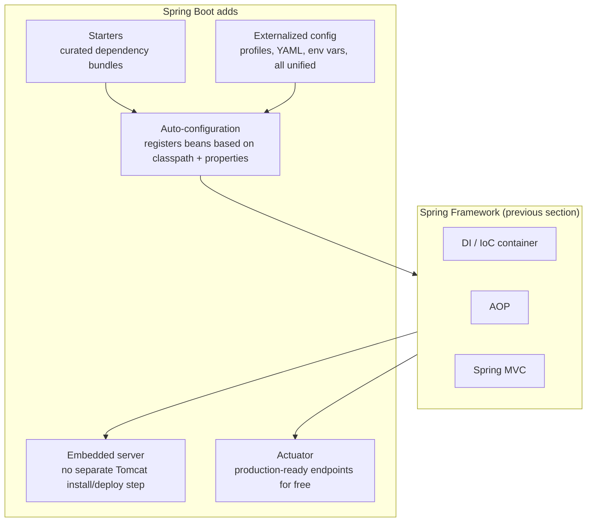

# Spring Boot 4

Spring Boot doesn't replace the Spring Framework concepts from the
previous section — it automates the *configuration* of them. Auto-
configuration decides which beans to register based on what's on the
classpath; starters decide what's on the classpath in the first place;
externalized config decides how those beans get their settings; Actuator
exposes what's actually running underneath it all.

## Topics

1. [Auto-configuration & starters](01-auto-configuration-starters.md)
2. [Spring Initializr & project setup](02-spring-initializr-project-setup.md)
3. [Externalized configuration — profiles, YAML, env vars](03-externalized-configuration.md)
4. [Actuator for observability](04-actuator.md)

## What Spring Boot actually adds on top of Spring

Nothing here is a new programming model — it's automation and convention
layered on top of the container, DI, and AOP mechanics from the Spring
Framework section.
