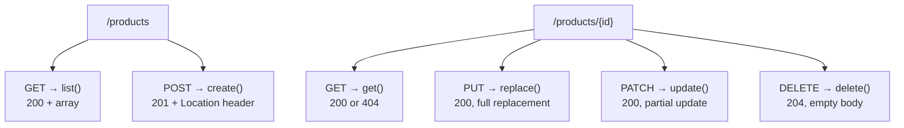
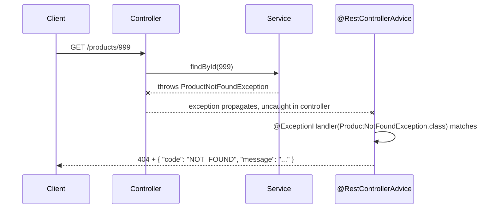

# CRUD via GET/POST/PUT/PATCH/DELETE

Putting the HTTP method semantics from
[Web Fundamentals](../02-web-fundamentals/03-http-methods-status-codes-headers.md)
into an actual Spring MVC controller — a full CRUD resource, built the
way you'd write it in a real application, with the status codes and
response shapes that make it usable by real clients.

## Before → After: one bloated endpoint vs. resource-shaped CRUD

**Before — a single, generic endpoint that takes an "action" parameter
(RPC-style, the anti-pattern already covered conceptually in the REST
principles file — here's what it looks like as actual Spring code):**

```java
@RestController
public class ProductController {

    @PostMapping("/products/action")
    public ResponseEntity<?> handle(@RequestBody Map<String, Object> payload) {
        String action = (String) payload.get("action");
        return switch (action) {
            case "create" -> ResponseEntity.ok(productService.create(payload));
            case "update" -> ResponseEntity.ok(productService.update(payload));
            case "delete" -> { productService.delete((Long) payload.get("id")); yield ResponseEntity.ok().build(); }
            default -> ResponseEntity.badRequest().body("Unknown action");
        };
    }
}
```

Every operation funnels through one method with runtime branching on an
`action` string — no compile-time contract for what each operation
actually needs, no distinct status codes, and every client has to guess
the payload shape per action from documentation rather than the URL/method.

**After — one method per operation, mapped to the correct HTTP verb:**

```java
@RestController
@RequestMapping("/products")
public class ProductController {

    private final ProductService productService;

    public ProductController(ProductService productService) {
        this.productService = productService;
    }

    @GetMapping
    public List<ProductResponse> list() {
        return productService.findAll();
    }

    @GetMapping("/{id}")
    public ProductResponse get(@PathVariable Long id) {
        return productService.findById(id);   // throws → 404, see error handling below
    }

    @PostMapping
    public ResponseEntity<ProductResponse> create(@Valid @RequestBody CreateProductRequest request) {
        ProductResponse created = productService.create(request);
        return ResponseEntity
                .created(URI.create("/products/" + created.id()))   // 201 + Location header
                .body(created);
    }

    @PutMapping("/{id}")
    public ProductResponse replace(@PathVariable Long id, @Valid @RequestBody UpdateProductRequest request) {
        return productService.replace(id, request);   // 200, full replacement
    }

    @PatchMapping("/{id}")
    public ProductResponse update(@PathVariable Long id, @RequestBody PatchProductRequest request) {
        return productService.applyPatch(id, request);   // 200, partial update
    }

    @DeleteMapping("/{id}")
    public ResponseEntity<Void> delete(@PathVariable Long id) {
        productService.delete(id);
        return ResponseEntity.noContent().build();   // 204, no body
    }
}
```



Each method is independently readable, independently testable, and maps
directly onto exactly the HTTP semantics from the Web Fundamentals notes —
no branching on a string, no ambiguity about what request shape each
operation expects.

## Before → After: exceptions leaking a 500 vs. mapped status codes

**Before — an unhandled exception always becomes a generic `500`, even
when the real cause is a client error:**

```java
@GetMapping("/{id}")
public ProductResponse get(@PathVariable Long id) {
    return productRepository.findById(id).orElseThrow();
    // NoSuchElementException propagates up uncaught → Spring's default
    // error handling turns this into a 500 Internal Server Error —
    // technically wrong: a missing resource is the CALLER's mistake (404),
    // not a server failure
}
```

A `500` on every "not found" case is actively misleading to clients and
monitoring — it looks like *your* server broke, when actually the caller
just asked for something that doesn't exist.

**After — a `@RestControllerAdvice` maps domain exceptions to the correct
status codes, once, for the whole application:**

```java
public class ProductNotFoundException extends RuntimeException {
    public ProductNotFoundException(Long id) {
        super("Product not found: " + id);
    }
}
```

```java
@Service
public class ProductService {
    public ProductResponse findById(Long id) {
        return productRepository.findById(id)
                .map(this::toResponse)
                .orElseThrow(() -> new ProductNotFoundException(id));
    }
}
```

```java
@RestControllerAdvice
public class ApiExceptionHandler {

    @ExceptionHandler(ProductNotFoundException.class)
    public ResponseEntity<ErrorResponse> handleNotFound(ProductNotFoundException ex) {
        return ResponseEntity.status(HttpStatus.NOT_FOUND)
                .body(new ErrorResponse("NOT_FOUND", ex.getMessage()));
    }

    @ExceptionHandler(MethodArgumentNotValidException.class)
    public ResponseEntity<ErrorResponse> handleValidation(MethodArgumentNotValidException ex) {
        return ResponseEntity.status(HttpStatus.BAD_REQUEST)
                .body(new ErrorResponse("VALIDATION_FAILED", ex.getMessage()));
    }
}

public record ErrorResponse(String code, String message) { }
```

Every controller in the application now gets consistent `404`/`400`
mapping for these exception types automatically — this is Spring MVC's
own version of the AOP-style cross-cutting-concern pattern from the
Spring Framework section: the mapping logic lives in exactly one place,
not repeated as try/catch in every controller method.



## `PUT` vs `PATCH` in practice — full vs. partial payload

```java
public record UpdateProductRequest(String name, BigDecimal price, String category) { }
// PUT: caller must send ALL fields — this replaces the whole resource

public record PatchProductRequest(
        Optional<String> name,
        Optional<BigDecimal> price,
        Optional<String> category) { }
// PATCH: each field is Optional — absent means "don't touch this field",
// not "clear it" (this distinguishes "not sent" from "sent as null")
```

```java
public ProductResponse applyPatch(Long id, PatchProductRequest patch) {
    Product product = productRepository.findById(id).orElseThrow(() -> new ProductNotFoundException(id));
    patch.name().ifPresent(product::setName);
    patch.price().ifPresent(product::setPrice);
    patch.category().ifPresent(product::setCategory);
    return toResponse(productRepository.save(product));
}
```

Wrapping each `PATCH` field in `Optional` is exactly the technique from
[the Java 8 refresher](../01-core-java/01-java8-refresher.md) applied to a
real API-design problem: distinguishing "the client didn't send this
field" from "the client sent this field as `null`" — a distinction plain
nullable fields can't express, since both cases would deserialize to
`null` on their own.

## Real advantages

- **One method per operation is independently testable, readable, and
  documentable** — contrast with the single-branching-endpoint
  anti-pattern, where every test has to exercise the same method through
  different `action` values.
- **Centralized exception-to-status-code mapping** (`@RestControllerAdvice`)
  means individual controller methods stay focused on business logic —
  they don't need repetitive try/catch blocks just to produce the right
  HTTP status.
- **Correct status codes make the API usable by generic tooling** —
  exactly the point made in the Web Fundamentals HTTP notes, now shown as
  actual application code: a `404` lets a client's error handling branch
  correctly without inspecting response body text.

## Caveats

- **`PUT`'s "full replacement" semantics are easy to violate
  accidentally.** A `PUT` handler that only updates non-null fields from
  the request (instead of replacing everything, including clearing
  omitted fields) is actually behaving like `PATCH` — this mismatch
  between a method's name and its real behavior is a common, confusing
  bug in real codebases.
- **`@ExceptionHandler` methods match by exception type, and Spring picks
  the most specific match** — two overly broad handlers (e.g. one for
  `RuntimeException`, one for a specific subtype) can produce surprising
  results if their specificity isn't what you expect; keep custom
  exceptions specific and intentional.
- **Returning entities directly (rather than a DTO)** from a controller
  method risks leaking internal fields (password hashes, internal audit
  columns) or triggering lazy-loading exceptions outside a transaction —
  the `ProductResponse`/`CreateProductRequest` pattern shown above (DTOs,
  not raw JPA entities) is deliberate, not incidental, and is worth
  applying consistently.
