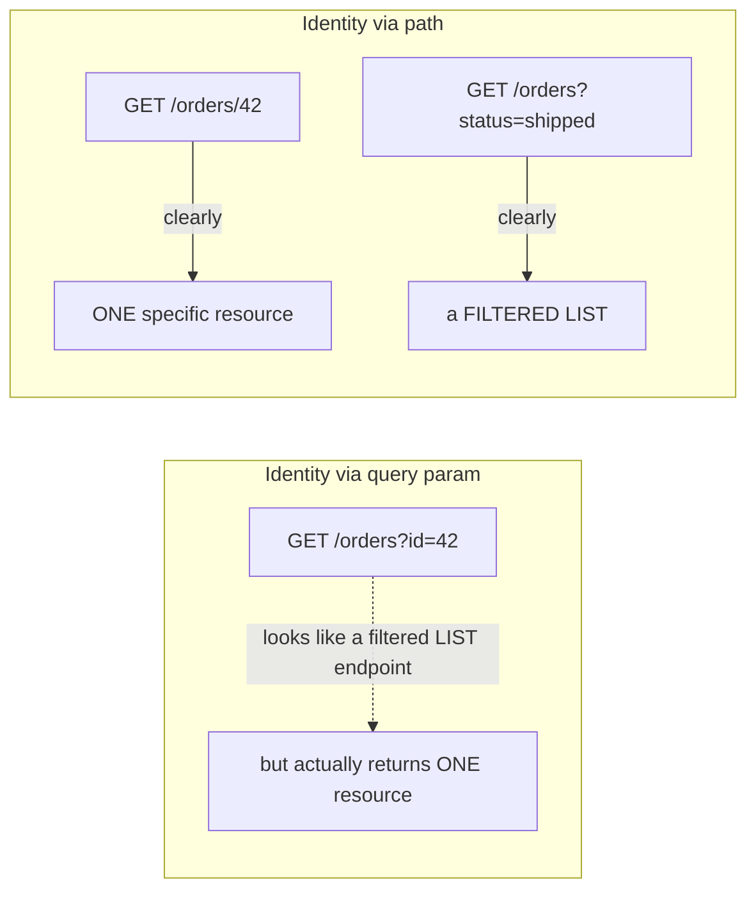

# Path, Query, and Request Body Design

Three different places a piece of data in an HTTP request can live —
`@PathVariable`, `@RequestParam`, `@RequestBody` — and choosing the wrong
one for a given piece of data is one of the most common REST API design
mistakes, even though Spring will happily let you get it "working" either
way.

## The three parameter sources

```mermaid
flowchart TD
    URL["GET /orders/42?status=shipped&page=0"] --> Path["Path: /orders/{id}\n= 42\nidentifies WHICH resource"]
    URL --> Query["Query: ?status=shipped&page=0\n= filtering, sorting, pagination"]
    Body["POST/PUT/PATCH body\n{ \"customerName\": \"Alice\", ... }"] --> BodyUse["the resource's DATA itself"]
```

| Goes in... | Use for | Example |
|---|---|---|
| **Path** (`@PathVariable`) | Identifying *which* resource | `/orders/{id}`, `/customers/{customerId}/orders/{orderId}` |
| **Query** (`@RequestParam`) | Filtering, sorting, pagination — optional modifiers | `?status=shipped&page=0&sort=createdAt,desc` |
| **Body** (`@RequestBody`) | The actual data of the resource being created/updated | `{ "customerName": "Alice", "items": [...] }` |

## Before → After: putting resource data in query params

**Before — treating a `POST` like query-string-only "form" data (or
worse, misusing path segments for arbitrary data):**

```java
@PostMapping("/orders")
public Order createOrder(
        @RequestParam String customerName,
        @RequestParam String customerEmail,
        @RequestParam List<String> itemIds,
        @RequestParam List<Integer> quantities) {
    // fragile: itemIds and quantities have to line up by INDEX,
    // nothing in the API enforces they're the same length
    ...
}
```

```
POST /orders?customerName=Alice&customerEmail=alice@x.com&itemIds=1&itemIds=2&quantities=3&quantities=1
```

This URL is unreadable, has a hard length limit (browsers/servers cap URL
length, typically around 2000-8000 characters depending on the stack),
shows up in server access logs and browser history (a real problem if any
field is remotely sensitive), and can't express nested/structured data
(the `itemIds`/`quantities` index-matching above is a symptom of trying
to force structured data through a flat query string).

**After — structured data belongs in the body:**

```java
public record CreateOrderRequest(
        String customerName,
        String customerEmail,
        List<OrderItem> items) { }

public record OrderItem(String itemId, int quantity) { }

@PostMapping("/orders")
public ResponseEntity<Order> createOrder(@Valid @RequestBody CreateOrderRequest request) {
    ...
}
```

```json
POST /orders
{
  "customerName": "Alice",
  "customerEmail": "alice@x.com",
  "items": [
    { "itemId": "1", "quantity": 3 },
    { "itemId": "2", "quantity": 1 }
  ]
}
```

Now `itemId` and `quantity` are correctly nested together — no fragile
index-matching — and the payload isn't bound by URL length limits or
exposed in logs.

## Before → After: putting a resource identifier in the query string

**Before — using a query param to identify the primary resource:**

```java
@GetMapping("/orders")
public Order getOrder(@RequestParam Long id) {
    return orderService.findById(id);
}
// GET /orders?id=42
```

This works, but it's not RESTful in the sense discussed in
[the REST principles file](../02-web-fundamentals/02-rest-architecture-principles.md) —
the resource's identity is supposed to live in the URL path, not be one
optional-looking parameter among many. It also means `/orders` (no `id`)
and `/orders?id=42` (one specific order) are handled by the exact same
route pattern with very different meaning, which is confusing for caching,
logging, and API consumers alike.

**After — the identifier lives in the path, exactly where a client
expects "get me THIS specific thing":**

```java
@GetMapping("/orders/{id}")
public Order getOrder(@PathVariable Long id) {
    return orderService.findById(id);
}
// GET /orders/42
```



## Query params for filtering, sorting, and pagination — done right

This is genuinely what query params are for — optional modifiers on a
collection endpoint, exactly matching the
[pagination & sorting patterns](../03-jakarta-persistence-spring-data/05-pagination-sorting.md)
covered earlier:

```java
@GetMapping("/orders")
public Page<Order> listOrders(
        @RequestParam(required = false) OrderStatus status,
        @RequestParam(required = false) LocalDate fromDate,
        @RequestParam(defaultValue = "0") int page,
        @RequestParam(defaultValue = "20") int size,
        @RequestParam(defaultValue = "createdAt,desc") String sort) {
    ...
}
// GET /orders?status=SHIPPED&fromDate=2026-01-01&page=0&size=20&sort=total,desc
```

Every one of these parameters is **optional** and **modifies the result
set** — that's the defining characteristic of a good query-param
candidate, as opposed to something that identifies a specific resource
(path) or represents the resource's actual data (body).

## Nested resources — path structure for ownership/hierarchy

```java
@GetMapping("/customers/{customerId}/orders")
public List<Order> getCustomerOrders(@PathVariable Long customerId) {
    return orderService.findByCustomerId(customerId);
}

@GetMapping("/customers/{customerId}/orders/{orderId}")
public Order getCustomerOrder(@PathVariable Long customerId, @PathVariable Long orderId) {
    Order order = orderService.findById(orderId);
    if (!order.getCustomerId().equals(customerId)) {
        throw new OrderNotFoundException(orderId);   // don't leak that it exists under a DIFFERENT customer
    }
    return order;
}
```

**Real advantage of nesting:** the URL itself documents the ownership
relationship (`/customers/{id}/orders` reads as "orders belonging to this
customer") — but note the second method above also does the ownership
check in code. The URL nesting alone doesn't enforce that `orderId`
actually belongs to `customerId`; that's still a business-logic
responsibility, not something free from the routing structure.

**Caveat — don't nest too deeply.** `/customers/{cId}/orders/{oId}/items/{iId}/reviews/{rId}`
is technically expressible but painful to consume; a common convention is
to stop nesting after one or two levels and let deeply-related resources
have their own top-level, filterable collection endpoint instead
(`/reviews?itemId={iId}`).

## Real advantages

- **Predictability.** Once a client understands "identity → path,
  filters → query, data → body," they can guess how to call an endpoint
  they've never seen before, in an API they've never used before — this
  is the practical payoff of the uniform interface constraint from the
  REST principles file.
- **Correct caching behavior.** HTTP caches key on the full URL
  (path + query string) — putting a resource's mutable data in the body
  rather than the URL keeps GET URLs stable and cacheable, since the URL
  only reflects *which* resource or *which filtered view*, not its
  contents.
- **No accidental data exposure.** Query strings appear in server access
  logs, browser history, and `Referer` headers; request bodies generally
  don't (over HTTPS, the body is encrypted in transit and not logged by
  default infrastructure the way URLs often are) — a real, practical
  reason to keep sensitive data out of the query string.

## Caveats

- **There's no hard technical enforcement** — Spring will happily bind a
  password from a `@RequestParam`, or accept a resource ID inside a
  `@RequestBody` — these are *design conventions*, not compiler-checked
  rules, so consistency depends on team discipline and code review.
- **Path variables need type conversion and validation.** `@PathVariable Long id`
  on a URL like `/orders/abc` throws a `MethodArgumentTypeMismatchException`
  — make sure your `@RestControllerAdvice` (previous file) maps this to a
  `400 Bad Request`, not a `500`, since it's a client mistake.
- **Very large or deeply nested request bodies** can still cause problems
  (payload size limits, deserialization cost) — moving data to the body
  fixes the URL-length problem but doesn't mean body size is free to
  ignore; large payloads (e.g. bulk imports) usually deserve a distinct
  endpoint design (streaming, chunked upload) rather than one giant JSON
  body.
