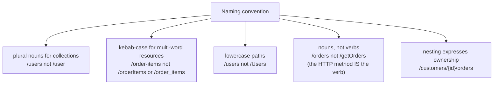
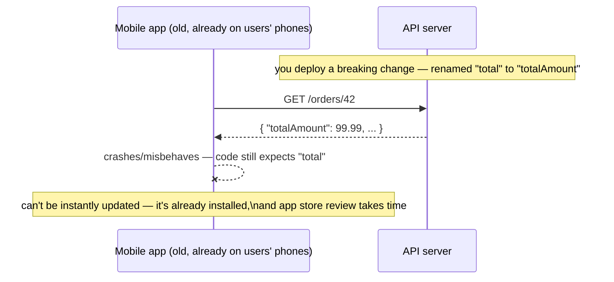
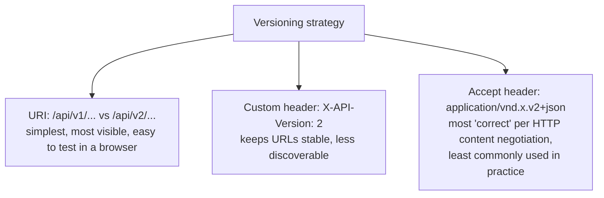
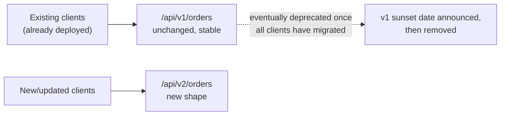

# API Versioning & Naming Conventions

An API is a contract with every client that consumes it — and unlike
internal code, you usually can't just refactor a public API's shape
in-place; existing clients (mobile apps already installed on users'
phones, other teams' services, third-party integrators) will break.
Versioning and consistent naming exist to manage change without breaking
everyone every time.

## Naming conventions — the small decisions that compound

**Before — inconsistent, ad hoc naming across endpoints (a common result
of an API growing organically without a style guide):**

```
GET  /getUser/42
GET  /Order-List
POST /create_new_product
GET  /customers/42/GetOrders
DELETE /removeItemFromCart?itemId=5
```

Every endpoint uses a different case style, a different verb-vs-noun
approach, and a different way of expressing "this belongs to that" — a
client integrating with this API has to memorize each endpoint's quirks
individually, because there's no consistent pattern to infer from.

**After — one consistent convention, applied everywhere:**

```
GET    /users/42
GET    /orders
POST   /products
GET    /customers/42/orders
DELETE /carts/{cartId}/items/5
```



| Convention | Good | Avoid |
|---|---|---|
| Plural nouns for collections | `/products` | `/product`, `/productList` |
| No verbs in the path | `GET /orders` | `GET /getOrders` |
| kebab-case for multi-word segments | `/order-items` | `/orderItems`, `/order_items` |
| Consistent casing | always lowercase | mixing `/Users` and `/orders` |
| IDs, not descriptive slugs, for internal APIs | `/products/42` | `/products/blue-wireless-mouse` (fine for a public, SEO-facing API; usually wrong for an internal REST API) |

**Real advantage:** consistency is a force multiplier for anyone
integrating with the API — once they've learned the pattern from one
endpoint, they can correctly *guess* the shape of every other endpoint
without reading documentation for each one individually. This is the same
"uniform interface" payoff from the REST principles file, applied at the
naming-convention level specifically.

## Versioning — why it's needed at all

**The core problem:** a breaking change to an existing endpoint's request
or response shape — renaming a field, changing a data type, removing a
field a client relies on — breaks every client still calling the old
shape, the moment you deploy.



Versioning gives you a way to change the contract **without breaking
clients still on the old version** — old and new versions coexist until
every client has migrated.

## The main versioning strategies

**1. URI versioning — most common, most visible:**

```java
@RestController
@RequestMapping("/api/v1/orders")
public class OrderControllerV1 { ... }

@RestController
@RequestMapping("/api/v2/orders")
public class OrderControllerV2 { ... }
```

```
GET /api/v1/orders/42   → { "total": 99.99 }
GET /api/v2/orders/42   → { "totalAmount": 99.99, "currency": "USD" }
```

**2. Header versioning — URL stays stable, version is metadata:**

```java
@GetMapping(value = "/orders/{id}", headers = "X-API-Version=1")
public OrderV1Response getOrderV1(@PathVariable Long id) { ... }

@GetMapping(value = "/orders/{id}", headers = "X-API-Version=2")
public OrderV2Response getOrderV2(@PathVariable Long id) { ... }
```

```
GET /orders/42
X-API-Version: 2
```

**3. Content negotiation (media-type) versioning — version embedded in
`Accept`:**

```java
@GetMapping(value = "/orders/{id}", produces = "application/vnd.example.v2+json")
public OrderV2Response getOrderV2(@PathVariable Long id) { ... }
```

```
GET /orders/42
Accept: application/vnd.example.v2+json
```



## Comparison

| Strategy | Pros | Cons |
|---|---|---|
| URI (`/v1/`, `/v2/`) | Obvious, cacheable per-version, testable directly in a browser/curl without extra headers | "Not really RESTful" by strict definition (a URL is supposed to identify a resource, not a version of an API); can lead to significant code duplication across versions |
| Header (`X-API-Version`) | Keeps URLs clean and stable | Less discoverable — you can't tell the version from the URL alone; harder to test casually |
| Media type (`Accept` header) | Most aligned with HTTP's actual content-negotiation design | Least common in practice, unfamiliar to most API consumers, awkward tooling support |

**In practice, URI versioning dominates real-world APIs** (Stripe,
GitHub, Twitter/X, and most public APIs use some variant of it) despite
being the "least pure REST" option — pragmatism and discoverability tend
to win over doctrinal correctness here, which is worth knowing
explicitly rather than assuming the "most RESTful" option is always the
right engineering choice.

## Before → After: no versioning strategy vs. a deliberate one

**Before — a breaking change ships directly into the only version that
exists:**

```java
// Originally:
public record OrderResponse(BigDecimal total) { }

// Six months later, "total" needs to become a structured Money object —
// this is a BREAKING change with no version boundary to absorb it
public record OrderResponse(Money totalAmount) { }
// every existing client's deserialization now silently fails or misbehaves
```

**After — the breaking change ships as a new version; old clients keep
working against the old one:**

```java
// v1 — kept exactly as-is, for existing clients, until they migrate off
public record OrderResponseV1(BigDecimal total) { }

// v2 — the improved shape, for new clients
public record OrderResponseV2(Money totalAmount) { }
```



## Real advantages

- **Breaking changes become possible without breaking existing users** —
  the entire point of versioning, and the reason it exists at all in
  public and even many internal APIs.
- **Consistent naming conventions dramatically reduce the learning curve**
  for new API consumers — a well-named API can often be used correctly
  from URL patterns alone, with documentation as backup rather than a
  requirement.
- **A visible, deliberate version strategy communicates a support
  lifecycle** — clients and API owners both know that v1 will eventually
  be deprecated, which sets expectations rather than leaving "when will
  this break" an open question.

## Caveats

- **Versioning isn't free — it multiplies maintenance surface.** Every
  additional live version is more code, more tests, and more operational
  surface to keep working; a sensible deprecation policy (announce,
  support in parallel for a fixed window, then sunset) is as important as
  the versioning mechanism itself.
- **Overusing major version bumps for small, additive changes is
  unnecessary.** Adding a new *optional* field to a response is not a
  breaking change for well-behaved clients (which should ignore unknown
  fields) — reserve a new version for changes that actually break
  existing clients: removing/renaming a field, changing a field's type or
  meaning, changing required-ness.
- **Naming conventions are only as good as their enforcement.** Without a
  style guide, a linter, or consistent code review, a large API
  inevitably drifts — the value of consistency compounds, but so does the
  cost of inconsistency once it creeps in.
