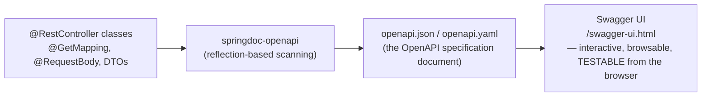
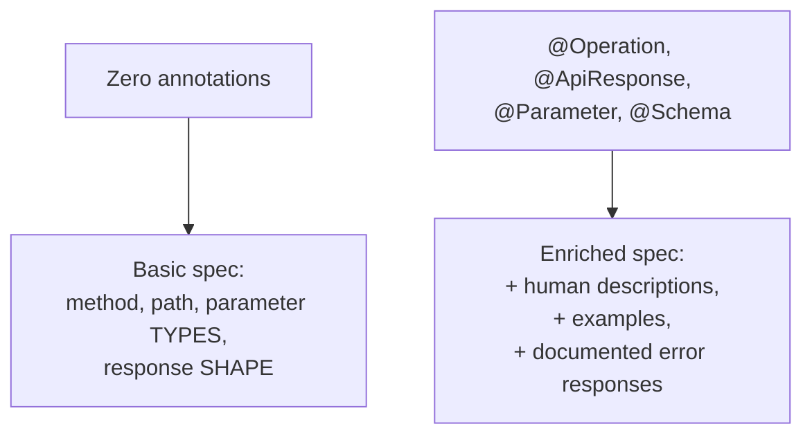
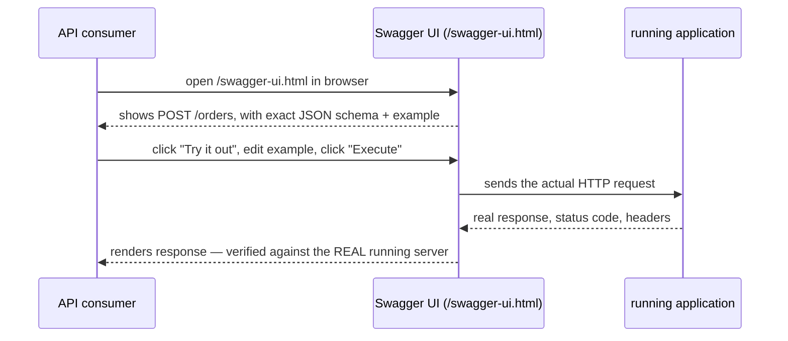
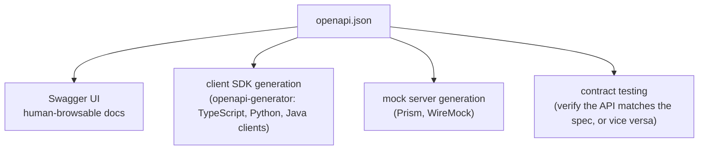

# OpenAPI/Swagger Documentation

An API without documentation forces every consumer to read your
controller source code (if they even have access to it) to understand
what to send and what they'll get back. OpenAPI (formerly "Swagger") is a
standard, machine-readable format for describing a REST API's shape —
and in a Spring Boot app, it can be generated automatically from the code
you've already written, rather than maintained as a separate document.

## Before → After: a hand-written Word doc/wiki page vs. generated OpenAPI

**Before — documentation maintained separately from the code, in a wiki
or shared doc:**

```
## GET /orders/{id}

Returns an order by ID.

Parameters:
- id (path, required): the order ID

Response:
{
  "id": 42,
  "total": 99.99,
  "status": "SHIPPED"
}
```

This is disconnected from the actual code — nothing stops the controller
from changing (a renamed field, a new required parameter) while this
document quietly goes stale. Documentation drift like this is one of the
most common, most frustrating problems API consumers run into.

**After — one dependency, and documentation is generated directly from
the controller code + annotations, guaranteed to match what's actually
deployed:**

```xml
<dependency>
    <groupId>org.springdoc</groupId>
    <artifactId>springdoc-openapi-starter-webmvc-ui</artifactId>
    <version>2.x</version>
</dependency>
```

With zero further code, visiting `/swagger-ui.html` now shows a live,
interactive, browsable API reference — every `@RestController`,
every `@GetMapping`/`@PostMapping`, every `@RequestBody`/`@PathVariable`
is inspected via reflection and turned into documentation automatically.



## Enriching the generated docs with annotations

The bare minimum (no annotations at all) already produces a usable spec,
but annotations fill in the human-readable context reflection alone can't
infer — what a field *means*, not just its type.

```java
@Tag(name = "Orders", description = "Order management operations")
@RestController
@RequestMapping("/api/v1/orders")
public class OrderController {

    @Operation(summary = "Get an order by ID",
               description = "Returns the full order, including line items and current status.")
    @ApiResponses({
        @ApiResponse(responseCode = "200", description = "Order found",
                content = @Content(schema = @Schema(implementation = OrderResponse.class))),
        @ApiResponse(responseCode = "404", description = "No order exists with this ID",
                content = @Content(schema = @Schema(implementation = ErrorResponse.class)))
    })
    @GetMapping("/{id}")
    public OrderResponse getOrder(
            @Parameter(description = "The order's unique identifier", example = "42")
            @PathVariable Long id) {
        return orderService.findById(id);
    }
}
```

```java
public record OrderResponse(
        @Schema(description = "Unique order identifier", example = "42")
        Long id,

        @Schema(description = "Total order amount in USD, including tax", example = "99.99")
        BigDecimal total,

        @Schema(description = "Current fulfillment status")
        OrderStatus status) { }
```



## Before → After: guessing a request shape vs. trying it in Swagger UI

**Before — a client developer has to read controller source, or worse,
trial-and-error against a running server, to learn a request's exact
shape:**

```java
// Client developer has to find and read THIS to know what to send:
public record CreateOrderRequest(String customerName, List<OrderItem> items) { }
```

**After — Swagger UI shows the exact schema, with examples, and lets you
send a real request from the browser without writing any client code
first:**



This is a meaningfully different experience from a static document: the
consumer can validate their understanding by making a real request against
a real (dev/staging) instance, directly from the documentation page.

## The OpenAPI spec itself — machine-readable, not just human-readable

Because `/v3/api-docs` exposes the raw specification as JSON/YAML (not
just the rendered Swagger UI page), the same artifact can drive tooling
beyond documentation:



**Real advantage:** teams building a separate frontend can generate a
fully-typed TypeScript API client directly from `openapi.json`, without
hand-writing `fetch` calls and interfaces that could drift out of sync
with the actual backend — the client is regenerated whenever the spec
changes.

## Real advantages

- **Documentation can't silently drift out of sync with the code**, since
  it's derived from the same source (controller methods, DTOs) that
  actually runs — a renamed field or new required parameter shows up in
  the generated docs the next time the app starts, with zero manual
  documentation-update step required.
- **Interactive testing removes an entire class of "does this endpoint
  even work the way I think" back-and-forth** between API producers and
  consumers — Swagger UI's "Try it out" lets a consumer verify their
  understanding directly.
- **The spec itself is a reusable artifact** beyond documentation —
  client SDK generation and contract testing both build on the same
  `openapi.json`, so investing in good annotations pays off in more than
  one place.

## Caveats

- **Reflection-based generation only knows what it can infer from
  code.** Without `@Schema`/`@Operation` annotations, the docs are
  technically accurate (correct types, correct required-ness) but often
  unhelpful — a field named `total` with no description doesn't tell a
  consumer whether it includes tax, is pre- or post-discount, or what
  currency it's in. Annotations aren't optional polish for a genuinely
  useful API doc; they're most of the value.
- **`/swagger-ui.html` and `/v3/api-docs` are publicly reachable by
  default if not secured** — for an internal or unreleased API, this can
  leak your entire API surface (including admin-only or not-yet-released
  endpoints) to anyone who finds the URL. Same class of concern as
  Actuator endpoint exposure from the Spring Boot section — secure or
  restrict these paths in production, deliberately, not by omission.
- **A generated spec documents *what the code does*, not *what the API
  is supposed to do*.** A bug in the controller (wrong status code,
  missing validation) gets faithfully documented as if it were correct
  behavior — generated docs are not a substitute for actual API design
  review.
