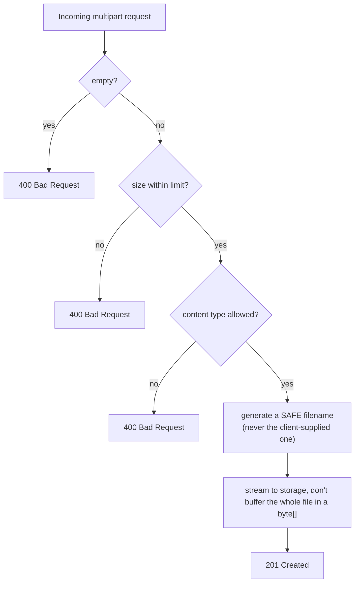
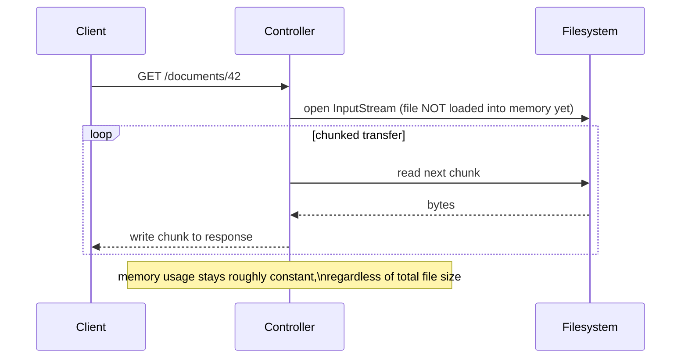

# File Upload/Download

Binary content (images, PDFs, CSV exports) doesn't fit naturally into a
JSON request/response body — it needs its own handling, both for
receiving files from a client and for streaming large files back out
without loading them entirely into memory first.

## File upload — `multipart/form-data`

**Before → After framing:** there isn't a meaningfully different "old
way" to do this in Spring — `MultipartFile` has been the standard
approach for a long time. The useful before/after here is **naive
in-memory handling vs. handling that actually scales to real file
sizes**.

**Naive — load the whole file into a `byte[]`, hold it in memory, write
it synchronously on the request thread:**

```java
@PostMapping("/documents")
public ResponseEntity<DocumentResponse> upload(@RequestParam("file") MultipartFile file) throws IOException {
    byte[] bytes = file.getBytes();          // ENTIRE file loaded into a byte array in memory
    Files.write(Paths.get("/uploads/" + file.getOriginalFilename()), bytes);
    // no validation of size, type, or filename — a client can send anything
    return ResponseEntity.ok(new DocumentResponse(file.getOriginalFilename()));
}
```

For a 2MB profile picture this is fine; for a handful of concurrent
500MB video uploads, this can exhaust heap memory, and using the raw
client-supplied filename directly is a path-traversal vulnerability
(`../../etc/passwd` as a filename).

**Better — validate, stream where possible, never trust the client-
supplied filename:**

```java
@PostMapping("/documents")
public ResponseEntity<DocumentResponse> upload(@RequestParam("file") MultipartFile file) throws IOException {

    if (file.isEmpty()) {
        throw new BadRequestException("File is empty");
    }
    if (file.getSize() > 10 * 1024 * 1024) {   // 10 MB cap, enforced explicitly in addition to server-level limits
        throw new BadRequestException("File too large");
    }
    String contentType = file.getContentType();
    if (!List.of("image/png", "image/jpeg", "application/pdf").contains(contentType)) {
        throw new BadRequestException("Unsupported file type: " + contentType);
    }

    String safeFilename = UUID.randomUUID() + getExtension(file.getOriginalFilename());   // NEVER trust the client's filename directly
    Path target = Paths.get("/uploads").resolve(safeFilename).normalize();

    try (InputStream in = file.getInputStream()) {
        Files.copy(in, target, StandardCopyOption.REPLACE_EXISTING);   // streamed, not buffered as one giant byte[]
    }

    return ResponseEntity.status(HttpStatus.CREATED)
            .body(new DocumentResponse(safeFilename, file.getOriginalFilename(), file.getSize()));
}
```



Server-level size limits also need configuring (defense in depth — don't
rely solely on the application-level check above):

```yaml
spring:
  servlet:
    multipart:
      max-file-size: 10MB
      max-request-size: 10MB
```

## File download — streaming instead of loading into memory

**Before — read the entire file into memory, then return it as a
`byte[]`:**

```java
@GetMapping("/documents/{id}")
public ResponseEntity<byte[]> download(@PathVariable String id) throws IOException {
    byte[] fileBytes = Files.readAllBytes(resolveDocumentPath(id));   // whole file loaded into memory
    return ResponseEntity.ok()
            .contentType(MediaType.APPLICATION_OCTET_STREAM)
            .body(fileBytes);
}
```

For a small file this is harmless; for a 4GB video export, this attempts
to allocate a 4GB byte array on the heap — likely an `OutOfMemoryError`,
and even if it fits, it holds the whole file in memory for the entire
request instead of releasing it incrementally as bytes are sent.

**After — stream the file directly to the response, constant memory
regardless of file size:**

```java
@GetMapping("/documents/{id}")
public ResponseEntity<StreamingResponseBody> download(@PathVariable String id) {
    Path filePath = resolveDocumentPath(id);
    String filename = filePath.getFileName().toString();

    StreamingResponseBody stream = outputStream -> {
        try (InputStream in = Files.newInputStream(filePath)) {
            in.transferTo(outputStream);   // copies in chunks, never holds the whole file at once
        }
    };

    return ResponseEntity.ok()
            .contentType(MediaType.APPLICATION_OCTET_STREAM)
            .header(HttpHeaders.CONTENT_DISPOSITION, "attachment; filename=\"" + filename + "\"")
            .body(stream);
}
```



`Content-Disposition: attachment; filename="..."` is what tells the
browser to save the file (with the given name) rather than trying to
render it inline — omitting it, or using `inline` instead, is the right
call for something like an image meant to display directly in a page.

## Real advantages

- **Streaming keeps memory usage flat regardless of file size** — the
  difference between a service that comfortably handles large files and
  one that falls over under real-world usage, once files exceed a few
  tens of megabytes and/or several uploads happen concurrently.
- **Explicit validation (size, type, filename sanitization) closes real
  security gaps** — path traversal via a malicious filename and
  unrestricted file-type uploads (e.g. an executable disguised with an
  image extension) are genuine, exploitable vulnerabilities in naive
  upload handlers, not theoretical concerns.
- **`Content-Disposition` gives you explicit control over browser
  behavior** — download vs. inline display — rather than leaving it to
  browser guesswork based on content type alone.

## Caveats

- **Client-reported `Content-Type` and file extension are both
  untrustworthy on their own** — a malicious client can label anything as
  `image/png`. For genuinely security-sensitive upload handling (public-
  facing services accepting arbitrary user uploads), validate the actual
  file content (magic-byte/signature checking, or a dedicated library)
  rather than trusting client-supplied metadata alone.
- **Local filesystem storage (`/uploads/...`, as shown above) doesn't
  scale past a single server** — once you have more than one application
  instance behind a load balancer, uploaded files need to live in shared
  storage (S3-compatible object storage, a network filesystem) or
  requests can land on an instance that never received the original
  upload. This is a common gap between a tutorial-style example and a
  real production deployment.
- **`StreamingResponseBody` runs on a separate thread from Spring MVC's
  request-handling thread by default** — this is usually beneficial (it
  frees the MVC thread sooner) but means exceptions thrown while
  streaming don't behave like a normal controller exception; they need
  explicit handling inside the streaming lambda itself, since the
  response's status/headers are often already committed by the time an
  error occurs partway through the stream.
