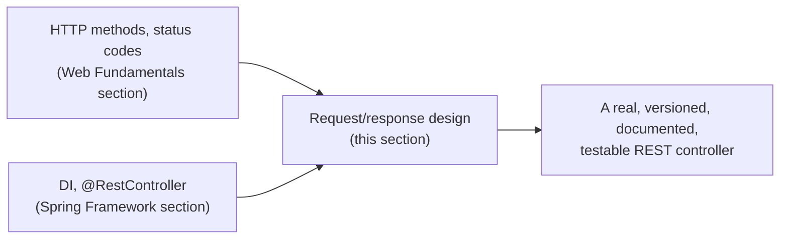

# REST API Development

Where [Web Fundamentals](../02-web-fundamentals/README.md)'s HTTP theory
and [Spring Framework 7](../04-spring-framework-7/README.md)'s
`@RestController`/DI concepts meet practical, day-to-day API-building
decisions: how to structure a CRUD controller, how to design a request/
response shape people won't hate, how to version and document an API, and
how to actually test one by hand before writing automated tests.

## Topics

1. [CRUD via GET/POST/PUT/PATCH/DELETE](01-crud-http-methods-in-spring.md)
2. [Path, query, and request body design](02-path-query-request-body-design.md)
3. [API versioning & naming conventions](03-api-versioning-naming-conventions.md)
4. [OpenAPI/Swagger documentation](04-openapi-swagger-documentation.md)
5. [File upload/download](05-file-upload-download.md)
6. [Testing with Postman/HTTPie](06-testing-with-postman-httpie.md)

## From HTTP theory to a real controller

