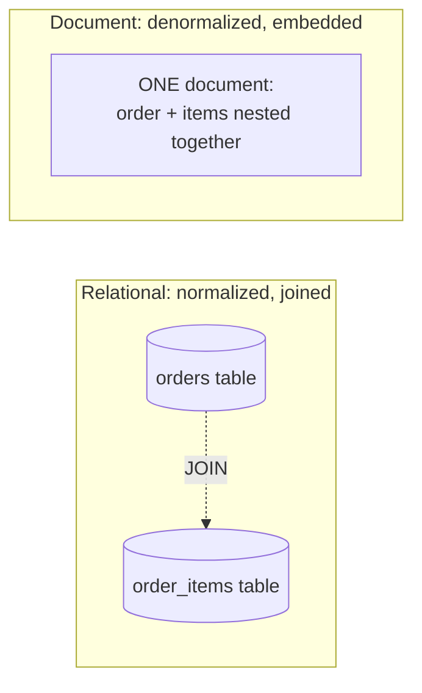
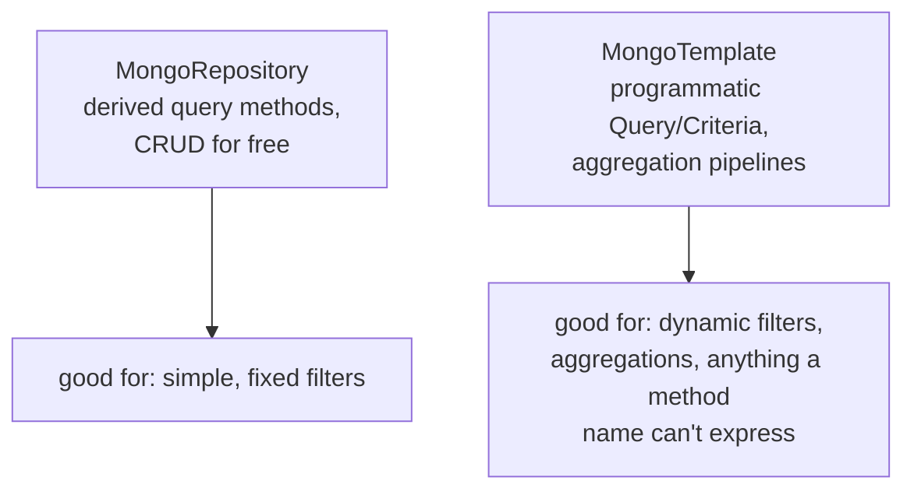

# Spring Data MongoDB (MongoTemplate, MongoRepository)

MongoDB is a **document database** — instead of rows spread across
normalized tables joined at query time (the JPA/relational model from
[section 3](../03-jakarta-persistence-spring-data/README.md)), related
data is typically stored together as one nested JSON-like document. Spring
Data MongoDB gives you the same two-layer API shape as Spring Data JPA
(`MongoRepository` for the 90% case, `MongoTemplate` for everything else)
applied to that different storage model.

## Before → After: relational modeling vs. document modeling

**Before — relational: an order and its line items live in separate
tables, joined at query time (exactly the [relationships file](../03-jakarta-persistence-spring-data/02-relationships.md)'s pattern):**

```java
@Entity
public class Order {
    @Id @GeneratedValue
    private Long id;
    private String customerName;

    @OneToMany(mappedBy = "order", cascade = CascadeType.ALL)
    private List<OrderItem> items;   // separate table, separate rows, JOINed to reassemble
}

@Entity
public class OrderItem {
    @Id @GeneratedValue
    private Long id;
    private String productName;
    private int quantity;

    @ManyToOne
    private Order order;
}
```

Reading one order with its items means either an N+1 query problem or a
`JOIN FETCH` — the data was split apart for normalization, then has to be
reassembled at read time.

**After — document: the order and its items are naturally stored and
read together, as one document, because they're always accessed
together:**

```java
@Document(collection = "orders")
public class Order {
    @Id
    private String id;   // MongoDB IDs are typically Strings (ObjectId), not Long
    private String customerName;
    private List<OrderItem> items;   // EMBEDDED directly in the same document — no join needed
    private LocalDateTime createdAt;
}

public class OrderItem {
    private String productName;
    private int quantity;
    // no @Entity, no @Id — this isn't a separate document, it's a nested object
}
```

```json
{
  "_id": "65f1a2b3c4d5e6f7a8b9c0d1",
  "customerName": "Alice",
  "items": [
    { "productName": "Widget", "quantity": 3 },
    { "productName": "Gadget", "quantity": 1 }
  ],
  "createdAt": "2026-09-02T10:00:00Z"
}
```



**The real modeling shift:** relational design starts from "avoid
duplication, normalize" (third normal form); document design starts from
"model around how the data is actually read and written together." An
order and its line items are almost always read and written as a unit —
embedding them avoids a join for the single most common access pattern,
at the cost of making "find all orders containing product X" a less
natural query than it would be with a normalized `order_items` table.

## `MongoRepository` — the same pattern as `JpaRepository`

```java
public interface OrderRepository extends MongoRepository<Order, String> {
    List<Order> findByCustomerName(String customerName);
    List<Order> findByCreatedAtBetween(LocalDateTime from, LocalDateTime to);
    List<Order> findByItemsProductName(String productName);   // queries INTO the embedded array
}
```

```java
Order saved = orderRepository.save(new Order("Alice", items, LocalDateTime.now()));
Optional<Order> found = orderRepository.findById("65f1a2b3c4d5e6f7a8b9c0d1");
List<Order> aliceOrders = orderRepository.findByCustomerName("Alice");
```

This is deliberately the same interface shape covered in
[Spring Data JPA repositories](../03-jakarta-persistence-spring-data/03-spring-data-jpa-repositories.md)
— derived query methods, `save`/`findById`/`delete` for free — just
backed by MongoDB's driver instead of Hibernate/JDBC. The consistency is
intentional: Spring Data's goal is a uniform repository abstraction across
different storage technologies.

## `MongoTemplate` — for queries a derived method can't express

**Before — trying to force a complex, dynamic filter through a derived
query method name (the same problem covered for JPA in the
[query methods file](../03-jakarta-persistence-spring-data/04-query-methods-native-vs-jpql.md)):**

```java
// Unreadable, and can't express "any of these optional filters, dynamically"
List<Order> findByCustomerNameAndCreatedAtBetweenAndItemsProductNameIn(
        String customerName, LocalDateTime from, LocalDateTime to, List<String> productNames);
```

**After — `MongoTemplate` with a `Query`/`Criteria` built dynamically:**

```java
@Repository
public class OrderSearchRepository {
    private final MongoTemplate mongoTemplate;

    public OrderSearchRepository(MongoTemplate mongoTemplate) {
        this.mongoTemplate = mongoTemplate;
    }

    public List<Order> search(String customerName, LocalDateTime from, LocalDateTime to) {
        Query query = new Query();
        if (customerName != null) {
            query.addCriteria(Criteria.where("customerName").is(customerName));
        }
        if (from != null && to != null) {
            query.addCriteria(Criteria.where("createdAt").gte(from).lte(to));
        }
        return mongoTemplate.find(query, Order.class);
    }
}
```



`MongoTemplate` also gives access to MongoDB's **aggregation pipeline** —
a multi-stage data-transformation query (group, filter, project, sum)
conceptually similar to SQL's `GROUP BY`/window functions, but expressed
as a sequence of stages:

```java
Aggregation agg = Aggregation.newAggregation(
        Aggregation.match(Criteria.where("status").is("SHIPPED")),
        Aggregation.unwind("items"),
        Aggregation.group("items.productName").sum("items.quantity").as("totalSold")
);
List<ProductSales> results = mongoTemplate.aggregate(agg, "orders", ProductSales.class)
        .getMappedResults();
```

## Real advantages

- **Schema flexibility.** Adding a new, optional field to `Order` doesn't
  require a migration the way an `ALTER TABLE` would — new documents can
  simply include it, and old documents without it deserialize fine as
  long as the field has a sensible default/nullable handling in the Java
  class. This is a genuine win for rapidly-evolving domains.
- **Embedding matches natural access patterns**, avoiding the N+1/JOIN
  concerns that dominate the relationships discussion in the JPA section
  — when data is always read and written together, storing it together
  is both simpler code and fewer round trips.
- **The Spring Data abstraction is consistent** across relational and
  document stores — a team already comfortable with `JpaRepository`
  patterns can be productive with `MongoRepository` almost immediately.

## Caveats

- **No cross-document (multi-collection) transactions in the simple
  case** — MongoDB does support multi-document ACID transactions since
  version 4.0, but they're not the default mode of operation the way
  relational transactions are, and reaching for them often signals the
  schema should have embedded the data instead. If your domain
  fundamentally needs strong, frequent cross-entity transactional
  consistency, that's a signal favoring relational modeling, not
  MongoDB.
- **No schema enforcement by default** cuts both ways — the same
  flexibility that avoids migrations also means nothing stops a buggy
  write path from inserting a document with the wrong shape (a string
  where a number was expected), which then silently fails to deserialize
  correctly later. MongoDB does support schema validation rules, but
  it's opt-in, not the default the way a relational column type is.
- **Embedding vs. referencing is a real design decision, not a default
  you can ignore.** Embedding an unbounded, ever-growing array (e.g.
  embedding ALL of a customer's orders inside the customer document,
  rather than orders as their own collection referencing a customer ID)
  leads to documents that grow without bound — MongoDB has a per-document
  size limit (16MB) and large documents hurt read/write performance well
  before that limit. Model embed-vs-reference around "is this bounded and
  always accessed together," not just convenience.
