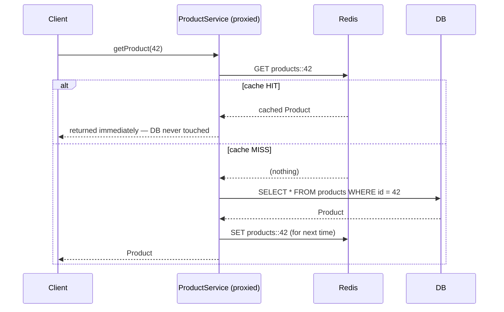
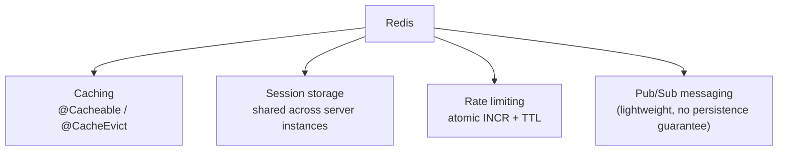
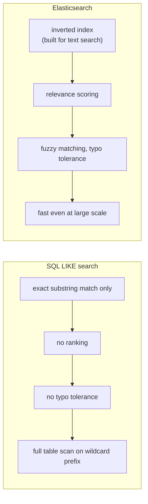
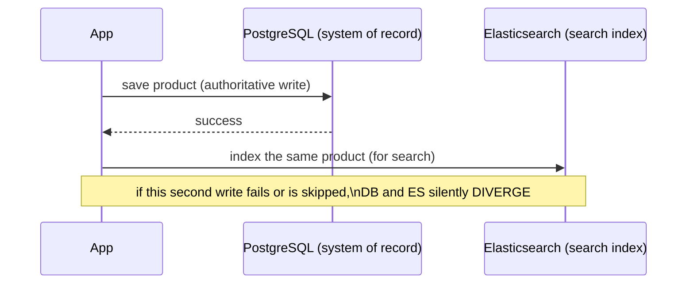

# Overview: Redis, Elasticsearch Integration

Two more specialized stores, each solving one problem the relational/
document databases from the previous files aren't built for: Redis for
extremely fast, ephemeral key-value access; Elasticsearch for full-text
search and relevance ranking. This is an overview — enough to recognize
when each fits and wire up basic Spring integration, not a deep dive.

## Redis — an in-memory key-value store

Redis keeps data **in memory**, which makes it roughly one to two orders
of magnitude faster than a disk-backed database for simple key lookups —
at the cost of being (by default) less durable and not a system of
record.

### Before → After: hitting the database on every request vs. caching

**Before — every request re-runs the same expensive query:**

```java
@Service
public class ProductService {
    public Product getProduct(Long id) {
        return productRepository.findById(id).orElseThrow();
        // every single call re-queries the database, even if the SAME
        // product was fetched by a different request one second ago
    }
}
```

For a product catalog page hit thousands of times a minute, and where
product data changes rarely, this repeats the same expensive work over
and over for no benefit.

**After — Redis as a read-through cache, via Spring's caching
abstraction:**

```java
@Service
public class ProductService {

    @Cacheable(value = "products", key = "#id")
    public Product getProduct(Long id) {
        return productRepository.findById(id).orElseThrow();
        // this method body only runs on a CACHE MISS —
        // subsequent calls with the same id are served from Redis directly
    }

    @CacheEvict(value = "products", key = "#product.id")
    public Product updateProduct(Product product) {
        return productRepository.save(product);
        // explicitly invalidate the stale cached entry when the underlying data changes
    }
}
```

```yaml
spring:
  cache:
    type: redis
  data:
    redis:
      host: localhost
      port: 6379
```

`@Cacheable` is itself another example of the AOP pattern from the
[Spring Framework section](../04-spring-framework-7/04-aop.md) —
a proxy intercepts the method call, checks Redis first, and only invokes
the real method body on a cache miss.



### Redis beyond caching — session storage and rate limiting

```java
// Session storage: replace in-memory HttpSession with Redis-backed sessions,
// so any server instance behind a load balancer can serve any user's session
// — directly solving the statelessness/horizontal-scaling tension discussed
// in the REST principles file
@EnableRedisHttpSession
public class SessionConfig { }
```

```java
// Rate limiting: atomic INCR + TTL makes Redis a natural fit for
// "N requests per minute per user" checks
@Service
public class RateLimiter {
    private final StringRedisTemplate redis;

    public boolean allowRequest(String userId) {
        String key = "rate-limit:" + userId;
        Long count = redis.opsForValue().increment(key);
        if (count == 1) {
            redis.expire(key, Duration.ofMinutes(1));   // TTL only set on the FIRST request in the window
        }
        return count <= 100;   // 100 requests per minute
    }
}
```



## Elasticsearch — full-text search and relevance ranking

**Before — trying to do "search" with SQL `LIKE`:**

```java
@Query("SELECT p FROM Product p WHERE LOWER(p.description) LIKE LOWER(CONCAT('%', :term, '%'))")
List<Product> search(@Param("term") String term);
```

```sql
-- What this actually runs as, roughly:
SELECT * FROM products WHERE LOWER(description) LIKE '%wireless mouse%'
```

This has real, fundamental limitations: it can't rank results by
relevance (every match is equally "good" as far as the query is
concerned), it can't handle typos or stemming ("running" won't match a
search for "run"), it can't do fuzzy matching, and `LIKE '%term%'` with a
leading wildcard typically can't use a standard database index — meaning
it degrades to scanning every row as the table grows.

**After — Elasticsearch, purpose-built for this:**

```java
@Document(indexName = "products")
public class ProductDocument {
    @Id
    private String id;

    @Field(type = FieldType.Text, analyzer = "standard")
    private String name;

    @Field(type = FieldType.Text)
    private String description;

    @Field(type = FieldType.Double)
    private BigDecimal price;
}

public interface ProductSearchRepository extends ElasticsearchRepository<ProductDocument, String> {
    List<ProductDocument> findByNameContainingOrDescriptionContaining(String name, String description);
}
```

```java
// A more realistic, relevance-ranked, fuzzy search — via ElasticsearchOperations
Query query = NativeQuery.builder()
        .withQuery(q -> q.multiMatch(m -> m
                .query("wireles mouze")             // note the typos
                .fields("name^2", "description")     // name matches weighted 2x more relevant
                .fuzziness("AUTO")))                  // tolerates typos
        .build();

SearchHits<ProductDocument> results = elasticsearchOperations.search(query, ProductDocument.class);
```

This query tolerates typos ("wireles mouze" still matches "wireless
mouse"), ranks results by computed relevance score (not just "matches or
doesn't"), and weights the `name` field as more important than
`description` — none of which SQL `LIKE` can express at all.



### Keeping Elasticsearch in sync with the system of record

A critical, easy-to-miss architectural point: **Elasticsearch is
typically a secondary index, not the system of record.** The relational
or document database still holds the authoritative data; Elasticsearch
holds a searchable copy that needs to be kept in sync.



Larger systems solve the sync problem with an event stream or
change-data-capture pipeline (e.g. Debezium reading the database's
write-ahead log, publishing changes to Kafka, which then updates
Elasticsearch) rather than the application code performing both writes
directly — that dual-write pattern shown above is simple but fragile,
since a failure partway through leaves the two stores inconsistent with
no automatic recovery.

## Real advantages

- **Redis's in-memory speed makes caching, session storage, and rate
  limiting dramatically cheaper on the primary database** — moving hot,
  frequently-repeated reads off the relational database (or Mongo) that
  holds the real data reduces load on the store that actually needs to be
  protected and scaled carefully.
- **Elasticsearch solves search problems SQL genuinely cannot** —
  relevance ranking, typo tolerance, and fast full-text queries at scale
  aren't things a relational database can be tuned into doing well; they
  require a fundamentally different index structure (an inverted index),
  which is exactly what Elasticsearch is built around.
- **Polyglot persistence lets each store do only what it's good at** —
  instead of stretching one relational database to also be a cache and a
  search engine (possible, but poorly, at real scale), each concern gets
  a purpose-built tool.

## Caveats

- **Redis's default durability is weaker than a relational database's.**
  Depending on configuration (RDB snapshots vs. AOF persistence), a Redis
  restart or crash can lose recently-written data — appropriate for a
  cache (worst case: a cache miss, re-fetch from the real database) but
  dangerous if you accidentally treat Redis as your only copy of
  important data.
- **Cache invalidation is a genuinely hard problem** ("there are only two
  hard things in computer science...") — `@CacheEvict` shown above only
  works if every code path that mutates the underlying data remembers to
  evict the right cache key; a missed eviction means stale data is served
  silently, sometimes for a long time, until the entry's TTL expires.
- **Elasticsearch-as-secondary-index requires an explicit sync strategy**
  — without one (event-driven sync, scheduled reindexing, or at minimum,
  disciplined dual-writes with monitoring), search results can drift out
  of sync with the real data in ways that are hard to detect until a user
  reports "I can find this in the app, but not in search" (or vice
  versa).
- **Both Redis and Elasticsearch are additional infrastructure to
  operate** — more moving parts to deploy, monitor, back up, and keep
  available. The decision to add either should be driven by a real,
  measured need (cache hit rate justifying the complexity, search
  requirements SQL genuinely can't meet), not adopted preemptively
  because it's a common part of a "modern" stack.
