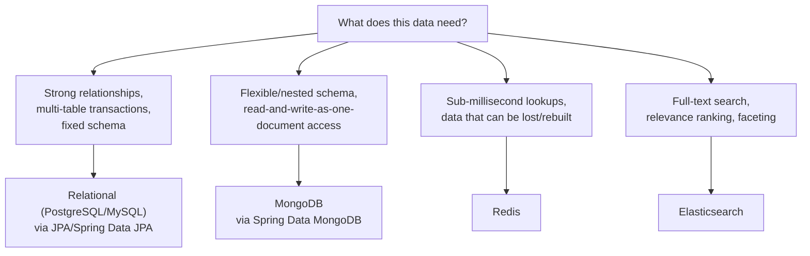

# NoSQL & Polyglot Persistence

Everything in [Jakarta Persistence & Spring Data](../03-jakarta-persistence-spring-data/README.md)
assumed a relational database. **Polyglot persistence** is the idea that a
real application often shouldn't use just one kind of database — a
document store for flexible, nested domain data, a key-value store for
sub-millisecond caching, a search engine for full-text queries — each
picked because it fits a specific access pattern better than a
one-size-fits-all relational schema would.

## Topics

1. [Spring Data MongoDB (MongoTemplate, MongoRepository)](01-spring-data-mongodb.md)
2. [Overview: Redis, Elasticsearch integration](02-redis-elasticsearch-overview.md)

## Picking the right store for the job

It's common for a single real application to use **more than one of
these at once** — e.g. PostgreSQL as the system of record, Redis caching
its hot read paths, and Elasticsearch indexing a subset of that data for
search — which is exactly what "polyglot persistence" means in practice.
