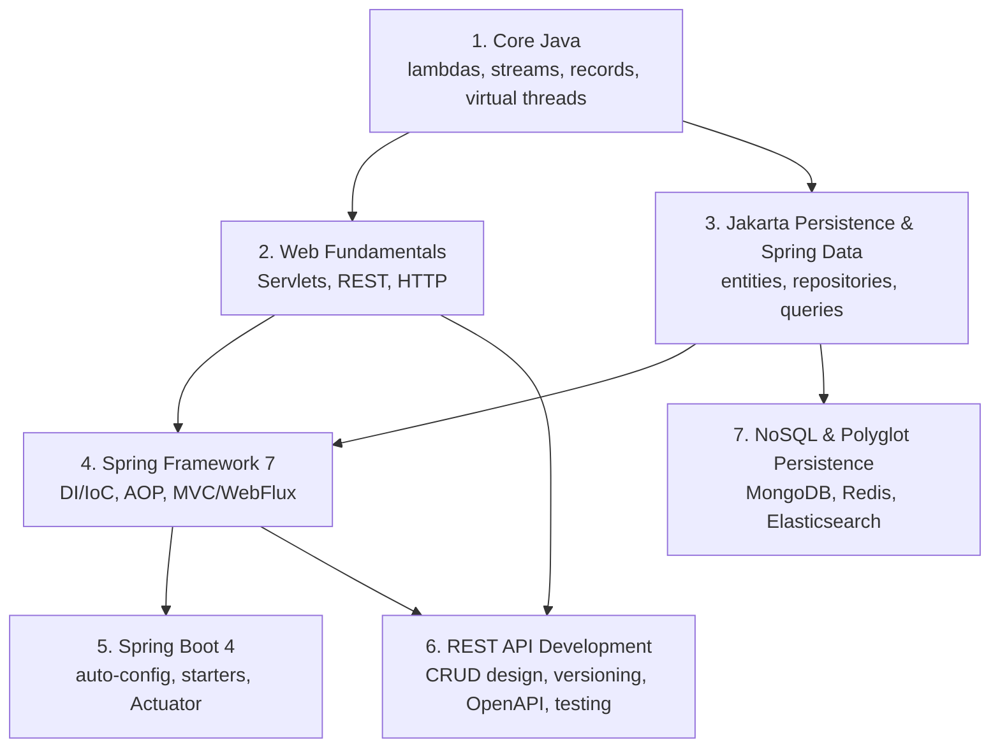

# Course Notes

Notes and worked examples following [content.md](../content.md)'s
curriculum. Each section is its own directory; each topic within a section
is its own file, with before/after code, a Mermaid diagram, and a "real
advantages vs. caveats" discussion.

## Sections

1. [Core Java (Java 17/21 LTS)](01-core-java/README.md)
2. [Web Fundamentals](02-web-fundamentals/README.md)
3. [Jakarta Persistence & Spring Data](03-jakarta-persistence-spring-data/README.md)
4. [Spring Framework 7](04-spring-framework-7/README.md)
5. [Spring Boot 4](05-spring-boot-4/README.md)
6. [REST API Development](06-rest-api-development/README.md)
7. [NoSQL & Polyglot Persistence](07-nosql-polyglot-persistence/README.md)

Remaining sections from the curriculum (Spring Security 7, Transactions,
Microservices & Cloud-Native, Containerization & DevOps) aren't written up
yet.

## How the sections build on each other

Section 4 (Spring Framework) explains the container and programming model
that section 3's repository proxies and section 5's auto-configuration are
both built on — if something in 3 or 5 feels like unexplained magic,
section 4 is usually where the underlying mechanism is covered.
